# ClinicX - Dental Clinic Management System

A comprehensive Spring Boot 3.x application for dental clinic management, built with PostgreSQL and featuring a complete treatment materials tracking system.

## 🏗️ Architecture

- **Backend**: Spring Boot 3.5.x with Java 21
- **Database**: PostgreSQL with Flyway migrations
- **Documentation**: OpenAPI/Swagger
- **Testing**: JUnit 5, Mockito, Testcontainers
- **Mapping**: MapStruct for DTO conversions
- **Build Tool**: Gradle

## 🚀 Quick Start

### Prerequisites
- Java 21+
- PostgreSQL 12+
- Gradle 8.0+

### Setup Database
```sql
CREATE DATABASE clinicx;
CREATE USER clinicx_user WITH PASSWORD 'your_password';
GRANT ALL PRIVILEGES ON DATABASE clinicx TO clinicx_user;
```

### Application Configuration
Create `src/main/resources/application-local.properties`:
```properties
spring.datasource.url=jdbc:postgresql://localhost:5432/clinicx
spring.datasource.username=clinicx_user
spring.datasource.password=your_password
```

### Run Application
```bash
./gradlew bootRun --args='--spring.profiles.active=local'
```

### Access Swagger UI
Navigate to: http://localhost:8080/swagger-ui.html

## 📊 Database Migration

The application uses Flyway for database migrations:

- **V1**: Initial MVP schema with core functionality
- **V2**: Treatment materials system and UI mockup alignment

Migrations run automatically on startup. To view migration status:
```bash
./gradlew flywayInfo
```

## 🧪 Testing

### Run All Tests
```bash
./gradlew test
```

### Run Tests by Category
```bash
# Unit tests only
./gradlew test --tests "*Test" --exclude-tests "*IntegrationTest"

# Integration tests only  
./gradlew test --tests "*IntegrationTest"

# Specific component tests
./gradlew test --tests "*TreatmentMaterial*"
```

### Test Coverage
The application includes comprehensive test coverage:
- Unit tests with Mockito
- Repository tests with @DataJpaTest
- Controller tests with @WebMvcTest
- Integration tests with Testcontainers

## erDiagram

```mermaid
erDiagram
    clinic_info {
        boolean id PK
        varchar name
        text address
        varchar phone_number
        varchar email
        varchar timezone
        timestamp created_at
        timestamp updated_at
    }

    tenants {
        uuid id PK
        varchar tenant_id UK
        varchar name
        varchar subdomain UK
        varchar realm_name
        boolean is_active
        varchar contact_email
        varchar contact_phone
        text address
        timestamp subscription_start_date
        timestamp subscription_end_date
        varchar subscription_plan
        integer max_users
        integer max_patients
        varchar specialty
        timestamp created_at
        timestamp updated_at
        varchar created_by
        varchar updated_by
    }

    specialty_types {
        uuid id PK
        varchar code UK
        varchar name
        varchar features
        varchar realm_name
        boolean is_active
        timestamp created_at
        timestamp updated_at
        varchar created_by
        varchar updated_by
    }

    staff {
        uuid id PK
        varchar full_name
        varchar email
        varchar phone_number
        boolean is_active
        varchar tenant_id
        varchar keycloak_user_id
        varchar source_realm
        timestamp created_at
        timestamp updated_at
    }

    staff_roles {
        uuid staff_id PK,FK
        varchar role PK
    }

    user_tenant_access {
        uuid id PK
        varchar user_id
        varchar tenant_id FK
        boolean is_primary
        boolean is_active
        timestamp created_at
        timestamp updated_at
        varchar created_by
        varchar updated_by
    }

    user_tenant_access_roles {
        uuid user_tenant_access_id PK,FK
        varchar role PK
    }

    specialties {
        uuid id PK
        varchar name UK
        text description
        boolean is_active
        timestamp created_at
        timestamp updated_at
    }

    staff_specialties {
        uuid staff_id PK,FK
        uuid specialty_id PK,FK
    }

    patients {
        uuid id PK
        varchar public_facing_id UK
        varchar full_name
        date date_of_birth
        varchar gender
        varchar phone_number
        varchar email
        text address
        varchar insurance_provider
        varchar insurance_number
        text important_medical_notes
        numeric balance
        boolean is_active
        uuid created_by FK
        timestamp created_at
        timestamp updated_at
    }

    dental_charts {
        uuid id PK
        uuid patient_id UK,FK
        json chart_data
        timestamp created_at
        timestamp updated_at
    }

    appointments {
        uuid id PK
        uuid specialty_id FK
        uuid patient_id FK
        uuid doctor_id FK
        timestamp appointment_datetime
        integer duration_minutes
        varchar status
        text notes
        uuid created_by FK
        timestamp created_at
        timestamp updated_at
    }

    procedures {
        uuid id PK
        uuid specialty_id FK
        varchar procedure_code UK
        varchar name
        text description
        numeric default_cost
        integer default_duration_minutes
        boolean is_active
        timestamp created_at
        timestamp updated_at
    }

    treatments {
        uuid id PK
        uuid appointment_id FK
        uuid patient_id FK
        uuid procedure_id FK
        uuid doctor_id FK
        integer tooth_number
        varchar status
        numeric cost
        text treatment_notes
        date treatment_date
        uuid created_by FK
        timestamp created_at
        timestamp updated_at
    }

    treatment_materials {
        uuid id PK
        uuid treatment_id FK
        varchar material_name
        numeric quantity
        varchar unit
        numeric cost_per_unit
        numeric total_cost
        varchar supplier
        varchar batch_number
        text notes
        timestamp created_at
        timestamp updated_at
    }

    tooth_conditions {
        uuid id PK
        varchar code UK
        varchar name
        text description
        varchar color_hex
        boolean is_active
        timestamp created_at
    }

    invoices {
        uuid id PK
        uuid patient_id FK
        varchar invoice_number UK
        date issue_date
        date due_date
        numeric total_amount
        varchar status
        uuid created_by FK
        timestamp created_at
        timestamp updated_at
    }

    invoice_items {
        uuid id PK
        uuid invoice_id FK
        uuid treatment_id UK,FK
        varchar description
        numeric amount
        timestamp created_at
    }

    payments {
        uuid id PK
        uuid invoice_id FK
        uuid patient_id FK
        date payment_date
        numeric amount
        varchar payment_method
        varchar type
        varchar description
        varchar reference_number
        uuid created_by FK
        timestamp created_at
    }

    lab_requests {
        uuid id PK
        uuid patient_id FK
        varchar order_number UK
        text item_description
        integer tooth_number
        date date_sent
        date date_due
        varchar status
        varchar lab_name
        timestamp created_at
        timestamp updated_at
    }

    documents {
        uuid id PK
        uuid patient_id FK
        uuid uploaded_by_staff_id FK
        varchar file_name
        text file_path
        bigint file_size_bytes
        varchar mime_type
        varchar type
        timestamp created_at
    }

    notes {
        uuid id PK
        uuid patient_id FK
        text content
        uuid created_by FK
        timestamp note_date
        timestamp created_at
        timestamp updated_at
    }

    flyway_schema_history {
        integer installed_rank PK
        varchar version
        varchar description
        varchar type
        varchar script
        integer checksum
        varchar installed_by
        timestamp installed_on
        integer execution_time
        boolean success
    }

%% Relationships
    staff ||--o{ staff_roles : has
    staff ||--o{ staff_specialties : has
    specialties ||--o{ staff_specialties : has
    specialties ||--o{ appointments : for
    specialties ||--o{ procedures : contains

    patients ||--o{ appointments : has
    patients ||--o{ treatments : receives
    patients ||--o{ invoices : has
    patients ||--o{ payments : makes
    patients ||--o{ lab_requests : has
    patients ||--o{ documents : has
    patients ||--o{ notes : has
    patients ||--|| dental_charts : has

    staff ||--o{ appointments : conducts
    staff ||--o{ treatments : performs
    staff ||--o{ patients : creates
    staff ||--o{ invoices : creates
    staff ||--o{ payments : records
    staff ||--o{ documents : uploads
    staff ||--o{ notes : creates
    staff ||--o{ appointments : creates
    staff ||--o{ treatments : creates

    appointments ||--o{ treatments : generates
    procedures ||--o{ treatments : used-in
    treatments ||--o{ treatment_materials : uses
    treatments ||--o| invoice_items : billed-in

    invoices ||--o{ invoice_items : contains
    invoices ||--o{ payments : receives

    tenants ||--o{ user_tenant_access : has
    user_tenant_access ||--o{ user_tenant_access_roles : has

```

## 📚 API Documentation

### Core Endpoints

#### Patient Management
- `GET /api/v1/patients` - List patients with search and pagination
- `POST /api/v1/patients` - Create new patient
- `GET /api/v1/patients/{id}` - Get patient details
- `PUT /api/v1/patients/{id}` - Update patient information

#### Treatment Management
- `POST /api/v1/treatments` - Create treatment record
- `GET /api/v1/treatments/patient/{patientId}` - Get treatment history
- `GET /api/v1/treatment-materials/treatment/{treatmentId}` - Get materials used

#### Financial Management
- `POST /api/v1/invoices` - Create invoice
- `GET /api/v1/invoices/patient/{patientId}` - Get patient invoices
- `POST /api/v1/invoices/{invoiceId}/payments` - Record payment

#### Treatment Materials (New)
- `POST /api/v1/treatment-materials` - Create material record
- `GET /api/v1/treatment-materials/treatment/{treatmentId}` - Materials by treatment
- `GET /api/v1/treatment-materials/patient/{patientId}/total-cost` - Total material costs

Full API documentation available at `/swagger-ui.html` when running.

## 🏥 Domain Model

### Core Entities
- **Patient**: Patient demographics and medical information
- **Appointment**: Scheduled patient visits
- **Treatment**: Medical procedures performed
- **TreatmentMaterial**: Materials used in treatments (New in V2)
- **Invoice/Payment**: Financial transactions
- **DentalChart**: Tooth-specific records and history

### Key Features
- Complete dental chart with 32-tooth tracking
- Financial management with balance tracking
- Lab request management
- Document storage and retrieval
- Treatment materials tracking with cost analysis
- Staff management with role-based access

## 🔧 Development

### Code Style
- Java 21 features and patterns
- Spring Boot 3.x best practices
- MapStruct for entity-DTO mapping
- Lombok for reducing boilerplate
- Bean Validation for input validation

### Project Structure
```
src/main/java/sy/sezar/clinicx/
├── core/                 # Common utilities and base classes
├── patient/              # Patient domain (main business logic)
│   ├── controller/       # REST endpoints
│   ├── service/          # Business logic
│   ├── repository/       # Data access
│   ├── model/            # JPA entities
│   ├── dto/              # Data transfer objects
│   └── mapper/           # MapStruct mappers
├── staff/                # Staff management
└── clinic/               # Clinic configuration
```

### Adding New Features
1. Create entity in `model/` package
2. Add repository with necessary queries
3. Create DTOs for API contracts
4. Implement service layer with business logic
5. Add REST controller with proper validation
6. Create MapStruct mapper for conversions
7. Write comprehensive tests
8. Add Flyway migration if schema changes needed

## 🛠️ Configuration

### Profiles
- `local` - Local development with PostgreSQL
- `test` - Testing with H2 database
- `prod` - Production configuration

### Key Properties
```properties
# Database
spring.datasource.url=jdbc:postgresql://localhost:5432/clinicx

# JPA
spring.jpa.hibernate.ddl-auto=validate
spring.jpa.show-sql=false

# Flyway
spring.flyway.enabled=true
spring.flyway.baseline-on-migrate=true

# Swagger
springdoc.api-docs.path=/api-docs
springdoc.swagger-ui.path=/swagger-ui.html
```

## 📈 Recent Updates (V2)

### New Features
- **Treatment Materials System**: Complete material tracking with cost analysis
- **Enhanced Appointments**: AppointmentCreateRequest DTO for better API consistency
- **Database Optimization**: New indexes and views for improved performance
- **Comprehensive Testing**: 100% test coverage for new components

### Database Enhancements
- Material usage tracking and cost calculations
- Automatic total cost computation with triggers
- Enhanced financial summaries including material costs
- Performance optimizations with strategic indexing

### API Improvements
- New treatment materials endpoints
- Enhanced cost calculation endpoints
- Improved pagination support
- Comprehensive Swagger documentation

## 🤝 Contributing

1. Fork the repository
2. Create a feature branch (`git checkout -b feature/amazing-feature`)
3. Commit your changes (`git commit -m 'Add amazing feature'`)
4. Push to the branch (`git push origin feature/amazing-feature`)
5. Open a Pull Request

### Development Guidelines
- Maintain test coverage above 90%
- Follow existing code patterns and conventions
- Add appropriate Javadoc for public APIs
- Include database migrations for schema changes
- Update API documentation for new endpoints

## 📄 License

This project is proprietary software. All rights reserved.

## 📞 Support

For issues and questions:
- Create an issue in the repository
- Contact the development team
- Check the implementation summary in `IMPLEMENTATION_SUMMARY.md`

---

Built with ❤️ using Spring Boot 3.x and Java 21
