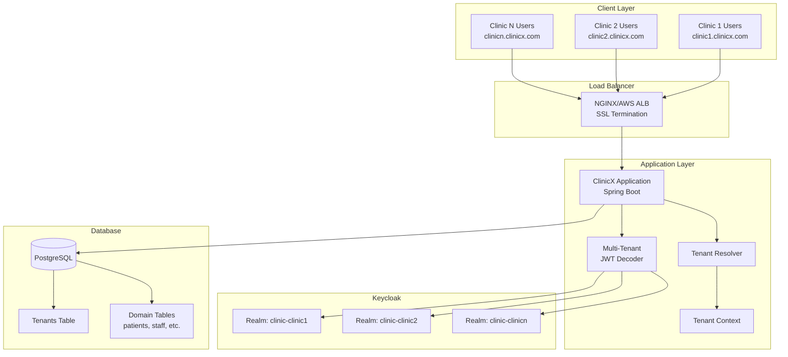
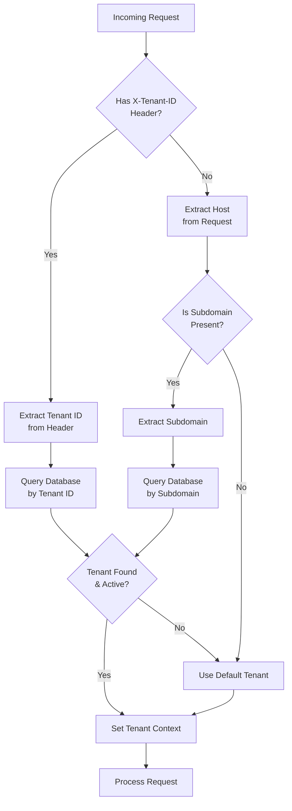
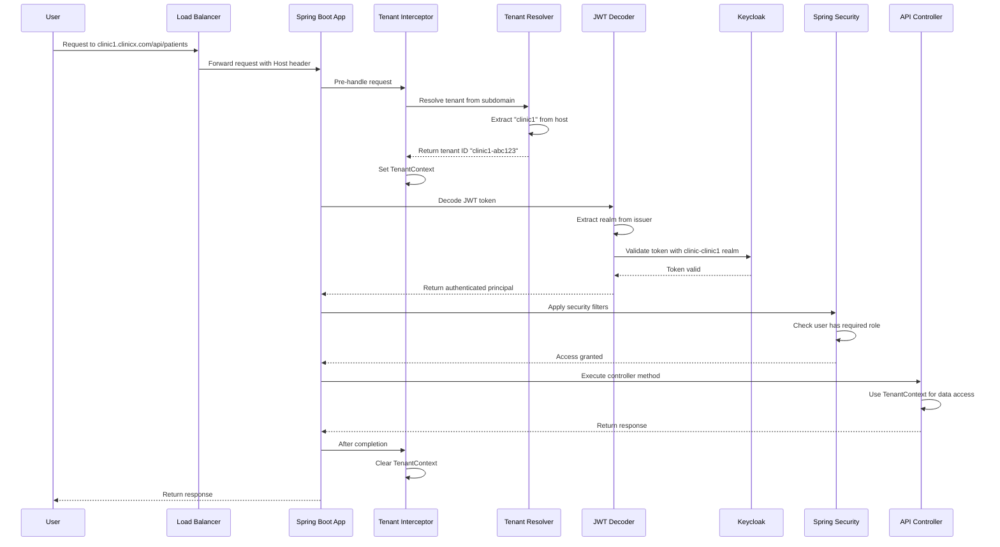
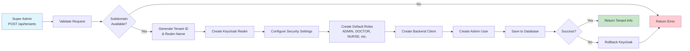
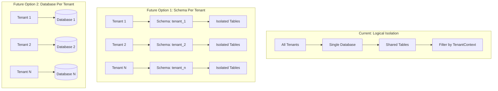
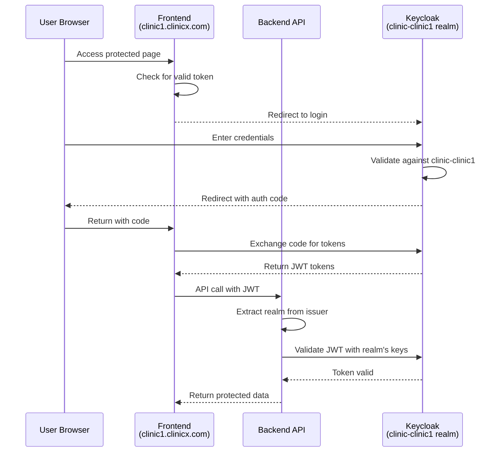
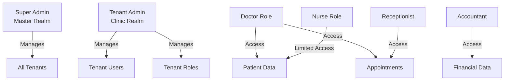
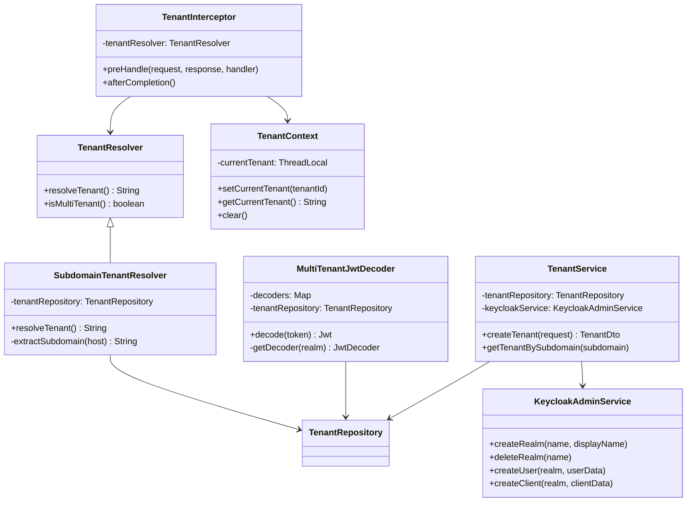

# Multi-Tenant Architecture Documentation

## Overview

ClinicX implements a multi-tenant architecture using the **one realm per tenant** approach with Keycloak. This provides complete isolation between clinics while maintaining a single application deployment.

## Architecture Diagram



## Architecture Decision

### Why One Realm Per Tenant?

- **Complete Isolation**: Each clinic's users, roles, and configurations are fully separated
- **Security**: No risk of cross-tenant data leakage or unauthorized access
- **Compliance**: Meets healthcare regulations (HIPAA) requiring strict data isolation
- **Customization**: Each clinic can have unique authentication flows and branding
- **Scalability**: Easy to scale horizontally and manage resources per tenant

## Components

### 1. Tenant Management

#### Entity Model
```java
@Entity
@Table(name = "tenants")
public class Tenant extends BaseEntity {
    private Long id;
    private String tenantId;        // Unique identifier (e.g., "clinic1-a1b2c3d4")
    private String name;            // Display name
    private String subdomain;       // URL subdomain (e.g., "clinic1")
    private String realmName;       // Keycloak realm (e.g., "clinic-clinic1")
    private Boolean active;
    private String contactEmail;
    private String subscriptionPlan;
    private Integer maxUsers;
    private Integer maxPatients;
    // ... additional fields
}
```

#### Database Schema
```sql
CREATE TABLE tenants (
    id BIGSERIAL PRIMARY KEY,
    tenant_id VARCHAR(100) NOT NULL UNIQUE,
    name VARCHAR(100) NOT NULL,
    subdomain VARCHAR(50) NOT NULL UNIQUE,
    realm_name VARCHAR(100) NOT NULL UNIQUE,
    active BOOLEAN NOT NULL DEFAULT true,
    -- ... additional columns
);
```

### 2. Tenant Resolution

The system identifies tenants through multiple methods:

#### Tenant Resolution Flow



#### Subdomain-Based Resolution
- URL Pattern: `https://{subdomain}.clinicx.com`
- Example: `https://clinic1.clinicx.com` → Tenant: clinic1

#### Header-Based Resolution
- Header: `X-Tenant-ID`
- Useful for API clients and mobile applications

#### Implementation
```java
@Component
public class SubdomainTenantResolver implements TenantResolver {
    public String resolveTenant() {
        // 1. Check X-Tenant-ID header
        // 2. Extract subdomain from host
        // 3. Validate tenant exists and is active
        // 4. Return tenant ID or default
    }
}
```

### 3. Keycloak Integration

#### Realm Management Service
The `KeycloakAdminService` provides programmatic realm management:

- **Create Realm**: Sets up a new Keycloak realm with security settings
- **Default Roles**: Automatically creates ADMIN, DOCTOR, NURSE, RECEPTIONIST, ACCOUNTANT
- **Client Configuration**: Creates backend client with proper OAuth2 settings
- **User Management**: Admin user creation and role assignment

#### Multi-Tenant JWT Decoder
```java
@Component
public class MultiTenantJwtDecoder implements JwtDecoder {
    public Jwt decode(String token) {
        // 1. Parse token to extract issuer
        // 2. Determine realm from issuer URL
        // 3. Validate tenant is active
        // 4. Get or create realm-specific decoder
        // 5. Decode and validate JWT
    }
}
```

### 4. Security Configuration

#### Request Flow



#### Configuration
```yaml
app:
  multi-tenant:
    enabled: true
    default-tenant: default
    default-realm: master
  domain: clinicx.com

keycloak:
  auth-server-url: http://localhost:18081
  admin-username: admin
  admin-password: admin
```

## API Endpoints

### Tenant Management (Super Admin Only)

#### Create Tenant
```http
POST /api/tenants
Content-Type: application/json

{
  "name": "City Medical Center",
  "subdomain": "citymedical",
  "contactEmail": "admin@citymedical.com",
  "subscriptionPlan": "professional",
  "maxUsers": 50,
  "maxPatients": 5000,
  "adminUsername": "admin",
  "adminEmail": "admin@citymedical.com",
  "adminFirstName": "John",
  "adminLastName": "Doe",
  "adminPassword": "SecurePassword123!"
}
```

#### List Tenants
```http
GET /api/tenants
Authorization: Bearer {super-admin-token}
```

#### Get Tenant by Subdomain
```http
GET /api/tenants/by-subdomain/{subdomain}
Authorization: Bearer {super-admin-token}
```

#### Activate/Deactivate Tenant
```http
POST /api/tenants/{id}/activate
POST /api/tenants/{id}/deactivate
Authorization: Bearer {super-admin-token}
```

## Tenant Provisioning Process



### Detailed Steps

1. **API Request**: Super admin submits tenant creation request
2. **Validation**: Check subdomain availability and validate inputs
3. **Keycloak Realm Creation**:
   - Create new realm with security settings
   - Configure token lifespans
   - Enable brute force protection
4. **Role Setup**: Create default roles (ADMIN, DOCTOR, etc.)
5. **Client Creation**: Set up OAuth2 client for backend
6. **Admin User**: Create initial admin user with ADMIN role
7. **Database Record**: Save tenant information
8. **Rollback on Failure**: Delete Keycloak realm if DB save fails

## Development Setup

### 1. Start Keycloak
```bash
docker-compose up -d keycloak
```

### 2. Configure Application
Update `application.yml`:
```yaml
app:
  multi-tenant:
    enabled: true  # Set to false for single-tenant mode
```

### 3. Run Database Migration
The migration automatically creates:
- Tenants table
- Required indexes
- Default tenant for development

### 4. Access Patterns

#### Development (Single Tenant)
- URL: `http://localhost:8080`
- Uses default tenant and realm

#### Development (Multi-Tenant)
- Add to `/etc/hosts`:
  ```
  127.0.0.1 clinic1.localhost
  127.0.0.1 clinic2.localhost
  ```
- Access: `http://clinic1.localhost:8080`

#### Production
- URL: `https://clinic1.clinicx.com`
- SSL termination at load balancer
- Subdomain routing to application

## Data Isolation Strategies



### Current Implementation
- **Logical Isolation**: All tenants share same database
- **Tenant Context**: Thread-local storage for current tenant
- **Future Enhancement**: Add tenant_id to all domain tables

### Alternative Strategies (Future)
1. **Schema Per Tenant**: Separate PostgreSQL schema per tenant
2. **Database Per Tenant**: Complete database isolation
3. **Hybrid**: Shared database for metadata, separate for transactional data

## Security Considerations

### Authentication Flow



### Authorization Hierarchy



### Token Validation
- Dynamic JWT validation per realm
- Cached decoders for performance
- Automatic tenant context from token

## Monitoring and Maintenance

### Health Checks
```java
// Check tenant is active
boolean isActive = tenantService.isTenantActive(tenantId);

// Update usage statistics
tenantService.updateTenantUsageStats(tenantId);
```

### Metrics to Track
- Active tenants count
- Users per tenant
- API calls per tenant
- Storage usage per tenant
- Failed authentication attempts

### Maintenance Tasks
1. **Expired Subscriptions**: Deactivate tenants with expired subscriptions
2. **Usage Limits**: Monitor and enforce user/patient limits
3. **Realm Cleanup**: Remove inactive tenant realms
4. **Performance**: Monitor JWT decoder cache efficiency

## Troubleshooting

### Common Issues

#### 1. Tenant Not Found
- Verify subdomain is correct
- Check tenant is active in database
- Ensure realm exists in Keycloak

#### 2. Authentication Failures
- Verify JWT issuer matches tenant realm
- Check realm is enabled in Keycloak
- Validate client credentials

#### 3. Cross-Tenant Access
- Ensure TenantContext is properly set
- Verify security filters are applied
- Check data queries include tenant filter

### Debug Endpoints
```http
# Check current tenant context (development only)
GET /api/debug/tenant-context

# Verify realm configuration
GET /api/debug/realm-info/{realmName}
```

## Best Practices

1. **Tenant Naming**: Use consistent naming conventions
   - Tenant ID: `{subdomain}-{random}`
   - Realm Name: `clinic-{subdomain}`

2. **Subdomain Validation**: Only allow lowercase letters, numbers, and hyphens

3. **Resource Limits**: Set and enforce limits per subscription plan

4. **Backup Strategy**: Include tenant metadata in backup procedures

5. **Migration Planning**: Design data migrations to be tenant-aware

## Future Enhancements

1. **Self-Service Portal**: Allow clinics to sign up themselves
2. **Custom Domains**: Support for clinic's own domains
3. **White-Label Branding**: Customizable UI per tenant
4. **Tenant Data Export**: Compliance with data portability
5. **Advanced Analytics**: Per-tenant usage analytics
6. **Automated Scaling**: Dynamic resource allocation based on usage

## Component Relationships



## Related Documentation

- [Keycloak Documentation](https://www.keycloak.org/documentation)
- [Spring Security Multi-Tenancy](https://docs.spring.io/spring-security/reference/servlet/architecture.html)
- [OAuth2 Resource Server](https://docs.spring.io/spring-security/reference/servlet/oauth2/resource-server/index.html)