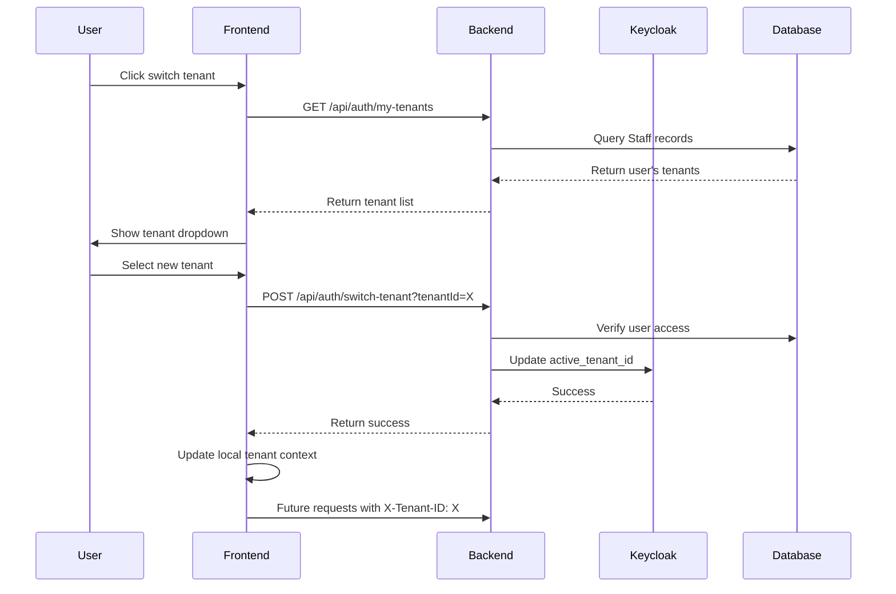

# Tenant Switching Implementation Guide

## Overview

This document explains the complete implementation of tenant switching functionality in ClinicX, including how the backend processes requests for different tenants and maintains security boundaries.

## Table of Contents

1. [Architecture Overview](#architecture-overview)
2. [Frontend Implementation](#frontend-implementation)
3. [Backend Implementation](#backend-implementation)
4. [Request Flow](#request-flow)
5. [Security Considerations](#security-considerations)
6. [Troubleshooting](#troubleshooting)

## Architecture Overview

The tenant switching mechanism allows users who have access to multiple tenants (clinics) to switch between them seamlessly while maintaining proper data isolation and security.

### Key Components

1. **Keycloak**: Manages user authentication and stores tenant access information in user attributes
2. **Frontend**: Provides UI for tenant switching and includes tenant context in API requests
3. **Backend**: Validates tenant access and ensures data isolation per tenant
4. **Database**: Uses schema-per-tenant approach with row-level security

## Frontend Implementation

### 1. Data Model Updates

```typescript
// interface.ts
export interface UserTenantResponse {
  tenantId: string;
  tenantName: string;
  subdomain: string;
  role: string;
  isPrimary: boolean;
  isActive: boolean;
  specialty?: TenantSpecialty;
}

export interface AccessibleTenant {
  tenant_id: string;
  clinic_name: string;
  clinic_type: string;
  specialty: TenantSpecialty;
  roles: string[];
}
```

### 2. Tenant API Service

The `TenantApiService` handles communication with backend tenant endpoints:

```typescript
// tenant-api.service.ts
getMyTenants(): Observable<AccessibleTenant[]> {
  return this.http.get<UserTenantResponse[]>(`${this.apiUrl}/auth/my-tenants`).pipe(
    map(tenants =>
      tenants.map(tenant => ({
        tenant_id: tenant.tenantId,
        clinic_name: tenant.tenantName,
        clinic_type: tenant.specialty || 'CLINIC',
        specialty: tenant.specialty || 'CLINIC',
        roles: tenant.role ? [tenant.role] : [],
      }))
    )
  );
}

switchTenant(tenantId: string): Observable<TenantSwitchResponse> {
  return this.http.post<TenantSwitchResponse>(
    `${this.apiUrl}/auth/switch-tenant?tenantId=${tenantId}`, 
    {}
  );
}
```

### 3. Tenant Switcher Component

The UI component that displays available tenants and handles switching:

```typescript
// tenant-switcher.component.ts
switchTenant(tenant: AccessibleTenant) {
  this.tenantApiService.switchTenant(tenant.tenant_id).pipe(
    tap(response => {
      // Update the current tenant ID in token service
      this.tokenService.setCurrentTenantId(tenant.tenant_id);
      
      // Update token if returned
      if (response?.token) {
        this.tokenService.set({
          access_token: response.token,
          // ... other token properties
        });
      }
    }),
    switchMap(() => this.authService.refresh()),
    tap(() => {
      // Navigate to dashboard after successful switch
      this.router.navigate(['/dashboard']);
    })
  ).subscribe();
}
```

### 4. HTTP Interceptor

All API requests include the current tenant ID in headers:

```typescript
// token.interceptor.ts
intercept(req: HttpRequest<any>, next: HttpHandler): Observable<HttpEvent<any>> {
  const tenantId = this.tokenService.getCurrentTenantId();
  
  if (tenantId) {
    req = req.clone({
      headers: req.headers.set('X-Tenant-ID', tenantId)
    });
  }
  
  return next.handle(req);
}
```

## Backend Implementation

### 1. Tenant Context Management

The backend uses ThreadLocal to maintain tenant context throughout the request lifecycle:

```java
// TenantContext.java
public class TenantContext {
    private static final ThreadLocal<String> currentTenant = new ThreadLocal<>();
    
    public static void setCurrentTenant(String tenantId) {
        currentTenant.set(tenantId);
    }
    
    public static String getCurrentTenant() {
        return currentTenant.get();
    }
    
    public static void clear() {
        currentTenant.remove();
    }
}
```

### 2. Tenant Interceptor

Validates tenant access and sets context for each request:

```java
// TenantInterceptor.java
@Component
public class TenantInterceptor implements HandlerInterceptor {
    
    @Override
    public boolean preHandle(HttpServletRequest request, HttpServletResponse response, 
                           Object handler) throws Exception {
        String tenantId = request.getHeader("X-Tenant-ID");
        
        if (tenantId != null) {
            // Validate user has access to this tenant
            Authentication auth = SecurityContextHolder.getContext().getAuthentication();
            if (auth != null && auth.getPrincipal() instanceof Jwt jwt) {
                String userId = jwt.getSubject();
                
                // Check if user has access to the requested tenant
                if (tenantAccessValidator.hasAccess(userId, tenantId)) {
                    TenantContext.setCurrentTenant(tenantId);
                    return true;
                }
            }
            
            response.sendError(HttpServletResponse.SC_FORBIDDEN, 
                             "Access denied to tenant: " + tenantId);
            return false;
        }
        
        return true;
    }
    
    @Override
    public void afterCompletion(HttpServletRequest request, HttpServletResponse response, 
                              Object handler, Exception ex) {
        TenantContext.clear();
    }
}
```

### 3. Tenant Switching Service

Handles the tenant switching logic and Keycloak synchronization:

```java
// TenantSwitchingServiceImpl.java
@Override
public TenantSwitchResponseDto switchTenant(String tenantId) {
    String userId = getCurrentUserId();
    
    // Verify user has access to the tenant
    Staff staff = staffRepository.findByUserIdAndTenantId(userId, tenantId)
        .orElseThrow(() -> new BusinessRuleException("You don't have access to tenant: " + tenantId));
    
    // Get tenant information
    Tenant tenant = tenantRepository.findByTenantId(tenantId)
        .orElseThrow(() -> new NotFoundException("Tenant not found: " + tenantId));
    
    // Update active tenant in Keycloak
    keycloakAdminService.updateUserActiveTenant(realmName, username, tenantId);
    
    // Update context
    TenantContext.setCurrentTenant(tenantId);
    
    return new TenantSwitchResponseDto(
        "current-access-token",
        "current-refresh-token",
        tenant.getTenantId(),
        tenant.getName(),
        staff.getRole().name(),
        "Successfully switched to tenant: " + tenant.getName()
    );
}
```

### 4. Keycloak Synchronization

Ensures user attributes in Keycloak match backend Staff records:

```java
@Override
public void syncUserTenantsToKeycloak(String userId, String realmName, String username) {
    // Get all staff records for this user
    List<Staff> staffRecords = staffRepository.findByUserId(userId);
    
    // Build accessible_tenants list
    List<Map<String, Object>> accessibleTenants = new ArrayList<>();
    Map<String, List<String>> userTenantRoles = new HashMap<>();
    
    for (Staff staff : staffRecords) {
        Tenant tenant = tenantRepository.findByTenantId(staff.getTenantId())
            .orElseThrow(() -> new NotFoundException("Tenant not found"));
        
        Map<String, Object> tenantAccess = new HashMap<>();
        tenantAccess.put("tenant_id", tenant.getTenantId());
        tenantAccess.put("clinic_name", tenant.getName());
        tenantAccess.put("clinic_type", tenant.getSpecialty());
        tenantAccess.put("specialty", tenant.getSpecialty());
        tenantAccess.put("roles", Arrays.asList(staff.getRole().name()));
        accessibleTenants.add(tenantAccess);
        
        userTenantRoles.put(tenant.getTenantId(), Arrays.asList(staff.getRole().name()));
    }
    
    // Update Keycloak user attributes
    Map<String, List<String>> attributes = new HashMap<>();
    attributes.put("accessible_tenants", Arrays.asList(toJsonString(accessibleTenants)));
    attributes.put("user_tenant_roles", Arrays.asList(toJsonString(userTenantRoles)));
    attributes.put("active_tenant_id", Arrays.asList(primaryStaff.getTenantId()));
    
    keycloakAdminService.updateUserAttributes(realmName, username, attributes);
}
```

### 5. Database Access Control

All JPA entities include tenant_id for row-level security:

```java
// BaseEntity.java
@MappedSuperclass
public abstract class BaseEntity {
    @Column(name = "tenant_id", nullable = false)
    private String tenantId;
    
    @PrePersist
    @PreUpdate
    public void prePersist() {
        if (tenantId == null) {
            tenantId = TenantContext.getCurrentTenant();
        }
    }
}

// Repository queries automatically filter by tenant
@Repository
public interface PatientRepository extends JpaRepository<Patient, Long> {
    @Query("SELECT p FROM Patient p WHERE p.tenantId = :tenantId AND p.id = :id")
    Optional<Patient> findByIdAndTenantId(@Param("id") Long id, @Param("tenantId") String tenantId);
    
    default Optional<Patient> findById(Long id) {
        return findByIdAndTenantId(id, TenantContext.getCurrentTenant());
    }
}
```

## Request Flow

### Initial Login Flow

1. User logs in via Keycloak with username/password
2. Keycloak returns JWT with tenant attributes from user profile
3. Frontend extracts `accessible_tenants` and `active_tenant_id` from JWT
4. Frontend displays current tenant in UI

### Tenant Switching Flow



### Subsequent Request Processing

1. **Frontend sends request** with `X-Tenant-ID` header
2. **TenantInterceptor** validates:
   - Extracts tenant ID from header
   - Verifies user has access via JWT claims or database
   - Sets `TenantContext.setCurrentTenant(tenantId)`
3. **Service layer** processes request:
   - All queries automatically filtered by `tenant_id`
   - New entities get `tenant_id` from TenantContext
4. **Response returns** data only from the requested tenant
5. **Cleanup**: TenantContext cleared after request

## Security Considerations

### 1. Never Trust Client Headers Alone

The `X-Tenant-ID` header is validated against:
- JWT claims (accessible_tenants)
- Database Staff records
- Active session context

### 2. Row-Level Security

All database queries include tenant filtering:
```sql
SELECT * FROM patients WHERE tenant_id = ? AND id = ?
```

### 3. Audit Logging

All tenant switches are logged:
```java
@EventListener
public void handleTenantSwitch(TenantSwitchEvent event) {
    auditService.log("TENANT_SWITCH", 
        "User " + event.getUserId() + " switched to tenant " + event.getTenantId());
}
```

### 4. Permission Validation

Each tenant can have different roles:
```java
// User might be ADMIN in tenant A but DOCTOR in tenant B
if (tenantId.equals("tenant-a")) {
    return userRoles.get("tenant-a"); // Returns ["ADMIN"]
} else if (tenantId.equals("tenant-b")) {
    return userRoles.get("tenant-b"); // Returns ["DOCTOR"]
}
```

## Troubleshooting

### Issue: "You don't have access to tenant: X"

**Cause**: Keycloak user attributes not synced with backend Staff records.

**Solution**:
1. Call sync endpoint: `POST /api/auth/sync-tenants`
2. Verify Staff records exist in database
3. Check Keycloak user attributes in admin console

### Issue: Tenant switching succeeds but data doesn't change

**Cause**: Frontend not including `X-Tenant-ID` header in requests.

**Solution**:
1. Verify TokenInterceptor is registered
2. Check browser DevTools for header presence
3. Ensure `tokenService.setCurrentTenantId()` is called after switch

### Issue: 403 Forbidden after switching tenants

**Cause**: JWT token still contains old tenant context.

**Solution**:
1. Implement token refresh after tenant switch
2. Or require re-login after tenant switch
3. Consider using refresh tokens to get updated JWT

## API Endpoints

### Get User's Tenants
```
GET /api/auth/my-tenants
Authorization: Bearer {token}

Response:
[
  {
    "tenantId": "dental-anas-4c40d19a",
    "tenantName": "Dental Main Anas",
    "subdomain": "dental-anas",
    "role": "ADMIN",
    "isPrimary": true,
    "isActive": true,
    "specialty": "DENTAL"
  },
  {
    "tenantId": "dental-ahmad-7c62a423",
    "tenantName": "Dental Main Ahmad",
    "subdomain": "dental-ahmad",
    "role": "DOCTOR",
    "isPrimary": false,
    "isActive": true,
    "specialty": "DENTAL"
  }
]
```

### Switch Tenant
```
POST /api/auth/switch-tenant?tenantId={tenantId}
Authorization: Bearer {token}
Content-Type: application/json

Body: {}

Response:
{
  "accessToken": "new-jwt-token",
  "refreshToken": "new-refresh-token",
  "tenantId": "dental-ahmad-7c62a423",
  "tenantName": "Dental Main Ahmad",
  "role": "DOCTOR",
  "message": "Successfully switched to tenant: Dental Main Ahmad"
}
```

### Sync Tenants (Admin/Debug)
```
POST /api/auth/sync-tenants
Authorization: Bearer {token}

Response: "Tenants synced successfully"
```

## Best Practices

1. **Always validate tenant access** at multiple layers
2. **Use database constraints** to enforce tenant isolation
3. **Log all tenant switches** for audit trails
4. **Clear tenant context** after each request
5. **Include tenant ID** in all database queries
6. **Test with multiple tenants** to ensure proper isolation
7. **Monitor for cross-tenant data leaks** in logs

## Future Improvements

1. **Implement JWT refresh** to include new tenant context without full re-login
2. **Add caching** for tenant access validation
3. **Create tenant-specific feature flags** for granular control
4. **Implement tenant-specific rate limiting**
5. **Add real-time tenant switching** without page reload