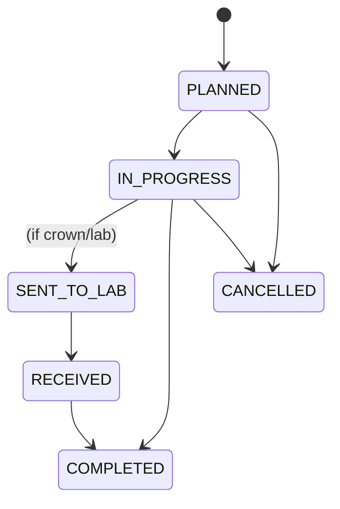

# Backend Plan: Visit (Encounter) With Multiple Procedures

Here’s a backend-first plan to model “one Visit (encounter) with many Procedures” while you’re still pre‑prod. Assumes Java + Spring Boot + JPA, but the ideas map to any stack.

## Overview
- Goal: Evolve from one-procedure-per-visit to Visit (encounter) owning many Procedures, with optional lab tracking (e.g., crowns).
- Benefits: Correct billing (line items), clearer workflow/status per procedure, per‑tooth detail, better reporting, and future‑proofing.

## Domain Model
- Visit (aka Encounter): Header for an appointment; owns procedures.
- Procedure: Billable clinical line item under a Visit (code/name, tooth/surface, fee, status, timings).
- Lab Case: Optional record attached to a crown procedure for lab workflow (sent/received).
- Tip: Using Visit + Procedure aligns with FHIR/HL7 and most EHRs.

## Database Schema
- visits
  - id (UUID PK), patient_id (FK), appointment_id (FK), provider_id (FK), date, time, notes, created_at, updated_at, tenant_id
- procedures
  - id (UUID PK), visit_id (FK), code, name, tooth_number, surfaces (JSON/array), quantity, unit_fee (DECIMAL), duration_minutes, performed_by_id (FK), status (ENUM), started_at, completed_at, updated_at, tenant_id
- lab_cases (optional)
  - id, procedure_id (FK), lab_name, sent_date, due_date, received_date, tracking_no, notes, tenant_id
- Indexes
  - procedures(visit_id), procedures(status), procedures(tooth_number), visits(patient_id, date), all tables (tenant_id)
- Constraints
  - NOT NULL where appropriate, FK ON DELETE CASCADE (or soft delete policy), ENUM for status.

### ER Diagram

## Status Model
- Procedure.status: PLANNED → IN_PROGRESS → SENT_TO_LAB → RECEIVED → COMPLETED (or CANCELLED)
- Visit.status (optional, derived): e.g., COMPLETED only if all procedures completed.
- Enforce valid state transitions in the service layer.

### Procedure Status State Diagram

## Money & Units
- Use DECIMAL/BigDecimal for money; store currency if multi-currency is possible.
- Derive Visit.totalCost = SUM(procedure.unit_fee × quantity) on read; cache only if needed.

## Materials Placement (Recommended)
- Prefer Procedure‑level materials for accurate costing:
  - ProcedureMaterial: id, procedure_id, material_id, qty, unit, unit_cost, total_cost, consumed_at, notes
- Optional Visit‑level consumables (rare): for non‑attributable items (e.g., PPE) use VisitMaterial with visit_id.
- Aggregation endpoint can report all materials used in a visit by joining all procedure materials under that visit.

## Billing Models (Single Total vs Line Items)
- One billable procedure + non‑billable steps:
  - Keep one priced procedure (e.g., Crown #14) and record sub‑steps as billable=false.
  - Create a single invoice item for the priced procedure; sub‑steps remain clinical only.
- Case/Bundle price:
  - A Case (plan item) with a single price; link all procedures (billable=false) to the case and invoice the case.
- Installments without splitting the charge:
  - Create one invoice and allocate multiple payments to it; or take deposits (patient credit) and apply at completion.

## Spring/JPA Entities (outline)
- Visit
  - `@Entity` with `@OneToMany(mappedBy = "visit", orphanRemoval = true, cascade = PERSIST)` to procedures.
  - Consider soft‑deletes; avoid cascading REMOVE if you don’t want to delete procedures automatically.
- Procedure
  - `@ManyToOne(fetch = LAZY)` Visit; `@Enumerated(EnumType.STRING)` for status.
- LabCase
  - `@OneToOne` or `@ManyToOne` to Procedure depending on needs.

## DTOs
- VisitDto: id, patientId, appointmentId, date, time, providerId, notes, procedureCount, totalCost.
- VisitDetailsDto: VisitDto + `procedures: ProcedureDto[]`.
- ProcedureDto: id, visitId, code, name, toothNumber, surfaces[], quantity, unitFee, durationMinutes, performedById, status, startedAt, completedAt, labCase?.
- Use MapStruct for mapping; keep DTOs stable and versioned.

## Controllers (Spring Boot)
- GET `/api/v1/visits/patient/{patientId}` → Page<VisitDto> (headers with aggregates via JOIN/SUM or cached).
- GET `/api/v1/visits/{id}` → VisitDetailsDto (eager fetch procedures via `@EntityGraph`).
- POST `/api/v1/visits` → create Visit header.
- POST `/api/v1/visits/{id}/procedures` → add Procedure.
- PATCH `/api/v1/procedures/{id}` → update status/fee/notes.
- DELETE `/api/v1/procedures/{id}` → optional.
- POST `/api/v1/visits/search` → advanced filters (status, provider, code, date range).

### Sequence: Create Visit and Add Procedure

## Service Layer
- Use `@Transactional` boundaries; validate status transitions.
- Optimistic locking with `@Version` or `updatedAt` checks.
- Multi‑tenant filtering (tenant_id) in all queries.

## Validation
- Bean Validation: `@NotNull`, `@DecimalMin("0.00")`, `@Size` on codes/names.
- Business rules: lock procedures once part of submitted claims; allow adjustments via correction procedures.

## Migrations (pre‑prod fast path)
- Create `procedures` and `lab_cases` tables.
- Backfill: For each existing visit, insert one procedure with name/cost/status from the visit.
- Stop writing name/cost/status on Visit header; later drop deprecated columns.

## Queries & Performance
- Aggregates: compute on read (JOIN + SUM) or store cached totals on Visit updated by triggers/service.
- Pagination/sorting: Spring `Pageable` (`page`, `size`, `sort=field,dir`).
- Filtering: by procedure status/code/provider (JOIN); index WHERE columns.

## Lab Workflow (Crowns)
- Track lab via Procedure status (SENT_TO_LAB → RECEIVED) and optional LabCase entity with dates/lab info.
- Optional reminders for due/overdue cases.

## Security
- Role checks (DOCTOR/ADMIN) for create/update.
- Audit: createdBy/updatedBy; use `updatedAt` for UI refresh.

## Example Controller Signatures
- `Page<VisitDto> list(UUID patientId, Pageable pageable, VisitFilter filter)`
- `VisitDetailsDto get(UUID id)`
- `VisitDto create(CreateVisitRequest req)`
- `ProcedureDto add(UUID visitId, CreateProcedureRequest req)`
- `ProcedureDto patch(UUID procedureId, ProcedurePatch patch)`

## Implementation Phases
- Phase 1: Entities + endpoints (visits, procedures, labCases). Backfill dev data.
- Phase 2: UI details page with procedures table; update create flow to add first procedure.
- Phase 3: Drop deprecated Visit fields; rely on aggregates; add reports.

---

Adopting this model now (pre‑prod) gives clean billing and flexible workflows for crowns and everyday visits (exams, fillings, extractions, endo, implants) without retrofitting later. Also standardizes material tracking at the procedure level for accurate cost and analytics.
