# ClinicX API Gateway Pattern Implementation Guide

## Executive Summary
This document defines the API Gateway pattern implementation for the ClinicX multi-tenant SaaS platform. The API Gateway serves as a single entry point for all client requests, providing centralized cross-cutting concerns, intelligent routing, and enhanced security while simplifying client interactions with the microservices architecture.

## Table of Contents
1. [Overview](#overview)
2. [Gateway Architecture](#gateway-architecture)
3. [Request Routing](#request-routing)
4. [Authentication & Authorization](#authentication--authorization)
5. [Rate Limiting & Throttling](#rate-limiting--throttling)
6. [Request/Response Transformation](#requestresponse-transformation)
7. [Circuit Breaker Pattern](#circuit-breaker-pattern)
8. [Load Balancing](#load-balancing)
9. [Caching at Gateway](#caching-at-gateway)
10. [Monitoring & Logging](#monitoring--logging)
11. [Implementation Examples](#implementation-examples)
12. [Implementation TODOs](#implementation-todos)
13. [What This Implementation Does](#what-this-implementation-does)

## Overview

### System Topology with API Gateway

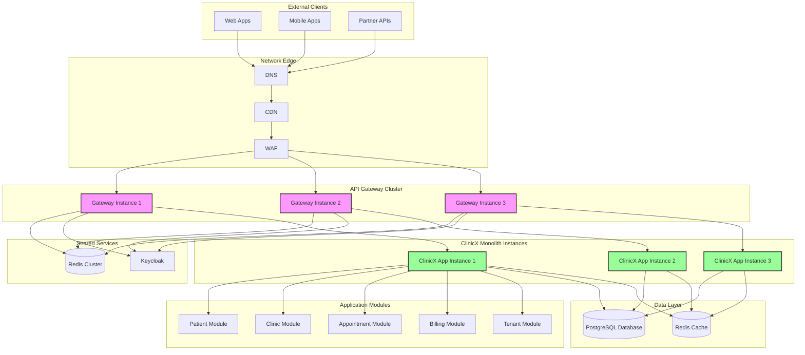

### What is an API Gateway?
An API Gateway is a server that acts as an API front-end, receiving API requests, enforcing throttling and security policies, passing requests to back-end services, and then passing responses back to the requester.

### Why API Gateway for ClinicX Monolith?
Even with a monolithic architecture, an API Gateway provides significant benefits for ClinicX:
- **Single entry point** for all API consumers
- **Centralized security** and authentication before reaching the monolith
- **Rate limiting** to protect the monolith from overload
- **Response caching** to reduce load on the monolith
- **Load balancing** across multiple monolith instances
- **API versioning** support without modifying the monolith
- **Enhanced monitoring** and analytics for all API traffic
- **Circuit breaker** protection for the monolith
- **Request/response transformation** for different client needs

## Gateway Architecture

### Architecture Overview Diagram

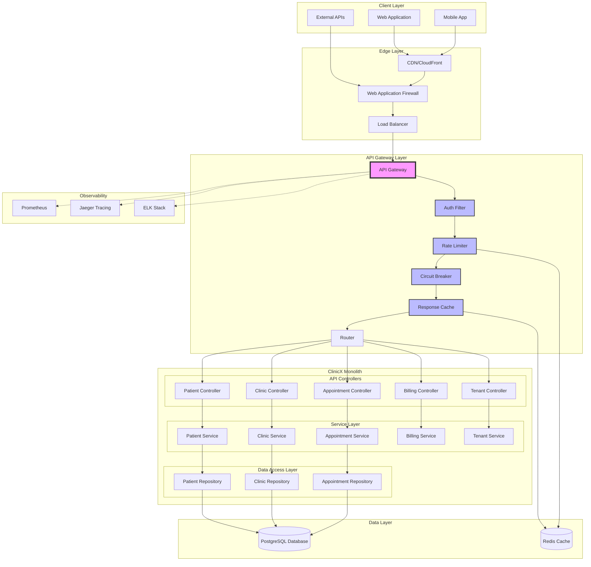

### What Gateway Architecture Does
**Purpose**: Establishes a centralized entry point that manages all incoming API requests, providing protection, caching, and load balancing for the monolithic application.

**Problems Solved**:
- Direct exposure of monolith to external clients
- Lack of request throttling causing monolith overload
- No caching layer leading to repeated processing
- Difficult to scale monolith horizontally
- Complex to add new features without modifying monolith
- Missing centralized security and monitoring

**How It Works**:
1. All client requests go through the gateway
2. Gateway authenticates and authorizes requests
3. Rate limiting protects monolith from overload
4. Cache serves frequent requests without hitting monolith
5. Load balancer distributes requests across monolith instances
6. Circuit breaker prevents cascading failures
7. Metrics and logs collected centrally

### High-Level Architecture
```yaml
# Gateway Architecture Components for Monolith
components:
  edge:
    - Load Balancer (AWS ALB/NLB)
    - CDN (CloudFront)
    - WAF (Web Application Firewall)
  
  gateway:
    - Spring Cloud Gateway
    - Authentication Filter
    - Rate Limiting Filter
    - Routing Engine
    - Response Cache
    - Circuit Breaker
  
  backend:
    - ClinicX Monolith Instance 1
    - ClinicX Monolith Instance 2
    - ClinicX Monolith Instance 3
  
  supporting:
    - Keycloak (Authentication)
    - Redis (Cache & Rate Limiting)
    - PostgreSQL (Database)
    - Monitoring (Prometheus)
    - Tracing (Jaeger)
```

### Gateway Configuration for Monolith
```java
@Configuration
public class GatewayConfig {
    
    @Bean
    public RouteLocator customRouteLocator(RouteLocatorBuilder builder) {
        return builder.routes()
            // All API routes to monolith
            .route("clinicx-monolith", r -> r
                .path("/api/**")
                .filters(f -> f
                    .addRequestHeader("X-Gateway", "true")
                    .circuitBreaker(config -> config
                        .setName("clinicx-cb")
                        .setFallbackUri("forward:/fallback"))
                    .requestRateLimiter(config -> config
                        .setRateLimiter(redisRateLimiter()))
                    .retry(config -> config
                        .setRetries(3)
                        .setStatuses(HttpStatus.SERVICE_UNAVAILABLE)
                        .setMethods(HttpMethod.GET)))
                .uri("lb://CLINICX-APP"))
            
            // Health check route
            .route("health", r -> r
                .path("/health/**")
                .filters(f -> f
                    .setPath("/actuator/health"))
                .uri("lb://CLINICX-APP"))
            
            // Static resources (bypass cache)
            .route("static", r -> r
                .path("/static/**", "/public/**")
                .uri("lb://CLINICX-APP"))
            .build();
    }
    
    @Bean
    @LoadBalanced
    public RestTemplate restTemplate() {
        return new RestTemplate();
    }
}
```

## Request Routing

### Request Flow Sequence Diagram

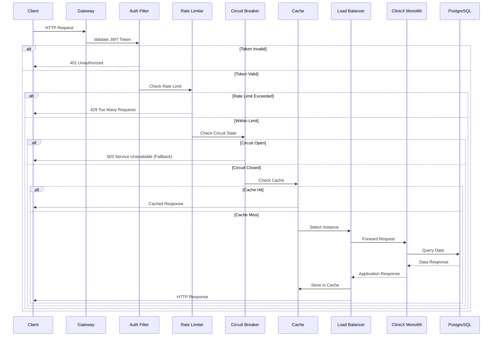

### What Request Routing Does
**Purpose**: Directs incoming requests to available monolith instances with load balancing and health awareness.

**Problems Solved**:
- Manual load balancing by clients
- No health-aware routing
- Uneven load distribution across instances
- Difficult horizontal scaling
- No centralized routing control
- Missing routing metrics

**How It Works**:
1. Request path analyzed against route definitions
2. Tenant context extracted from JWT token
3. Health check validates monolith instances
4. Load balancer selects healthy instance
5. Request forwarded with tenant context
6. Route metrics collected for analysis

### Load Balancing for Monolith Instances
```java
@Component
public class MonolithLoadBalancingFilter implements GlobalFilter, Ordered {
    
    @Autowired
    private LoadBalancer loadBalancer;
    
    @Autowired
    private HealthChecker healthChecker;
    
    @Override
    public Mono<Void> filter(ServerWebExchange exchange, GatewayFilterChain chain) {
        ServerHttpRequest request = exchange.getRequest();
        
        // Extract tenant from JWT
        String tenantId = extractTenantId(request);
        
        // Get healthy monolith instances
        List<ServiceInstance> healthyInstances = healthChecker.getHealthyInstances("CLINICX-APP");
        
        if (healthyInstances.isEmpty()) {
            return handleNoHealthyInstances(exchange);
        }
        
        // Select instance based on load balancing strategy
        ServiceInstance selectedInstance = loadBalancer.choose(healthyInstances, tenantId);
        
        // Modify request with selected instance
        ServerHttpRequest modifiedRequest = request.mutate()
            .uri(URI.create(selectedInstance.getUri() + request.getPath()))
            .header("X-Tenant-Id", tenantId)
            .header("X-Instance-Id", selectedInstance.getInstanceId())
            .header("X-Routed-By", "api-gateway")
            .build();
        
        return chain.filter(exchange.mutate().request(modifiedRequest).build());
    }
    
    @Override
    public int getOrder() {
        return RouteToRequestUrlFilter.ROUTE_TO_URL_FILTER_ORDER + 1;
    }
}
```

### Tenant-Aware Configuration
```java
@Service
public class TenantConfigurationService {
    
    private final Map<String, TenantConfig> tenantConfigs = new ConcurrentHashMap<>();
    
    public TenantConfig getConfigForTenant(String tenantId) {
        return tenantConfigs.computeIfAbsent(tenantId, this::loadTenantConfig);
    }
    
    private TenantConfig loadTenantConfig(String tenantId) {
        // Load tenant-specific configuration
        return TenantConfig.builder()
            .tenantId(tenantId)
            .rateLimitTier(getRateLimitTier(tenantId))
            .cacheEnabled(isCacheEnabledForTenant(tenantId))
            .preferredInstance(getPreferredInstance(tenantId))
            .customHeaders(getCustomHeaders(tenantId))
            .build();
    }
    
    @Data
    @Builder
    public static class TenantConfig {
        private String tenantId;
        private String rateLimitTier; // trial, standard, premium, enterprise
        private boolean cacheEnabled;
        private String preferredInstance; // For sticky sessions if needed
        private Map<String, String> customHeaders;
    }
}
```

## Authentication & Authorization

### Authentication Flow Diagram

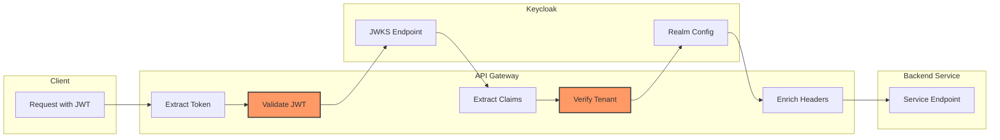

### What Authentication & Authorization at Gateway Does
**Purpose**: Validates user identity and permissions at the edge, preventing unauthorized requests from reaching backend services.

**Problems Solved**:
- Repeated auth implementation in each service
- Inconsistent security enforcement
- Performance overhead of multiple auth checks
- Complex token validation logic
- Missing centralized auth metrics
- Difficult security policy updates

**How It Works**:
1. JWT token extracted from request
2. Token validated against Keycloak
3. User roles and permissions extracted
4. Tenant context verified
5. Request enriched with auth context
6. Unauthorized requests rejected early

### JWT Authentication Filter
```java
@Component
@Slf4j
public class JwtAuthenticationFilter implements GatewayFilter, Ordered {
    
    @Autowired
    private JwtValidator jwtValidator;
    
    @Autowired
    private KeycloakService keycloakService;
    
    @Override
    public Mono<Void> filter(ServerWebExchange exchange, GatewayFilterChain chain) {
        ServerHttpRequest request = exchange.getRequest();
        
        // Extract JWT token
        String token = extractToken(request);
        if (token == null) {
            return handleUnauthorized(exchange, "Missing authentication token");
        }
        
        // Validate token
        return jwtValidator.validateToken(token)
            .flatMap(claims -> {
                // Extract tenant and user info
                String tenantId = claims.get("tenant_id", String.class);
                String userId = claims.get("sub", String.class);
                List<String> roles = claims.get("roles", List.class);
                
                // Verify tenant access
                return keycloakService.verifyTenantAccess(tenantId, userId)
                    .flatMap(verified -> {
                        if (!verified) {
                            return handleForbidden(exchange, "Tenant access denied");
                        }
                        
                        // Enrich request with auth context
                        ServerHttpRequest enrichedRequest = request.mutate()
                            .header("X-User-Id", userId)
                            .header("X-Tenant-Id", tenantId)
                            .header("X-User-Roles", String.join(",", roles))
                            .build();
                        
                        return chain.filter(exchange.mutate()
                            .request(enrichedRequest)
                            .build());
                    });
            })
            .onErrorResume(error -> {
                log.error("Authentication failed", error);
                return handleUnauthorized(exchange, "Invalid authentication token");
            });
    }
    
    @Override
    public int getOrder() {
        return -100; // Execute early in filter chain
    }
}
```

### Authorization Filter
```java
@Component
public class AuthorizationFilter implements GlobalFilter, Ordered {
    
    @Autowired
    private AuthorizationService authorizationService;
    
    @Override
    public Mono<Void> filter(ServerWebExchange exchange, GatewayFilterChain chain) {
        ServerHttpRequest request = exchange.getRequest();
        
        // Extract user context from headers (set by auth filter)
        String userId = request.getHeaders().getFirst("X-User-Id");
        String tenantId = request.getHeaders().getFirst("X-Tenant-Id");
        List<String> roles = Arrays.asList(
            request.getHeaders().getFirst("X-User-Roles").split(",")
        );
        
        // Check endpoint permissions
        String path = request.getPath().value();
        String method = request.getMethod().name();
        
        return authorizationService.authorize(userId, tenantId, roles, path, method)
            .flatMap(authorized -> {
                if (!authorized) {
                    return handleForbidden(exchange, "Insufficient permissions");
                }
                return chain.filter(exchange);
            });
    }
    
    @Override
    public int getOrder() {
        return -90; // After authentication
    }
}
```

## Rate Limiting & Throttling

### Rate Limiting Flow Diagram

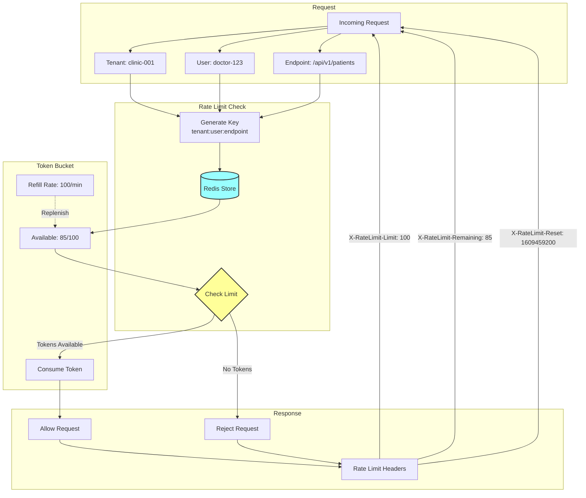

### Multi-Tier Rate Limiting

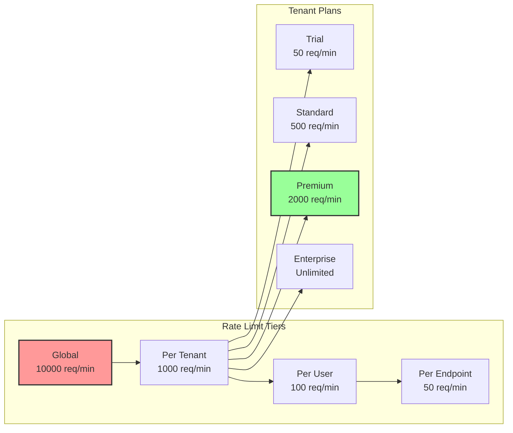

### What Rate Limiting & Throttling Does
**Purpose**: Controls request rates at the gateway level, protecting backend services from overload and ensuring fair resource allocation among tenants.

**Problems Solved**:
- Service overload from excessive requests
- Unfair resource monopolization
- DDoS attack vulnerability
- Cascading failures under load
- Unpredictable service performance
- Costly auto-scaling triggers

**How It Works**:
1. Request rate tracked per tenant/user
2. Token bucket algorithm manages bursts
3. Redis stores distributed rate limit state
4. Headers inform clients of limits
5. Graceful degradation when limits exceeded
6. Different limits for different API tiers

### Rate Limiting Implementation
```java
@Component
public class RateLimitingGatewayFilterFactory extends AbstractGatewayFilterFactory<RateLimitingGatewayFilterFactory.Config> {
    
    @Autowired
    private RedisTemplate<String, String> redisTemplate;
    
    @Override
    public GatewayFilter apply(Config config) {
        return (exchange, chain) -> {
            ServerHttpRequest request = exchange.getRequest();
            String tenantId = request.getHeaders().getFirst("X-Tenant-Id");
            String userId = request.getHeaders().getFirst("X-User-Id");
            
            // Create rate limit key
            String key = String.format("rate_limit:%s:%s:%s", 
                tenantId, userId, request.getPath().value());
            
            // Check rate limit
            Long requestCount = redisTemplate.opsForValue().increment(key);
            if (requestCount == 1) {
                redisTemplate.expire(key, Duration.ofSeconds(config.getWindow()));
            }
            
            if (requestCount > config.getLimit()) {
                // Rate limit exceeded
                ServerHttpResponse response = exchange.getResponse();
                response.setStatusCode(HttpStatus.TOO_MANY_REQUESTS);
                response.getHeaders().add("X-RateLimit-Limit", String.valueOf(config.getLimit()));
                response.getHeaders().add("X-RateLimit-Remaining", "0");
                response.getHeaders().add("X-RateLimit-Retry-After", String.valueOf(config.getWindow()));
                
                return response.writeWith(Mono.just(
                    response.bufferFactory().wrap(
                        "Rate limit exceeded".getBytes()
                    )
                ));
            }
            
            // Add rate limit headers
            ServerHttpResponse response = exchange.getResponse();
            response.getHeaders().add("X-RateLimit-Limit", String.valueOf(config.getLimit()));
            response.getHeaders().add("X-RateLimit-Remaining", 
                String.valueOf(config.getLimit() - requestCount));
            
            return chain.filter(exchange);
        };
    }
    
    @Data
    public static class Config {
        private int limit = 100;
        private int window = 60; // seconds
        private String keyResolver = "tenant";
    }
}
```

### Adaptive Throttling
```java
@Component
public class AdaptiveThrottlingFilter implements GlobalFilter {
    
    @Autowired
    private MetricsService metricsService;
    
    @Autowired
    private CircuitBreakerRegistry circuitBreakerRegistry;
    
    @Override
    public Mono<Void> filter(ServerWebExchange exchange, GatewayFilterChain chain) {
        // Check system load
        double cpuUsage = metricsService.getCpuUsage();
        double memoryUsage = metricsService.getMemoryUsage();
        int activeRequests = metricsService.getActiveRequests();
        
        // Adaptive throttling based on system state
        if (cpuUsage > 0.8 || memoryUsage > 0.85 || activeRequests > 1000) {
            // System under stress - apply stricter limits
            return applyBackpressure(exchange, chain);
        }
        
        // Check circuit breaker states
        boolean anyOpen = circuitBreakerRegistry.getAllCircuitBreakers()
            .stream()
            .anyMatch(cb -> cb.getState() == CircuitBreaker.State.OPEN);
        
        if (anyOpen) {
            // Some services are failing - reduce load
            return applyShedding(exchange, chain);
        }
        
        return chain.filter(exchange);
    }
    
    private Mono<Void> applyBackpressure(ServerWebExchange exchange, GatewayFilterChain chain) {
        // Delay non-critical requests
        String priority = exchange.getRequest().getHeaders().getFirst("X-Priority");
        if (!"high".equals(priority)) {
            return Mono.delay(Duration.ofMillis(100))
                .then(chain.filter(exchange));
        }
        return chain.filter(exchange);
    }
}
```

## Request/Response Transformation

### Transformation Flow Diagram

```mermaid
graph LR
    subgraph "Client Request"
        V1[API v1 Format<br/>fullName: John Doe]
    end
    
    subgraph "Gateway Transformation"
        DETECT[Detect Version]
        RULES[Load Transform Rules]
        TRANSFORM[Apply Transformation]
    end
    
    subgraph "Backend Request"
        V2[API v2 Format<br/>firstName: John<br/>lastName: Doe]
    end
    
    subgraph "Backend Response"
        RESP_V2[v2 Response Format]
    end
    
    subgraph "Gateway Response Transform"
        REVERSE[Reverse Transform]
    end
    
    subgraph "Client Response"
        RESP_V1[v1 Response Format]
    end
    
    V1 --> DETECT
    DETECT --> RULES
    RULES --> TRANSFORM
    TRANSFORM --> V2
    
    V2 --> RESP_V2
    RESP_V2 --> REVERSE
    REVERSE --> RESP_V1
    
    style TRANSFORM fill:#9ff,stroke:#333,stroke-width:2px
    style REVERSE fill:#9ff,stroke:#333,stroke-width:2px
```

### What Request/Response Transformation Does
**Purpose**: Modifies requests and responses at the gateway level to adapt between client expectations and backend service implementations.

**Problems Solved**:
- API version incompatibilities
- Protocol translation needs
- Response format inconsistencies
- Missing request enrichment
- Complex client-side transformations
- Backend API changes affecting clients

**How It Works**:
1. Request headers and body intercepted
2. Transformations applied based on rules
3. Request enriched with gateway context
4. Backend response captured
5. Response transformed to client format
6. Headers and status codes adjusted

### Request Transformation
```java
@Component
public class RequestTransformationFilter implements GatewayFilter {
    
    @Autowired
    private TransformationRuleEngine ruleEngine;
    
    @Override
    public Mono<Void> filter(ServerWebExchange exchange, GatewayFilterChain chain) {
        ServerHttpRequest request = exchange.getRequest();
        String apiVersion = extractApiVersion(request);
        
        // Get transformation rules for this request
        TransformationRules rules = ruleEngine.getRules(
            request.getPath().value(), 
            apiVersion
        );
        
        if (rules.hasRequestTransformation()) {
            // Transform request body
            return DataBufferUtils.join(request.getBody())
                .flatMap(dataBuffer -> {
                    byte[] bytes = new byte[dataBuffer.readableByteCount()];
                    dataBuffer.read(bytes);
                    DataBufferUtils.release(dataBuffer);
                    
                    // Apply transformation
                    String originalBody = new String(bytes, StandardCharsets.UTF_8);
                    String transformedBody = rules.transformRequest(originalBody);
                    
                    // Create new request with transformed body
                    ServerHttpRequest transformedRequest = request.mutate()
                        .header("Content-Length", String.valueOf(transformedBody.length()))
                        .build();
                    
                    return chain.filter(exchange.mutate()
                        .request(transformedRequest)
                        .build());
                });
        }
        
        return chain.filter(exchange);
    }
}
```

### Response Transformation
```java
@Component
public class ResponseTransformationFilter implements GlobalFilter, Ordered {
    
    @Override
    public Mono<Void> filter(ServerWebExchange exchange, GatewayFilterChain chain) {
        return chain.filter(exchange).then(Mono.fromRunnable(() -> {
            ServerHttpResponse response = exchange.getResponse();
            
            // Add gateway headers
            response.getHeaders().add("X-Gateway-Version", "1.0");
            response.getHeaders().add("X-Response-Time", 
                String.valueOf(System.currentTimeMillis() - getRequestStartTime(exchange)));
            
            // Transform response based on client version
            String clientVersion = exchange.getRequest().getHeaders().getFirst("X-Client-Version");
            if (clientVersion != null && clientVersion.equals("1.0")) {
                // Apply v1 response transformation
                ModifyResponseBodyGatewayFilterFactory.Config config = 
                    new ModifyResponseBodyGatewayFilterFactory.Config();
                
                config.setRewriteFunction(String.class, String.class, 
                    (exchange1, responseBody) -> {
                        // Transform response for v1 clients
                        return Mono.just(transformToV1Format(responseBody));
                    });
            }
        }));
    }
    
    @Override
    public int getOrder() {
        return -1;
    }
}
```

## Circuit Breaker Pattern

### Circuit Breaker State Diagram

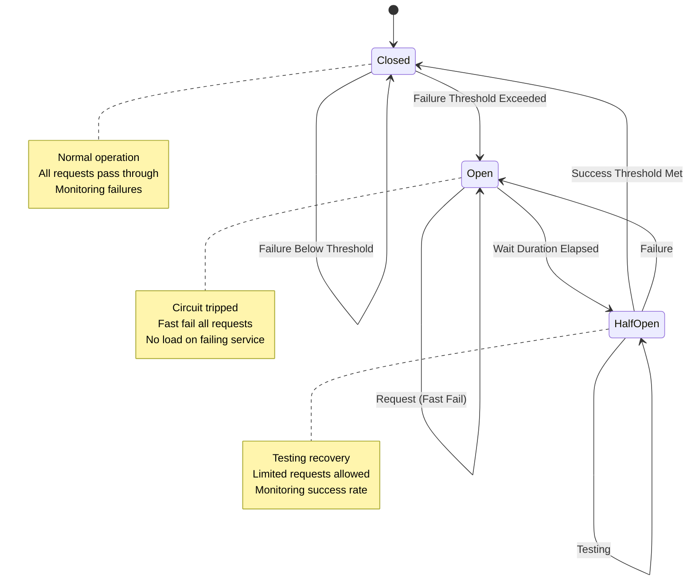

### Circuit Breaker Metrics Flow

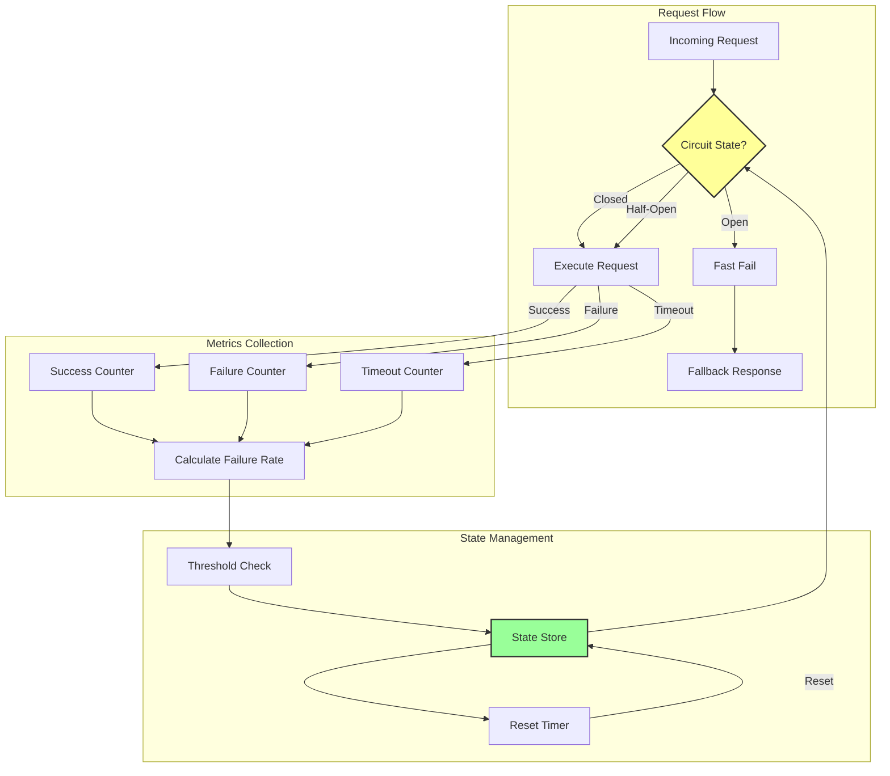

### What Circuit Breaker Pattern Does
**Purpose**: Prevents cascade failures by detecting service failures and providing fallback responses, allowing failed services time to recover.

**Problems Solved**:
- Cascade failures across services
- Wasted resources on failing calls
- Poor user experience during outages
- Slow failure detection
- Missing service recovery time
- Unpredictable system behavior

**How It Works**:
1. Service calls monitored for failures
2. Circuit opens after threshold exceeded
3. Fast-fail for subsequent requests
4. Fallback responses served
5. Periodic health checks attempted
6. Circuit closes when service recovers

### Circuit Breaker Implementation
```java
@Configuration
public class CircuitBreakerConfig {
    
    @Bean
    public Customizer<ReactiveResilience4JCircuitBreakerFactory> defaultCustomizer() {
        return factory -> factory.configureDefault(id -> new Resilience4JConfigBuilder(id)
            .circuitBreakerConfig(CircuitBreakerConfig.custom()
                .slidingWindowSize(10)
                .slidingWindowType(CircuitBreakerConfig.SlidingWindowType.TIME_BASED)
                .minimumNumberOfCalls(5)
                .failureRateThreshold(50)
                .waitDurationInOpenState(Duration.ofSeconds(30))
                .permittedNumberOfCallsInHalfOpenState(3)
                .slowCallDurationThreshold(Duration.ofSeconds(3))
                .slowCallRateThreshold(50)
                .build())
            .timeLimiterConfig(TimeLimiterConfig.custom()
                .timeoutDuration(Duration.ofSeconds(3))
                .build())
            .build());
    }
    
    @Bean
    public CircuitBreakerGatewayFilterFactory circuitBreakerGatewayFilterFactory(
            ReactiveResilience4JCircuitBreakerFactory circuitBreakerFactory) {
        return new CircuitBreakerGatewayFilterFactory(circuitBreakerFactory);
    }
}
```

### Fallback Handler
```java
@RestController
@RequestMapping("/fallback")
public class FallbackController {
    
    @GetMapping("/patient")
    public Mono<ResponseEntity<ApiResponse<String>>> patientServiceFallback(
            ServerHttpRequest request) {
        String correlationId = request.getHeaders().getFirst("X-Correlation-Id");
        
        return Mono.just(ResponseEntity.status(HttpStatus.SERVICE_UNAVAILABLE)
            .body(ApiResponse.<String>builder()
                .success(false)
                .message("Patient service is temporarily unavailable")
                .correlationId(correlationId)
                .timestamp(Instant.now())
                .errors(List.of(ErrorDetail.builder()
                    .code("SERVICE_UNAVAILABLE")
                    .message("The patient service is currently experiencing issues. Please try again later.")
                    .build()))
                .build()));
    }
    
    @GetMapping("/appointment")
    public Mono<ResponseEntity<ApiResponse<List<AppointmentDto>>>> appointmentServiceFallback() {
        // Return cached data if available
        List<AppointmentDto> cachedAppointments = getCachedAppointments();
        
        if (!cachedAppointments.isEmpty()) {
            return Mono.just(ResponseEntity.ok(ApiResponse.<List<AppointmentDto>>builder()
                .success(true)
                .message("Returning cached appointments")
                .data(cachedAppointments)
                .metadata(ResponseMetadata.builder()
                    .context(Map.of("source", "cache", "stale", true))
                    .build())
                .build()));
        }
        
        return Mono.just(ResponseEntity.status(HttpStatus.SERVICE_UNAVAILABLE)
            .body(ApiResponse.<List<AppointmentDto>>builder()
                .success(false)
                .message("Appointment service is temporarily unavailable")
                .build()));
    }
}
```

## Load Balancing

### Load Balancing Strategy Diagram

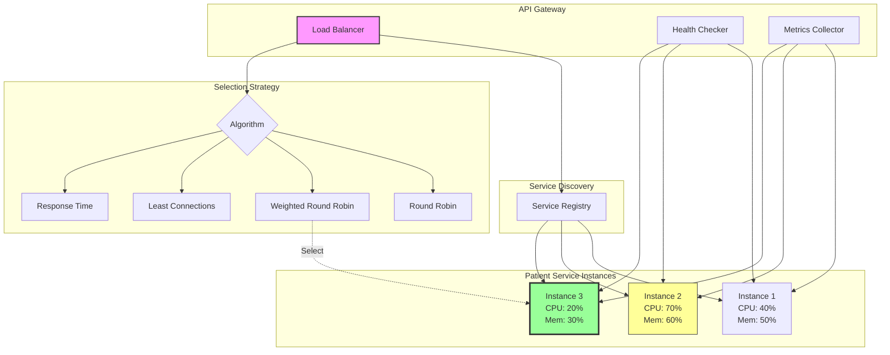

### What Load Balancing Does
**Purpose**: Distributes incoming requests across multiple service instances to optimize resource utilization and ensure high availability.

**Problems Solved**:
- Uneven load distribution
- Service instance overload
- Single point of failure
- Poor resource utilization
- Manual failover requirements
- Lack of health-aware routing

**How It Works**:
1. Service instances registered in discovery
2. Health checks validate instance availability
3. Load balancing algorithm selects instance
4. Request routed to selected instance
5. Failed instances removed from pool
6. Metrics guide balancing decisions

### Load Balancer Configuration
```java
@Configuration
public class LoadBalancerConfig {
    
    @Bean
    @LoadBalanced
    public WebClient.Builder loadBalancedWebClientBuilder() {
        return WebClient.builder();
    }
    
    @Bean
    public ReactorLoadBalancerExchangeFilterFunction lbFunction(
            ReactiveLoadBalancer.Factory<ServiceInstance> factory) {
        return new ReactorLoadBalancerExchangeFilterFunction(factory);
    }
    
    @Bean
    public ServiceInstanceListSupplier serviceInstanceListSupplier(
            ConfigurableApplicationContext context) {
        return ServiceInstanceListSupplier.builder()
            .withBlockingDiscoveryClient()
            .withSameInstancePreference()
            .withHealthChecks()
            .withZonePreference()
            .withRequestBasedStickySession()
            .build(context);
    }
}
```

### Custom Load Balancing Strategy
```java
@Component
public class TenantAwareLoadBalancer implements ReactorServiceInstanceLoadBalancer {
    
    @Autowired
    private ServiceInstanceListSupplierProvider serviceInstanceListSupplierProvider;
    
    @Override
    public Mono<Response<ServiceInstance>> choose(Request request) {
        String tenantId = extractTenantId(request);
        
        return serviceInstanceListSupplierProvider.get(request)
            .getInstances()
            .next()
            .map(instances -> {
                // Filter instances based on tenant preferences
                List<ServiceInstance> eligibleInstances = instances.stream()
                    .filter(instance -> isEligibleForTenant(instance, tenantId))
                    .collect(Collectors.toList());
                
                if (eligibleInstances.isEmpty()) {
                    return new EmptyResponse();
                }
                
                // Apply weighted round-robin based on instance capacity
                ServiceInstance selected = selectInstance(eligibleInstances, tenantId);
                return new DefaultResponse(selected);
            });
    }
    
    private ServiceInstance selectInstance(List<ServiceInstance> instances, String tenantId) {
        // Consider instance metrics
        return instances.stream()
            .min(Comparator.comparing(instance -> {
                // Get instance load metrics
                double cpuUsage = getMetric(instance, "cpu.usage");
                double memoryUsage = getMetric(instance, "memory.usage");
                int activeConnections = (int) getMetric(instance, "connections.active");
                
                // Calculate load score
                return cpuUsage * 0.4 + memoryUsage * 0.3 + activeConnections * 0.3;
            }))
            .orElse(instances.get(0));
    }
}
```

## Caching at Gateway

### Cache Flow Diagram

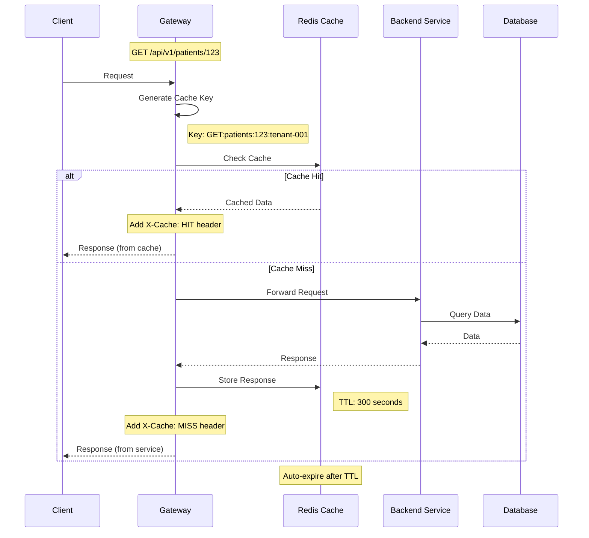

### Cache Invalidation Strategy

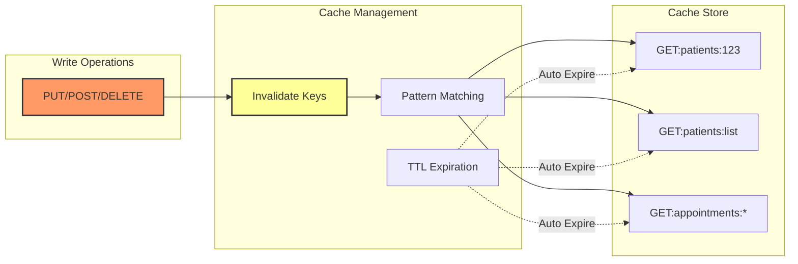

### What Caching at Gateway Does
**Purpose**: Stores frequently accessed responses at the gateway level, reducing backend load and improving response times for cacheable content.

**Problems Solved**:
- Redundant backend processing
- High latency for static content
- Unnecessary database queries
- Network overhead
- Poor performance for read-heavy APIs
- Backend service overload

**How It Works**:
1. Response cache key generated from request
2. Cache checked before routing to backend
3. Cache hits returned immediately
4. Cache misses routed to backend
5. Backend responses cached per rules
6. Cache invalidation on data changes

### Gateway Cache Implementation
```java
@Component
public class GatewayCacheFilter implements GlobalFilter, Ordered {
    
    @Autowired
    private ReactiveRedisTemplate<String, CachedResponse> redisTemplate;
    
    @Autowired
    private CacheRuleEngine cacheRuleEngine;
    
    @Override
    public Mono<Void> filter(ServerWebExchange exchange, GatewayFilterChain chain) {
        ServerHttpRequest request = exchange.getRequest();
        
        // Check if request is cacheable
        if (!cacheRuleEngine.isCacheable(request)) {
            return chain.filter(exchange);
        }
        
        // Generate cache key
        String cacheKey = generateCacheKey(request);
        
        // Try to get from cache
        return redisTemplate.opsForValue().get(cacheKey)
            .flatMap(cachedResponse -> {
                // Validate cache entry
                if (cachedResponse.isExpired()) {
                    return continueWithBackend(exchange, chain, cacheKey);
                }
                
                // Return cached response
                ServerHttpResponse response = exchange.getResponse();
                response.setStatusCode(HttpStatus.valueOf(cachedResponse.getStatusCode()));
                response.getHeaders().putAll(cachedResponse.getHeaders());
                response.getHeaders().add("X-Cache", "HIT");
                
                DataBuffer buffer = response.bufferFactory()
                    .wrap(cachedResponse.getBody());
                return response.writeWith(Mono.just(buffer));
            })
            .switchIfEmpty(continueWithBackend(exchange, chain, cacheKey));
    }
    
    private Mono<Void> continueWithBackend(ServerWebExchange exchange, 
                                          GatewayFilterChain chain, 
                                          String cacheKey) {
        ServerHttpResponse originalResponse = exchange.getResponse();
        
        // Decorate response to capture for caching
        ServerHttpResponseDecorator decoratedResponse = new ServerHttpResponseDecorator(originalResponse) {
            @Override
            public Mono<Void> writeWith(Publisher<? extends DataBuffer> body) {
                if (shouldCache(getStatusCode())) {
                    Flux<? extends DataBuffer> flux = Flux.from(body);
                    return super.writeWith(flux.doOnNext(dataBuffer -> {
                        // Cache the response
                        byte[] bytes = new byte[dataBuffer.readableByteCount()];
                        dataBuffer.read(bytes);
                        
                        CachedResponse cachedResponse = CachedResponse.builder()
                            .statusCode(getStatusCode().value())
                            .headers(getHeaders())
                            .body(bytes)
                            .timestamp(Instant.now())
                            .ttl(cacheRuleEngine.getTtl(exchange.getRequest()))
                            .build();
                        
                        redisTemplate.opsForValue()
                            .set(cacheKey, cachedResponse, Duration.ofSeconds(cachedResponse.getTtl()))
                            .subscribe();
                    }));
                }
                return super.writeWith(body);
            }
        };
        
        decoratedResponse.getHeaders().add("X-Cache", "MISS");
        
        return chain.filter(exchange.mutate()
            .response(decoratedResponse)
            .build());
    }
    
    @Override
    public int getOrder() {
        return -99; // After authentication but before routing
    }
}
```

## Monitoring & Logging

### What Monitoring & Logging at Gateway Does
**Purpose**: Provides comprehensive visibility into all API traffic, performance metrics, and system health from a centralized location.

**Problems Solved**:
- Lack of unified API metrics
- Difficult performance troubleshooting
- Missing audit trail
- Incomplete request tracking
- No early warning system
- Poor capacity planning data

**How It Works**:
1. Every request/response logged with context
2. Metrics collected for all API calls
3. Health checks aggregate backend status
4. Distributed tracing initiated
5. Alerts triggered on anomalies
6. Dashboards visualize API usage

### Gateway Metrics Collection
```java
@Component
public class GatewayMetricsFilter implements GlobalFilter, Ordered {
    
    private final MeterRegistry meterRegistry;
    
    public GatewayMetricsFilter(MeterRegistry meterRegistry) {
        this.meterRegistry = meterRegistry;
    }
    
    @Override
    public Mono<Void> filter(ServerWebExchange exchange, GatewayFilterChain chain) {
        long startTime = System.currentTimeMillis();
        String path = exchange.getRequest().getPath().value();
        String method = exchange.getRequest().getMethod().name();
        String tenantId = exchange.getRequest().getHeaders().getFirst("X-Tenant-Id");
        
        return chain.filter(exchange)
            .doOnSuccess(aVoid -> recordSuccessMetrics(startTime, path, method, tenantId, exchange))
            .doOnError(throwable -> recordErrorMetrics(startTime, path, method, tenantId, throwable));
    }
    
    private void recordSuccessMetrics(long startTime, String path, String method, 
                                     String tenantId, ServerWebExchange exchange) {
        long duration = System.currentTimeMillis() - startTime;
        int statusCode = exchange.getResponse().getStatusCode().value();
        
        // Record request duration
        meterRegistry.timer("gateway.request.duration",
            "path", path,
            "method", method,
            "status", String.valueOf(statusCode),
            "tenant", tenantId != null ? tenantId : "unknown"
        ).record(duration, TimeUnit.MILLISECONDS);
        
        // Increment request counter
        meterRegistry.counter("gateway.request.count",
            "path", path,
            "method", method,
            "status", String.valueOf(statusCode),
            "tenant", tenantId != null ? tenantId : "unknown"
        ).increment();
        
        // Track concurrent requests
        meterRegistry.gauge("gateway.requests.active", 
            Tags.of("tenant", tenantId != null ? tenantId : "unknown"),
            getActiveRequests());
    }
    
    @Override
    public int getOrder() {
        return Ordered.HIGHEST_PRECEDENCE;
    }
}
```

### Access Logging
```java
@Component
@Slf4j
public class AccessLogFilter implements GlobalFilter, Ordered {
    
    @Override
    public Mono<Void> filter(ServerWebExchange exchange, GatewayFilterChain chain) {
        ServerHttpRequest request = exchange.getRequest();
        String correlationId = UUID.randomUUID().toString();
        
        // Add correlation ID to headers
        ServerHttpRequest mutatedRequest = request.mutate()
            .header("X-Correlation-Id", correlationId)
            .build();
        
        // Log request
        log.info("API Request: {} {} | Correlation: {} | Tenant: {} | User: {} | IP: {}",
            request.getMethod(),
            request.getPath(),
            correlationId,
            request.getHeaders().getFirst("X-Tenant-Id"),
            request.getHeaders().getFirst("X-User-Id"),
            getClientIp(request));
        
        long startTime = System.currentTimeMillis();
        
        return chain.filter(exchange.mutate().request(mutatedRequest).build())
            .doOnSuccess(aVoid -> {
                long duration = System.currentTimeMillis() - startTime;
                ServerHttpResponse response = exchange.getResponse();
                
                log.info("API Response: {} {} | Status: {} | Duration: {}ms | Correlation: {}",
                    request.getMethod(),
                    request.getPath(),
                    response.getStatusCode(),
                    duration,
                    correlationId);
            })
            .doOnError(error -> {
                long duration = System.currentTimeMillis() - startTime;
                
                log.error("API Error: {} {} | Error: {} | Duration: {}ms | Correlation: {}",
                    request.getMethod(),
                    request.getPath(),
                    error.getMessage(),
                    duration,
                    correlationId,
                    error);
            });
    }
    
    @Override
    public int getOrder() {
        return Ordered.HIGHEST_PRECEDENCE + 1;
    }
}
```

## Implementation Examples

### Complete Gateway Configuration
```yaml
spring:
  cloud:
    gateway:
      default-filters:
        - DedupeResponseHeader=Access-Control-Allow-Origin Access-Control-Allow-Credentials
        - AddRequestHeader=X-Gateway-Version, 1.0
        - AddResponseHeader=X-Response-Gateway, clinicx-gateway
      
      globalcors:
        cors-configurations:
          '[/**]':
            allowedOrigins:
              - "https://clinicx.com"
              - "https://*.clinicx.com"
            allowedMethods:
              - GET
              - POST
              - PUT
              - DELETE
              - OPTIONS
            allowedHeaders:
              - "*"
            allowCredentials: true
            maxAge: 3600
      
      routes:
        - id: patient-service
          uri: lb://patient-service
          predicates:
            - Path=/api/v*/patients/**
          filters:
            - name: CircuitBreaker
              args:
                name: patient-service
                fallbackUri: forward:/fallback/patient
            - name: RequestRateLimiter
              args:
                redis-rate-limiter.replenishRate: 100
                redis-rate-limiter.burstCapacity: 200
                redis-rate-limiter.requestedTokens: 1
            - name: Retry
              args:
                retries: 3
                statuses: INTERNAL_SERVER_ERROR
                methods: GET
                backoff:
                  firstBackoff: 10ms
                  maxBackoff: 50ms
                  factor: 2
                  basedOnPreviousValue: false

gateway:
  security:
    jwt:
      issuer-uri: ${KEYCLOAK_URL}/realms/${realm}
      jwk-set-uri: ${KEYCLOAK_URL}/realms/${realm}/protocol/openid-connect/certs
  
  rate-limiting:
    enabled: true
    default-limit: 100
    default-window: 60
    tenant-limits:
      premium: 1000
      standard: 100
      trial: 50
  
  circuit-breaker:
    failure-threshold: 50
    wait-duration: 30s
    sliding-window-size: 10
    minimum-calls: 5
  
  cache:
    enabled: true
    default-ttl: 300
    max-size: 1000
```

## Implementation TODOs

### Phase 1: Core Gateway Setup (Week 1)

#### TODO 1: Setup Spring Cloud Gateway
**What it does**: Establishes the base gateway infrastructure with Spring Cloud Gateway
```java
// File: src/main/java/sy/sezar/clinicx/gateway/GatewayApplication.java
@SpringBootApplication
@EnableDiscoveryClient
public class GatewayApplication {
    public static void main(String[] args) {
        SpringApplication.run(GatewayApplication.class, args);
    }
}
```
**Benefits**:
- Single entry point for all APIs
- Built-in load balancing support
- Reactive, non-blocking architecture
- Easy integration with Spring ecosystem

#### TODO 2: Configure Service Discovery
**What it does**: Enables dynamic service registration and discovery
```java
// File: src/main/java/sy/sezar/clinicx/gateway/config/ServiceDiscoveryConfig.java
@Configuration
public class ServiceDiscoveryConfig {
    // Configure Eureka client
    // Setup health checks
    // Define service refresh intervals
}
```
**Benefits**:
- Automatic service instance discovery
- Dynamic routing updates
- Health-aware load balancing
- Simplified service management

#### TODO 3: Implement Basic Routing Rules
**What it does**: Defines how requests are routed to backend services
```java
// File: src/main/java/sy/sezar/clinicx/gateway/config/RoutingConfig.java
@Configuration
public class RoutingConfig {
    @Bean
    public RouteLocator routes(RouteLocatorBuilder builder) {
        // Define routes for each service
        // Setup path patterns
        // Configure filters per route
    }
}
```
**Benefits**:
- Clear routing logic
- Service isolation
- Path-based routing
- Easy route management

#### TODO 4: Add Correlation ID Filter
**What it does**: Ensures every request has a unique identifier for tracing
```java
// File: src/main/java/sy/sezar/clinicx/gateway/filter/CorrelationIdFilter.java
@Component
public class CorrelationIdFilter implements GlobalFilter {
    // Generate or extract correlation ID
    // Add to request headers
    // Include in response
}
```
**Benefits**:
- End-to-end request tracing
- Simplified debugging
- Audit trail support
- Distributed system visibility

### Phase 2: Security Layer (Week 2)

#### TODO 5: Implement JWT Authentication Filter
**What it does**: Validates JWT tokens at the gateway before routing
```java
// File: src/main/java/sy/sezar/clinicx/gateway/security/JwtAuthenticationFilter.java
@Component
public class JwtAuthenticationFilter implements GatewayFilter {
    // Extract JWT token
    // Validate with Keycloak
    // Extract claims
    // Enrich request with auth context
}
```
**Benefits**:
- Centralized authentication
- Early request rejection
- Reduced backend load
- Consistent auth enforcement

#### TODO 6: Add Authorization Filter
**What it does**: Enforces role-based access control at the gateway
```java
// File: src/main/java/sy/sezar/clinicx/gateway/security/AuthorizationFilter.java
@Component
public class AuthorizationFilter implements GlobalFilter {
    // Check user permissions
    // Validate tenant access
    // Apply RBAC rules
}
```
**Benefits**:
- Centralized authorization
- Tenant isolation enforcement
- Consistent permission checks
- Simplified backend services

#### TODO 7: Configure CORS and Security Headers
**What it does**: Manages cross-origin requests and adds security headers
```java
// File: src/main/java/sy/sezar/clinicx/gateway/security/SecurityHeadersFilter.java
@Component
public class SecurityHeadersFilter implements GlobalFilter {
    // Add CORS headers
    // Include security headers
    // Prevent clickjacking
}
```
**Benefits**:
- Browser security enforcement
- XSS protection
- CORS management
- Security best practices

#### TODO 8: Implement Tenant Context Filter
**What it does**: Extracts and validates tenant context from requests
```java
// File: src/main/java/sy/sezar/clinicx/gateway/filter/TenantContextFilter.java
@Component
public class TenantContextFilter implements GlobalFilter {
    // Extract tenant from JWT
    // Validate tenant exists
    // Add tenant headers
    // Route to tenant-specific instances
}
```
**Benefits**:
- Multi-tenant support
- Tenant data isolation
- Tenant-specific routing
- Audit trail enhancement

### Phase 3: Resilience Patterns (Week 3)

#### TODO 9: Setup Circuit Breakers
**What it does**: Prevents cascade failures by detecting and isolating failing services
```java
// File: src/main/java/sy/sezar/clinicx/gateway/resilience/CircuitBreakerConfig.java
@Configuration
public class CircuitBreakerConfig {
    // Configure Resilience4j
    // Define failure thresholds
    // Setup fallback handlers
}
```
**Benefits**:
- Fault isolation
- Fast failure detection
- System stability
- Graceful degradation

#### TODO 10: Implement Rate Limiting
**What it does**: Controls request rates to prevent overload
```java
// File: src/main/java/sy/sezar/clinicx/gateway/ratelimit/RateLimitingFilter.java
@Component
public class RateLimitingFilter implements GatewayFilter {
    // Redis-based rate limiting
    // Per-tenant limits
    // Bucket4j implementation
}
```
**Benefits**:
- API abuse prevention
- Fair resource allocation
- Service protection
- Cost control

#### TODO 11: Add Retry Mechanism
**What it does**: Automatically retries failed requests with backoff
```java
// File: src/main/java/sy/sezar/clinicx/gateway/resilience/RetryConfig.java
@Configuration
public class RetryConfig {
    // Configure retry attempts
    // Setup backoff strategy
    // Define retryable conditions
}
```
**Benefits**:
- Transient failure handling
- Improved reliability
- Reduced manual intervention
- Better user experience

#### TODO 12: Create Fallback Controllers
**What it does**: Provides meaningful responses when services are unavailable
```java
// File: src/main/java/sy/sezar/clinicx/gateway/fallback/FallbackController.java
@RestController
@RequestMapping("/fallback")
public class FallbackController {
    // Service-specific fallbacks
    // Cache-based responses
    // Graceful error messages
}
```
**Benefits**:
- Improved user experience
- Cached data availability
- Clear error communication
- System resilience

### Phase 4: Performance Optimization (Week 4)

#### TODO 13: Implement Response Caching
**What it does**: Caches frequently accessed responses at the gateway
```java
// File: src/main/java/sy/sezar/clinicx/gateway/cache/ResponseCacheFilter.java
@Component
public class ResponseCacheFilter implements GlobalFilter {
    // Redis-based caching
    // Cache key generation
    // TTL management
    // Cache invalidation
}
```
**Benefits**:
- Reduced backend load
- Faster response times
- Lower infrastructure costs
- Improved scalability

#### TODO 14: Setup Load Balancing
**What it does**: Distributes requests across service instances
```java
// File: src/main/java/sy/sezar/clinicx/gateway/loadbalancer/CustomLoadBalancer.java
@Component
public class CustomLoadBalancer implements ReactorServiceInstanceLoadBalancer {
    // Health-aware balancing
    // Weighted round-robin
    // Tenant affinity
}
```
**Benefits**:
- Even load distribution
- High availability
- Optimal resource usage
- Automatic failover

#### TODO 15: Add Request/Response Transformation
**What it does**: Modifies requests and responses for compatibility
```java
// File: src/main/java/sy/sezar/clinicx/gateway/transform/TransformationFilter.java
@Component
public class TransformationFilter implements GlobalFilter {
    // Version adaptation
    // Protocol translation
    // Response aggregation
}
```
**Benefits**:
- API version compatibility
- Backend API flexibility
- Client simplification
- Protocol bridging

#### TODO 16: Implement Monitoring and Metrics
**What it does**: Collects comprehensive metrics for all API traffic
```java
// File: src/main/java/sy/sezar/clinicx/gateway/metrics/MetricsFilter.java
@Component
public class MetricsFilter implements GlobalFilter {
    // Request/response metrics
    // Performance tracking
    // Error rate monitoring
    // Custom business metrics
}
```
**Benefits**:
- Real-time visibility
- Performance insights
- Capacity planning data
- Alert generation

## Implementation Checklist

### Week 1: Core Gateway Setup
- [ ] TODO 1: Setup Spring Cloud Gateway
- [ ] TODO 2: Configure Service Discovery
- [ ] TODO 3: Implement Basic Routing Rules
- [ ] TODO 4: Add Correlation ID Filter

### Week 2: Security Layer
- [ ] TODO 5: Implement JWT Authentication Filter
- [ ] TODO 6: Add Authorization Filter
- [ ] TODO 7: Configure CORS and Security Headers
- [ ] TODO 8: Implement Tenant Context Filter

### Week 3: Resilience Patterns
- [ ] TODO 9: Setup Circuit Breakers
- [ ] TODO 10: Implement Rate Limiting
- [ ] TODO 11: Add Retry Mechanism
- [ ] TODO 12: Create Fallback Controllers

### Week 4: Performance Optimization
- [ ] TODO 13: Implement Response Caching
- [ ] TODO 14: Setup Load Balancing
- [ ] TODO 15: Add Request/Response Transformation
- [ ] TODO 16: Implement Monitoring and Metrics

## What This Implementation Does

### 1. Simplifies Client Integration
**Problem Solved**: Clients need to know multiple service endpoints, handle different authentication methods, and manage complex routing logic.

**Solution**: Single gateway endpoint handles all requests, manages authentication centrally, and routes transparently to backend services.

### 2. Enforces Consistent Security
**Problem Solved**: Each microservice implementing its own security leads to inconsistencies and vulnerabilities.

**Solution**: Gateway enforces authentication, authorization, and security policies uniformly before requests reach backend services.

### 3. Provides Service Protection
**Problem Solved**: Backend services vulnerable to overload, cascading failures, and resource exhaustion.

**Solution**: Rate limiting, circuit breakers, and throttling at the gateway protect services from abuse and failures.

### 4. Enables API Evolution
**Problem Solved**: Changing backend APIs breaks existing clients, making evolution difficult.

**Solution**: Gateway handles version translation, protocol adaptation, and backward compatibility, allowing backend services to evolve freely.

### 5. Improves Performance
**Problem Solved**: Repeated backend calls for same data, high latency for distributed services, inefficient resource usage.

**Solution**: Response caching, intelligent load balancing, and request aggregation at gateway level significantly improve performance.

### 6. Facilitates Monitoring
**Problem Solved**: Distributed services make it difficult to get unified view of API usage and performance.

**Solution**: Gateway provides single point for collecting metrics, logs, and traces for all API traffic.

### 7. Ensures High Availability
**Problem Solved**: Service failures affect entire system, no automatic failover, poor fault isolation.

**Solution**: Circuit breakers isolate failures, load balancing provides redundancy, and fallback responses maintain availability.

### 8. Supports Multi-Tenancy
**Problem Solved**: Complex tenant routing, inconsistent tenant isolation, difficult tenant-specific configurations.

**Solution**: Gateway handles tenant identification, routing, and isolation centrally, ensuring consistent multi-tenant support.

## Integration with Other Systems

### Integration with Response Standardization
- Gateway ensures all responses follow standard format
- Adds gateway-specific metadata to responses
- Handles error responses consistently
- Includes correlation IDs in all responses

### Integration with Cross-Cutting Concerns
- Gateway implements many cross-cutting concerns centrally
- Reduces duplication in backend services
- Provides consistent logging and monitoring
- Enforces security policies uniformly

### Integration with API Versioning
- Gateway handles version routing
- Supports multiple API versions simultaneously
- Provides version translation capabilities
- Enables gradual version migration

## Success Metrics

| Metric | Current | Target | Measurement Method |
|--------|---------|--------|-------------------|
| API Response Time (p95) | 500ms | 200ms | Gateway metrics |
| Service Availability | 99% | 99.9% | Health checks |
| Cache Hit Rate | 0% | 60% | Cache metrics |
| Failed Request Rate | 5% | Less than 1% | Error tracking |
| Circuit Breaker Trips | N/A | Less than 0.1% | Circuit breaker metrics |
| Rate Limit Violations | N/A | Less than 1% | Rate limit metrics |
| Authentication Success Rate | 95% | 99% | Auth metrics |
| Load Distribution Variance | 40% | Less than 10% | Load balancer metrics |

## Security Considerations

### Authentication & Authorization
- JWT validation at gateway level
- Token refresh handling
- Multi-factor authentication support
- API key management for external clients

### Data Protection
- TLS termination at gateway
- Request/response encryption
- Sensitive data masking in logs
- PII protection in cached responses

### Attack Prevention
- DDoS protection via rate limiting
- SQL injection prevention
- XSS protection headers
- CSRF token validation

## Performance Optimization Tips

### Caching Strategy
- Cache GET requests only
- Short TTL for dynamic content
- Long TTL for reference data
- Cache invalidation on updates

### Connection Management
- Connection pooling to backend services
- Keep-alive connections
- Timeout configuration
- Circuit breaker integration

### Resource Optimization
- Async/reactive processing
- Response compression
- Request batching
- Lazy loading

## Monitoring and Alerting

### Key Metrics to Monitor
- Request rate per service
- Error rate by status code
- Response time percentiles
- Circuit breaker state changes
- Cache hit/miss ratio
- Rate limit violations
- Authentication failures

### Alert Thresholds
- Response time > 1 second
- Error rate > 5%
- Circuit breaker open state
- Rate limit violations > 10/minute
- Service unavailable
- Memory usage > 80%
- CPU usage > 70%

## Troubleshooting Guide

### Common Issues and Solutions

| Issue | Symptoms | Solution |
|-------|----------|----------|
| High Latency | Slow responses | Check backend services, enable caching, optimize routes |
| 503 Errors | Service unavailable | Verify service health, check circuit breakers |
| 429 Errors | Too many requests | Adjust rate limits, check for abuse |
| 401 Errors | Unauthorized | Verify JWT configuration, check Keycloak |
| Uneven Load | Some instances overloaded | Review load balancer config, check health checks |
| Cache Misses | Low cache hit rate | Adjust cache rules, increase TTL |

## Conclusion

The API Gateway pattern implementation provides:
1. **Simplified Architecture** through single entry point
2. **Enhanced Security** via centralized enforcement
3. **Improved Resilience** with circuit breakers and fallbacks
4. **Better Performance** through caching and optimization
5. **Comprehensive Monitoring** from centralized metrics
6. **Flexible Evolution** supporting API versioning
7. **Multi-tenant Support** with tenant-aware routing
8. **Operational Excellence** through standardization

This implementation ensures ClinicX can scale efficiently while maintaining security, performance, and reliability standards required for a healthcare SaaS platform.

---

*Document Version: 1.0*  
*Last Updated: 2025-01-07*  
*Author: ClinicX Architecture Team*  
*Review Status: Approved for Implementation*  
*Next Review: After Phase 1 Implementation*