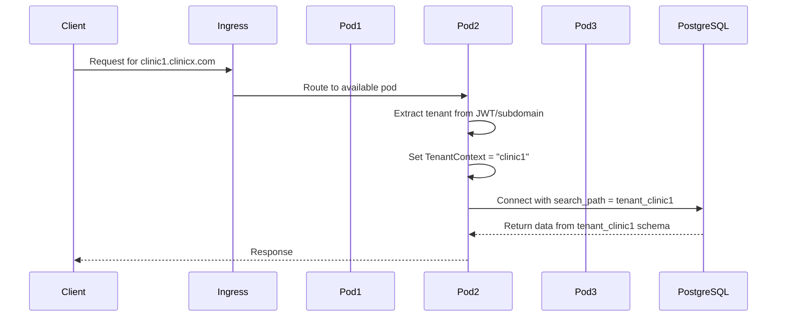

# Kubernetes Multi-Instance Architecture with Schema-Per-Tenant

## Overview

This document explains how to run ClinicX with multiple backend instances in Kubernetes while using a single PostgreSQL database with schema-per-tenant isolation.

## Architecture Diagram

```
┌──────────────────────────────────────────────────────────┐
│                        Kubernetes Cluster                │
├──────────────────────────────────────────────────────────┤
│                                                          │
│  ┌─────────────┐  ┌─────────────┐  ┌─────────────┐       │
│  │  Backend    │  │  Backend    │  │  Backend    │       │
│  │  Pod 1      │  │  Pod 2      │  │  Pod 3      │  ...  │
│  │             │  │             │  │             │       │
│  │ Spring Boot │  │ Spring Boot │  │ Spring Boot │       │
│  └──────┬──────┘  └──────┬──────┘  └──────┬──────┘       │
│         │                │                │              │
│         └────────────────┴────────────────┘              │
│                          │                               │
│                          ▼                               │
│                    ┌─────────────┐                       │
│                    │  PgBouncer  │                       │
│                    │ Connection  │                       │
│                    │   Pooler    │                       │
│                    └──────┬──────┘                       │
└───────────────────────────┼──────────────────────────────┘
                            │
                            ▼
                    ┌───────────────┐
                    │  PostgreSQL   │
                    │   Database    │
                    ├───────────────┤
                    │    public     │ ← System tables
                    ├───────────────┤
                    │tenant_clinic1 │ ← Tenant schemas
                    │tenant_clinic2 │
                    │tenant_dental1 │
                    │      ...      │
                    └───────────────┘
```

## How It Works

### 1. Request Flow



### 2. Tenant Context Management

Each backend instance can handle requests for ANY tenant. The tenant context is:
- **Request-scoped**: Set per HTTP request
- **Thread-local**: Isolated between concurrent requests
- **Stateless**: No session affinity needed

```java
@Component
public class TenantInterceptor implements HandlerInterceptor {
    
    @Override
    public boolean preHandle(HttpServletRequest request, 
                           HttpServletResponse response, 
                           Object handler) {
        // Extract tenant from JWT or subdomain
        String tenantId = tenantResolver.resolveTenant(request);
        
        // Set thread-local context
        TenantContext.setCurrentTenant(tenantId);
        
        return true;
    }
    
    @Override
    public void afterCompletion(HttpServletRequest request,
                              HttpServletResponse response,
                              Object handler,
                              Exception ex) {
        // Clear context after request
        TenantContext.clear();
    }
}
```

### 3. Database Connection Management

```java
@Component
public class SchemaBasedConnectionProvider implements MultiTenantConnectionProvider {
    
    @Autowired
    private DataSource dataSource; // Shared connection pool
    
    @Override
    public Connection getConnection(String tenantIdentifier) throws SQLException {
        Connection connection = dataSource.getConnection();
        
        // Dynamically set schema based on current tenant
        String schema = resolveSchema(tenantIdentifier);
        try (Statement stmt = connection.createStatement()) {
            stmt.execute("SET search_path TO " + schema + ", public");
        }
        
        return connection;
    }
}
```

## Kubernetes Configuration

### 1. Deployment with Multiple Replicas

```yaml
apiVersion: apps/v1
kind: Deployment
metadata:
  name: clinicx-backend
  namespace: clinicx
spec:
  replicas: 5  # Start with 5 instances
  selector:
    matchLabels:
      app: clinicx-backend
  template:
    metadata:
      labels:
        app: clinicx-backend
    spec:
      containers:
      - name: clinicx-backend
        image: clinicx/backend:latest
        env:
        - name: SPRING_PROFILES_ACTIVE
          value: "production,kubernetes"
        - name: DB_HOST
          value: "postgres-service.clinicx.svc.cluster.local"
        - name: DB_PORT
          value: "5432"
        - name: DB_NAME
          value: "clinicx"
        - name: DB_POOL_SIZE
          value: "20"  # Per pod connection pool
        - name: JAVA_OPTS
          value: "-Xmx2g -Xms2g"
        resources:
          requests:
            memory: "2Gi"
            cpu: "1000m"
          limits:
            memory: "3Gi"
            cpu: "2000m"
        livenessProbe:
          httpGet:
            path: /actuator/health/liveness
            port: 8080
          initialDelaySeconds: 60
          periodSeconds: 10
        readinessProbe:
          httpGet:
            path: /actuator/health/readiness
            port: 8080
          initialDelaySeconds: 30
          periodSeconds: 5
```

### 2. Horizontal Pod Autoscaler

```yaml
apiVersion: autoscaling/v2
kind: HorizontalPodAutoscaler
metadata:
  name: clinicx-backend-hpa
spec:
  scaleTargetRef:
    apiVersion: apps/v1
    kind: Deployment
    name: clinicx-backend
  minReplicas: 3
  maxReplicas: 50
  metrics:
  - type: Resource
    resource:
      name: cpu
      target:
        type: Utilization
        averageUtilization: 70
  - type: Resource
    resource:
      name: memory
      target:
        type: Utilization
        averageUtilization: 80
  behavior:
    scaleDown:
      stabilizationWindowSeconds: 300
      policies:
      - type: Percent
        value: 10
        periodSeconds: 60
    scaleUp:
      stabilizationWindowSeconds: 60
      policies:
      - type: Percent
        value: 100
        periodSeconds: 30
      - type: Pods
        value: 5
        periodSeconds: 60
```

### 3. Service Configuration

```yaml
apiVersion: v1
kind: Service
metadata:
  name: clinicx-backend-service
spec:
  selector:
    app: clinicx-backend
  ports:
  - port: 80
    targetPort: 8080
  type: ClusterIP
  sessionAffinity: None  # No session affinity needed
```

## Database Connection Pooling Strategy

### 1. Application-Level Pooling (HikariCP)

```yaml
spring:
  datasource:
    hikari:
      # Per-pod configuration
      maximum-pool-size: 20
      minimum-idle: 5
      connection-timeout: 30000
      idle-timeout: 600000
      max-lifetime: 1800000
      
# Total connections calculation:
# max_connections = pod_count * maximum_pool_size
# Example: 10 pods * 20 = 200 connections
```

### 2. PgBouncer Configuration (Optional but Recommended)

```yaml
apiVersion: v1
kind: ConfigMap
metadata:
  name: pgbouncer-config
data:
  pgbouncer.ini: |
    [databases]
    clinicx = host=postgres-service port=5432 dbname=clinicx
    
    [pgbouncer]
    listen_port = 6432
    listen_addr = *
    auth_type = md5
    pool_mode = transaction
    max_client_conn = 1000
    default_pool_size = 25
    reserve_pool_size = 5
    reserve_pool_timeout = 3
    server_idle_timeout = 600
    server_lifetime = 3600
    server_idle_timeout = 600
---
apiVersion: apps/v1
kind: Deployment
metadata:
  name: pgbouncer
spec:
  replicas: 2  # HA setup
  selector:
    matchLabels:
      app: pgbouncer
  template:
    metadata:
      labels:
        app: pgbouncer
    spec:
      containers:
      - name: pgbouncer
        image: pgbouncer/pgbouncer:latest
        ports:
        - containerPort: 6432
        volumeMounts:
        - name: config
          mountPath: /etc/pgbouncer
      volumes:
      - name: config
        configMap:
          name: pgbouncer-config
```

## Load Distribution

### 1. Tenant Request Distribution

```
With 5 backend pods and 50 active tenants:
- Each pod can handle requests for ALL tenants
- Load balancer distributes requests evenly
- No tenant affinity required
- Average: 10 concurrent tenants per pod
```

### 2. Connection Distribution

```
Database Connections:
- Max PostgreSQL connections: 500
- PgBouncer pool: 250 active connections
- Per pod: 20 connections
- Maximum pods: 250 / 20 = 12 pods

With connection pooling:
- Transaction pooling mode
- Effective connections: 1000+
- Maximum pods: 50+
```

## Scaling Scenarios

### Scenario 1: Normal Load (50-100 tenants)
```yaml
pods: 3-5
connections_per_pod: 20
total_connections: 60-100
cpu_per_pod: 1-2 cores
memory_per_pod: 2-3 GB
```

### Scenario 2: High Load (200-300 tenants)
```yaml
pods: 10-15
connections_per_pod: 15
total_connections: 150-225
cpu_per_pod: 2 cores
memory_per_pod: 3 GB
pgbouncer: enabled
```

### Scenario 3: Peak Load (500+ tenants)
```yaml
pods: 20-30
connections_per_pod: 10
total_connections: 200-300
cpu_per_pod: 2 cores
memory_per_pod: 4 GB
pgbouncer: required
cache_layer: Redis cluster
```

## Monitoring and Observability

### 1. Key Metrics to Monitor

```yaml
# Prometheus metrics
- name: tenant_requests_total
  labels: [tenant_id, pod_name]
  
- name: schema_switch_duration_seconds
  labels: [tenant_id]
  
- name: db_connections_active
  labels: [pod_name]
  
- name: tenant_response_time_seconds
  labels: [tenant_id, endpoint]
```

### 2. Grafana Dashboard Configuration

```json
{
  "dashboard": {
    "title": "ClinicX Multi-Tenant Monitoring",
    "panels": [
      {
        "title": "Requests per Tenant",
        "query": "sum(rate(tenant_requests_total[5m])) by (tenant_id)"
      },
      {
        "title": "Active Connections per Pod",
        "query": "db_connections_active"
      },
      {
        "title": "Schema Switch Performance",
        "query": "histogram_quantile(0.95, schema_switch_duration_seconds)"
      }
    ]
  }
}
```

## Best Practices

### 1. Stateless Design
- No session state in pods
- Use Redis for shared cache
- JWT tokens for authentication
- Tenant context is request-scoped

### 2. Connection Management
```java
@Configuration
public class DatabaseConfig {
    
    @Bean
    @Primary
    public DataSource dataSource() {
        HikariConfig config = new HikariConfig();
        config.setMaximumPoolSize(20);
        config.setMinimumIdle(5);
        config.setConnectionTimeout(30000);
        
        // Important for schema switching
        config.setAutoCommit(false);
        config.setConnectionTestQuery("SELECT 1");
        
        return new HikariDataSource(config);
    }
}
```

### 3. Health Checks
```java
@Component
public class TenantHealthIndicator implements HealthIndicator {
    
    @Override
    public Health health() {
        try {
            // Test schema switching
            testSchemaSwitch();
            return Health.up()
                .withDetail("mode", "schema-per-tenant")
                .withDetail("schemas", getActiveSchemaCount())
                .build();
        } catch (Exception e) {
            return Health.down()
                .withDetail("error", e.getMessage())
                .build();
        }
    }
}
```

## Troubleshooting

### Common Issues and Solutions

1. **Connection Pool Exhaustion**
   - Symptom: "Connection timeout" errors
   - Solution: Increase pool size or add PgBouncer
   
2. **Schema Switch Failures**
   - Symptom: "Schema not found" errors
   - Solution: Verify schema exists and permissions

3. **Uneven Load Distribution**
   - Symptom: Some pods overloaded
   - Solution: Check ingress configuration

4. **Memory Issues**
   - Symptom: OOM kills
   - Solution: Tune JVM heap and pod limits

## Performance Optimization

### 1. Caching Strategy
```java
@Configuration
@EnableCaching
public class CacheConfig {
    
    @Bean
    public CacheManager cacheManager(RedisConnectionFactory factory) {
        RedisCacheConfiguration config = RedisCacheConfiguration
            .defaultCacheConfig()
            .prefixCacheNameWith("clinicx:")
            .entryTtl(Duration.ofMinutes(10));
            
        return RedisCacheManager.builder(factory)
            .cacheDefaults(config)
            .build();
    }
}
```

### 2. Query Optimization
- Use prepared statements
- Implement query result caching
- Optimize N+1 queries
- Use database indexes effectively

## Conclusion

Running multiple backend instances in Kubernetes with schema-per-tenant architecture provides:

✅ **Scalability**: Horizontal scaling based on load  
✅ **High Availability**: No single point of failure  
✅ **Efficient Resource Usage**: Shared connection pool  
✅ **Tenant Isolation**: Complete data separation  
✅ **Performance**: Load distributed across pods  

This architecture can handle hundreds of tenants with proper configuration and monitoring.
