# Cross-Schema Patient Sharing Architecture

## Executive Summary

This document outlines the architecture for sharing patient data across multiple database schemas in a multi-tenant SaaS healthcare platform where each tenant/specialty operates in its own schema while maintaining data isolation and preventing patient duplication.

## System Overview Diagram

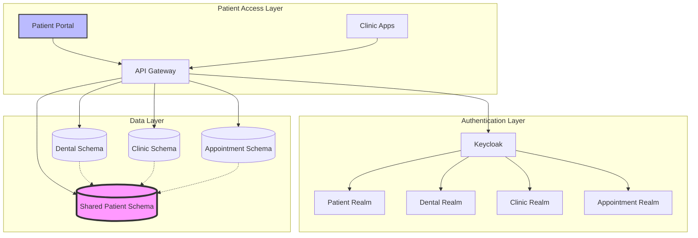

## Current Architecture

### Multi-Tenancy Model
- **Schema per Tenant**: Each tenant has its own database schema
- **Realm per Specialty**: Each specialty (Dental, Clinic, Appointments) has its own Keycloak realm
- **Data Isolation**: Complete data separation between tenants at the schema level

## Proposed Cross-Schema Patient Sharing Architecture

### Core Principles
1. **Single Source of Truth**: One master patient record across all schemas
2. **Data Sovereignty**: Each schema maintains ownership of its specific data
3. **Controlled Access**: Explicit permission required for cross-schema access
4. **Audit Trail**: Complete logging of all cross-schema operations
5. **Performance**: Minimize cross-schema queries through caching and materialization

## Architecture Options

### Option 1: Centralized Patient Master Schema (Recommended)

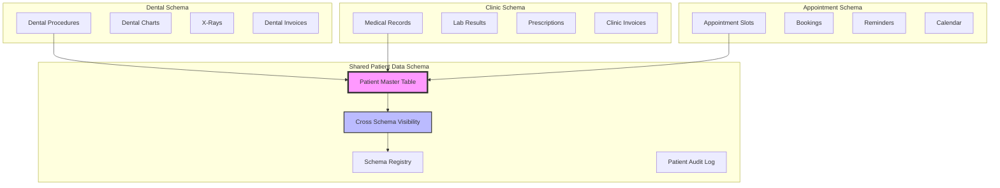

#### Advantages
- Single source of truth for patient demographics
- Centralized access control
- Easier to maintain data consistency
- Simplified backup and recovery

#### Disadvantages
- Single point of failure (mitigated by replication)
- Requires cross-schema queries
- Network latency for distributed systems

### Option 2: Federated Model with Synchronization

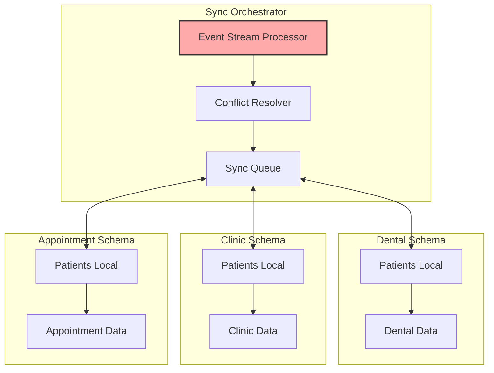

#### Advantages
- Better performance (local queries)
- Schema autonomy
- Works well in distributed environments

#### Disadvantages
- Complex synchronization logic
- Potential for data conflicts
- Higher storage requirements

### Option 3: Hybrid Approach with Caching

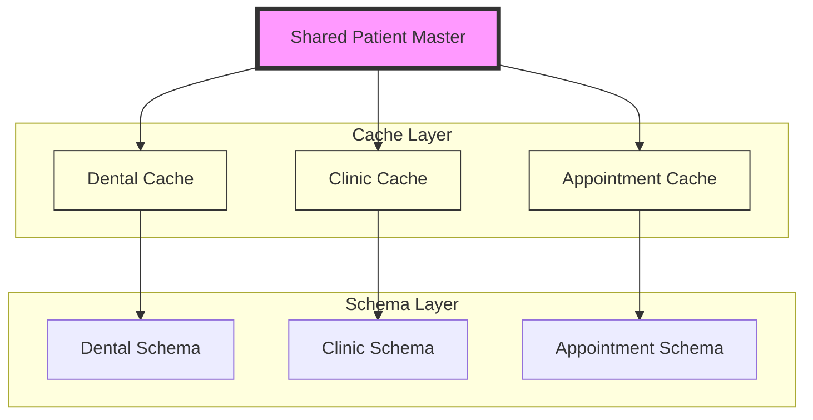

## Patient Journey Flow

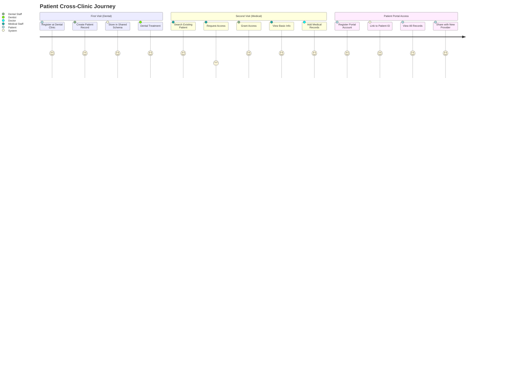

## Data Access Flow Diagram

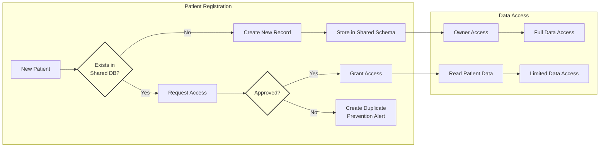

## Implementation Strategy

### Phase 1: Foundation (Weeks 1-2)
1. **Create Shared Schema**
   - Design shared_patient_data schema
   - Define access control tables
   - Set up schema registry

2. **Establish Connectivity**
   - Configure Foreign Data Wrappers (PostgreSQL FDW)
   - Set up cross-schema permissions
   - Create connection pooling

### Phase 2: Migration (Weeks 3-4)
1. **Data Migration**
   - Identify and merge duplicate patients
   - Migrate existing patients to shared schema
   - Create reference mappings

2. **Access Control Setup**
   - Define access matrices per specialty
   - Implement Row Level Security (RLS)
   - Set up audit logging

### Phase 3: Integration (Weeks 5-6)
1. **Application Layer**
   - Update repositories for cross-schema queries
   - Implement caching layer
   - Add patient search across schemas

2. **Testing**
   - Performance testing
   - Security testing
   - Data integrity validation

## Technical Components

### 1. Database Layer

#### Shared Schema Structure
```sql
shared_patient_data
├── patients (master table)
├── cross_schema_visibility
├── schema_registry
├── patient_sharing_audit
└── data_access_rules
```

#### Access Methods
- **PostgreSQL FDW**: For direct cross-schema access
- **Materialized Views**: For read-heavy operations
- **Event Streaming**: For real-time synchronization

### 2. Application Layer

#### Service Architecture
```
┌─────────────────────────────────────────┐
│         PatientSharingService           │
├─────────────────────────────────────────┤
│ + findOrCreatePatient()                 │
│ + sharePatientAcrossSchemas()          │
│ + revokeSchemaAccess()                 │
│ + getAccessiblePatients()              │
└─────────────────────────────────────────┘
                    │
    ┌───────────────┼───────────────┐
    ▼               ▼               ▼
┌──────────┐  ┌──────────┐  ┌──────────┐
│ Schema   │  │ Patient  │  │ Access   │
│ Registry │  │ Cache    │  │ Control  │
└──────────┘  └──────────┘  └──────────┘
```

#### Key Components
- **SchemaContextHolder**: Manages current schema context
- **CrossSchemaRepository**: Handles cross-schema queries
- **PatientCacheManager**: Manages patient data caching
- **AuditService**: Logs all cross-schema operations

### 3. Security Layer

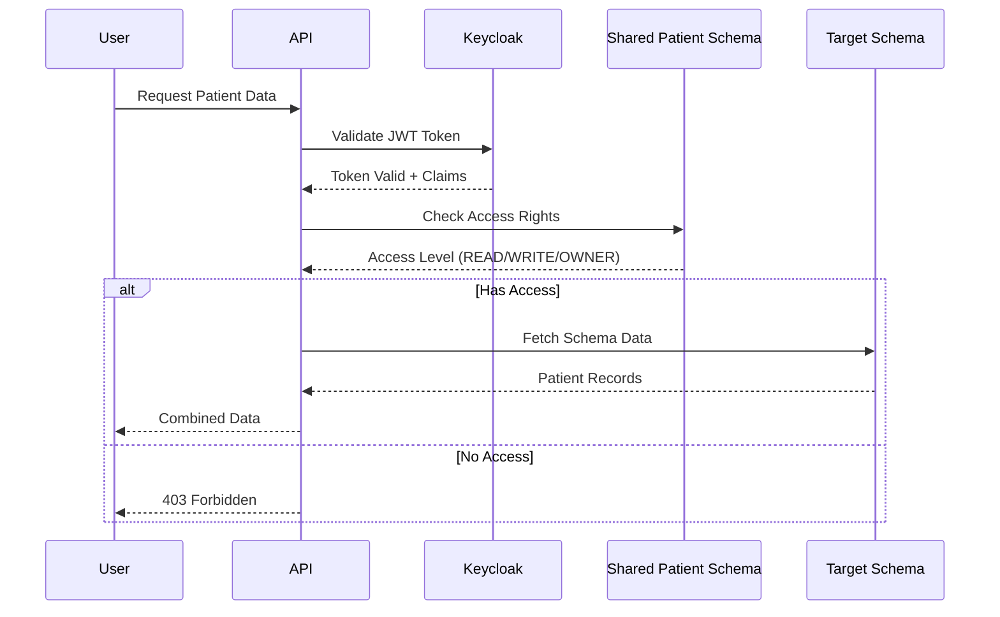

#### Access Control Matrix
| Operation | Owner Schema | Shared Schema | Other Schemas |
|-----------|--------------|---------------|---------------|
| Create Patient | ✅ WRITE | ❌ | ❌ |
| Read Basic Info | ✅ READ | ✅ READ | ✅ READ* |
| Update Demographics | ✅ WRITE | ❌ | ❌ |
| View Medical Records | ✅ READ | ❌ | ❌ |
| Share Patient | ✅ WRITE | ❌ | ❌ |

*With explicit permission

#### Permission Levels
- **OWNER**: Full control, can share with others
- **WRITE**: Can modify shared data categories
- **READ**: Can view permitted data categories
- **NONE**: No access

### 4. Caching Strategy

#### Cache Layers
1. **L1 Cache**: Application-level (Caffeine/Redis)
   - TTL: 5 minutes
   - Scope: Basic patient info

2. **L2 Cache**: Database materialized views
   - Refresh: Every 15 minutes
   - Scope: Frequently accessed patients

3. **L3 Cache**: Schema-local copies
   - Sync: Event-driven
   - Scope: Active patients only

## API Design

### Patient Sharing Endpoints

```yaml
POST /api/v1/patients/share
  Request:
    patientId: UUID
    targetSchema: string
    targetTenant: string
    accessLevel: READ|WRITE
    dataCategories: string[]
    expiresAt: datetime (optional)
    reason: string

GET /api/v1/patients/shared
  Response:
    patients: [
      id: UUID
      name: string
      sharedFrom: string
      accessLevel: string
      dataCategories: string[]
    ]

POST /api/v1/patients/find-or-create
  Request:
    phoneNumber: string
    email: string
    demographics: object
  Response:
    patientId: UUID
    isNew: boolean
    sharedFrom: string (if existing)
```

## Data Governance

### Privacy Considerations
1. **Data Minimization**: Share only necessary data categories
2. **Purpose Limitation**: Access tied to specific use cases
3. **Consent Management**: Track patient consent for sharing
4. **Right to be Forgotten**: Cascade deletion across schemas

### Compliance Requirements
- **HIPAA**: Maintain audit logs for all access
- **GDPR**: Implement data portability and deletion
- **Regional Laws**: Respect data residency requirements

## Performance Considerations

### Query Optimization
1. **Index Strategy**
   - Index on global_patient_id
   - Composite index on (schema, tenant, patient)
   - Partial indexes for active records

2. **Query Patterns**
   ```sql
   -- Efficient: Use indexed global ID
   SELECT * FROM shared_patient_data.patients 
   WHERE global_patient_id = ?
   
   -- Avoid: Cross-schema joins
   SELECT * FROM dental_schema.records r
   JOIN shared_patient_data.patients p ON ...
   ```

3. **Connection Pooling**
   - Separate pools per schema
   - Maximum 10 connections per schema
   - Connection timeout: 30 seconds

### Monitoring Metrics
- Cross-schema query latency
- Cache hit rates
- Failed access attempts
- Data synchronization lag

## Deployment Architecture

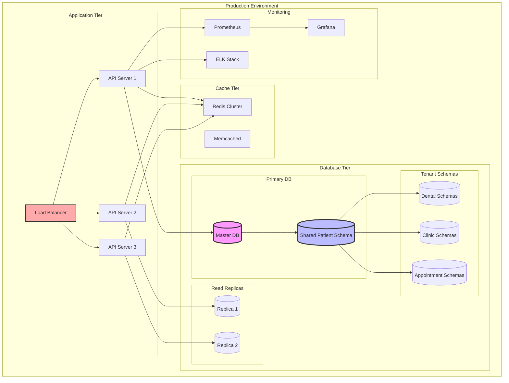

## Performance Optimization Flow

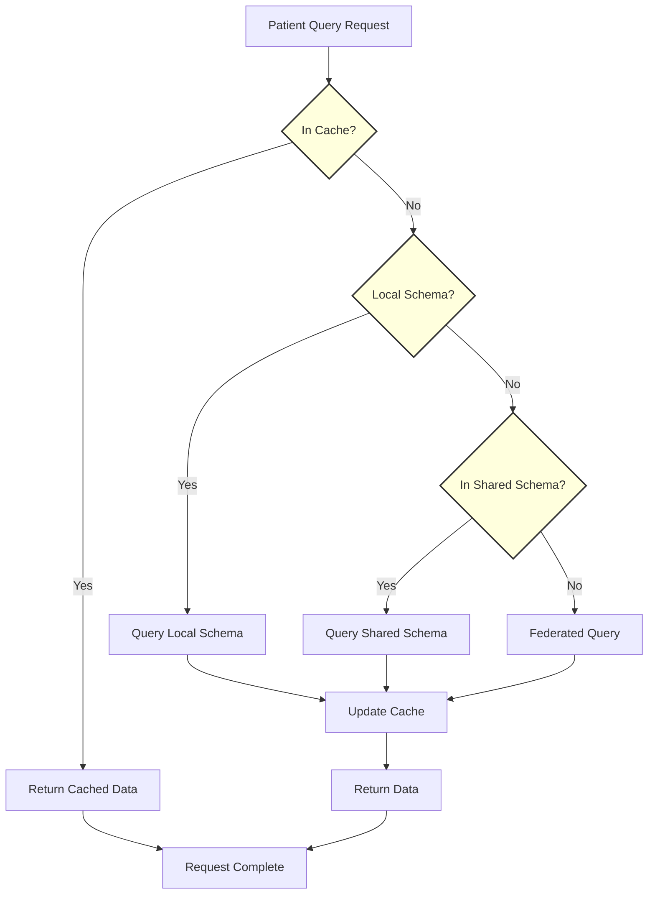

## Disaster Recovery

### Backup Strategy
1. **Shared Schema**: Daily backups with point-in-time recovery
2. **Schema References**: Backup reference mappings
3. **Access Control**: Export permissions weekly

### Failover Plan
1. **Primary Failure**: Promote read replica
2. **Schema Isolation**: Fall back to local data
3. **Cache Warming**: Pre-populate after recovery

## Implementation Roadmap

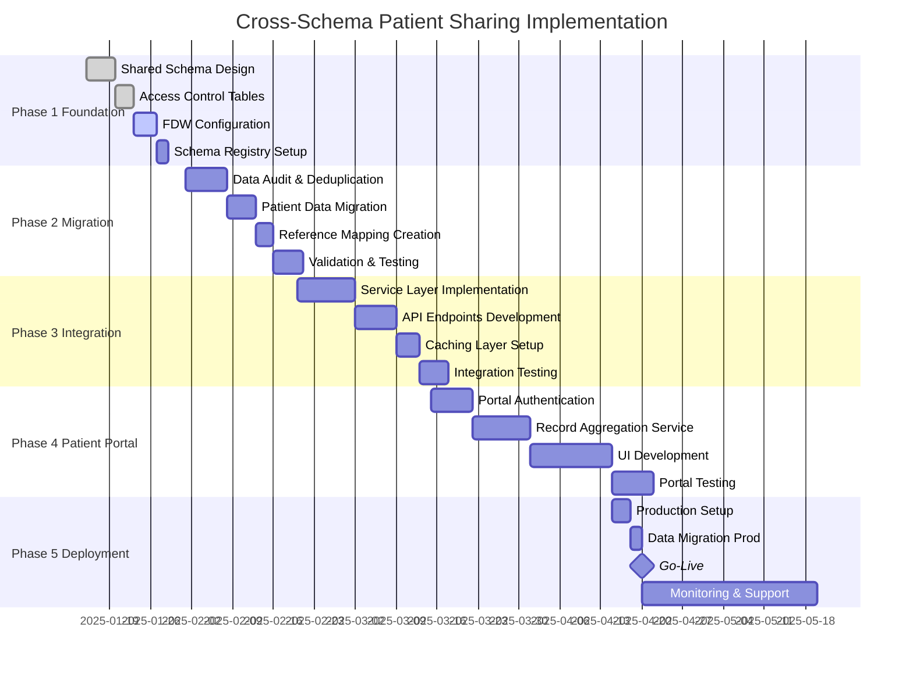

## Migration Plan

### Prerequisites
- PostgreSQL 12+ with FDW support
- Sufficient database permissions
- Application downtime window (4 hours)

### Migration Steps
1. **Preparation** (T-2 weeks)
   - Audit existing patient data
   - Identify duplicates
   - Plan merge strategy

2. **Execution** (Day of migration)
   - Create shared schema
   - Migrate patient data
   - Update application configuration
   - Verify data integrity

3. **Validation** (T+1 week)
   - Monitor performance
   - Check access logs
   - Gather user feedback

## Risks and Mitigation

| Risk | Impact | Likelihood | Mitigation |
|------|--------|------------|------------|
| Performance degradation | High | Medium | Implement caching, optimize queries |
| Data inconsistency | High | Low | Use transactions, implement validation |
| Security breach | High | Low | Encrypt connections, audit all access |
| Schema drift | Medium | Medium | Automated schema validation |
| Complexity overhead | Medium | High | Comprehensive documentation, training |

## Cost Analysis

### Infrastructure Costs
- Additional database storage: ~20% increase
- Network transfer: Minimal for same-region
- Caching infrastructure: Redis cluster ($200/month)

### Development Costs
- Initial implementation: 3 developers × 6 weeks
- Testing and validation: 2 QA engineers × 4 weeks
- Documentation and training: 1 week

### Operational Costs
- Monitoring and maintenance: 0.5 FTE ongoing
- Regular audits: Quarterly reviews

## Success Criteria

1. **Functional Requirements**
   - ✅ No duplicate patients across schemas
   - ✅ Sub-second patient lookup
   - ✅ Granular access control
   - ✅ Complete audit trail

2. **Non-Functional Requirements**
   - ✅ 99.9% availability
   - ✅ <100ms query latency (p95)
   - ✅ Zero data loss
   - ✅ HIPAA compliance maintained

## Patient Portal Integration (Post-MVP)

### Overview
The patient portal will provide patients with unified access to their medical records across all clinics and specialties they've visited, creating a comprehensive health history view.

### Architecture Design

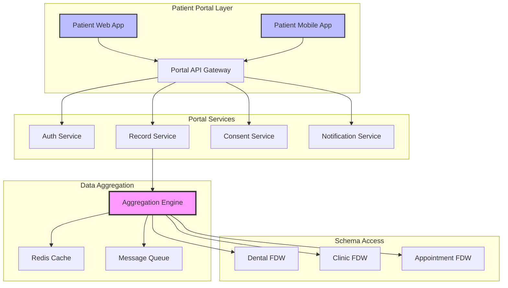

### Key Features

#### 1. Patient Authentication
- **Self-Registration**: Using phone/email verification
- **Secure Access**: Multi-factor authentication
- **Account Recovery**: OTP-based password reset
- **Keycloak Realm**: Dedicated `patient-portal` realm

#### 2. Unified Medical Records View
```
Patient Dashboard
├── Personal Information
│   └── Editable demographics
├── Medical Timeline
│   ├── Dental visits
│   ├── Clinical consultations
│   └── Appointments
├── Documents
│   ├── X-rays & Imaging
│   ├── Lab Results
│   ├── Prescriptions
│   └── Invoices
├── Health Summary
│   ├── Allergies
│   ├── Medications
│   └── Conditions
└── Appointment Management
    ├── Upcoming appointments
    ├── Booking requests
    └── Cancellations
```

#### 3. Data Access Control
- **Patient-Initiated Access**: Patients explicitly grant portal access
- **Granular Permissions**: Choose what to share per clinic
- **Time-Limited Sharing**: Temporary access for referrals
- **Audit Trail**: Track who accessed what and when

### Implementation Approach

#### Phase 1: Foundation (Months 1-2)
1. **Patient Identity Management**
   ```yaml
   patient_portal_users:
     - patient_id: UUID (links to shared_patient_data)
     - portal_username: string (email/phone)
     - activated: boolean
     - consent_given: timestamp
     - last_login: timestamp
   ```

2. **Access Token Management**
   ```yaml
   patient_access_tokens:
     - patient_id: UUID
     - clinic_schema: string
     - granted_at: timestamp
     - expires_at: timestamp
     - access_scope: string[] (records, appointments, billing)
   ```

#### Phase 2: Data Aggregation (Months 3-4)
1. **Record Collection Service**
   - Federated queries across schemas
   - Data transformation and normalization
   - Caching for performance

2. **API Design**
   ```yaml
   GET /api/patient-portal/v1/my-records
     Headers:
       Authorization: Bearer {patient_jwt}
     Response:
       records: [
         {
           source: "Smile Dental Clinic"
           type: "dental_procedure"
           date: "2024-01-15"
           details: {...}
         },
         {
           source: "City Medical Center"
           type: "lab_result"
           date: "2024-02-20"
           details: {...}
         }
       ]
   ```

#### Phase 3: Interactive Features (Months 5-6)
1. **Appointment Booking**
   - View available slots across clinics
   - Book appointments directly
   - Manage existing appointments

2. **Document Sharing**
   - Share records with other healthcare providers
   - Generate shareable links with expiration
   - Download medical history reports

### Security Considerations

#### Authentication Flow

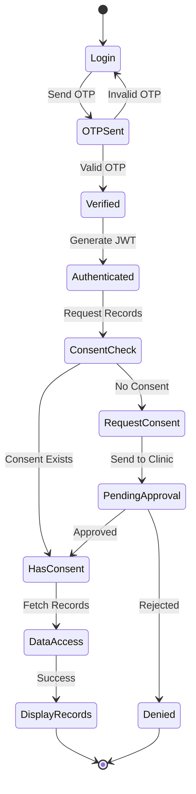

#### Privacy Controls
1. **Data Minimization**: Only show data patient consents to
2. **Access Logging**: Complete audit trail of all access
3. **Encryption**: End-to-end encryption for sensitive data
4. **Session Management**: Auto-logout after inactivity

### Technical Implementation

#### Database Schema Extensions
```sql
-- Patient portal specific tables
CREATE SCHEMA patient_portal;

-- Patient portal accounts
CREATE TABLE patient_portal.accounts (
    id UUID PRIMARY KEY,
    patient_id UUID REFERENCES shared_patient_data.patients(id),
    email VARCHAR(255) UNIQUE,
    phone VARCHAR(50) UNIQUE,
    password_hash VARCHAR(255),
    is_active BOOLEAN DEFAULT FALSE,
    activation_token VARCHAR(255),
    created_at TIMESTAMP DEFAULT NOW(),
    last_login TIMESTAMP
);

-- Patient consent records
CREATE TABLE patient_portal.consent_records (
    id UUID PRIMARY KEY,
    patient_id UUID,
    clinic_schema VARCHAR(100),
    consent_type VARCHAR(50), -- 'full', 'appointments_only', 'read_only'
    granted_at TIMESTAMP DEFAULT NOW(),
    expires_at TIMESTAMP,
    revoked_at TIMESTAMP
);

-- Access logs for compliance
CREATE TABLE patient_portal.access_logs (
    id UUID PRIMARY KEY,
    patient_id UUID,
    accessed_schema VARCHAR(100),
    accessed_data_type VARCHAR(50),
    ip_address INET,
    user_agent TEXT,
    accessed_at TIMESTAMP DEFAULT NOW()
);
```

#### API Gateway Configuration
- Rate limiting per patient
- Request validation
- Response caching
- Circuit breaker for schema connections

### Benefits for Patients
1. **Complete Health Picture**: All medical records in one place
2. **Convenience**: No need to request records from multiple clinics
3. **Control**: Decide what information to share and with whom
4. **Accessibility**: Access records 24/7 from anywhere
5. **Portability**: Easy to switch providers or get second opinions

### Benefits for Clinics
1. **Reduced Administrative Load**: Fewer record requests to process
2. **Better Patient Engagement**: Patients more involved in their care
3. **Improved Continuity of Care**: Complete patient history available
4. **Competitive Advantage**: Modern patient experience

### Success Metrics
- Patient portal adoption rate > 60%
- Average session duration > 5 minutes
- Monthly active users > 40%
- Patient satisfaction score > 4.5/5
- Support ticket reduction by 30%

## Conclusion

The centralized patient master schema approach (Option 1) is recommended for its simplicity, maintainability, and strong consistency guarantees. This architecture effectively prevents patient duplication while maintaining strict data isolation between tenants/specialties. The patient portal extension will provide significant value by empowering patients with unified access to their health records across all participating clinics. The implementation should be phased, starting with a proof of concept in a development environment before rolling out to production.

## Appendices

### A. Database Scripts
- Schema creation scripts
- FDW configuration
- RLS policies

### B. API Documentation
- OpenAPI specification
- Integration examples

### C. Security Policies
- Access control matrices
- Encryption standards
- Audit requirements

### D. Performance Benchmarks
- Query performance tests
- Load testing results
- Capacity planning

---

*Document Version: 1.0*  
*Last Updated: 2025-01-12*  
*Author: ClinicX Architecture Team*