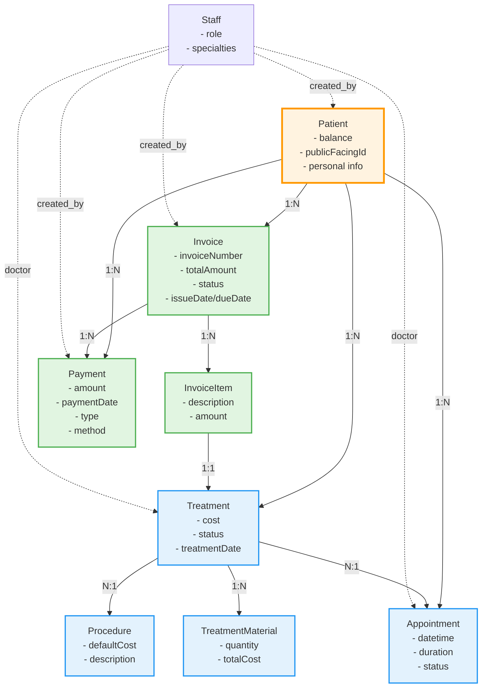
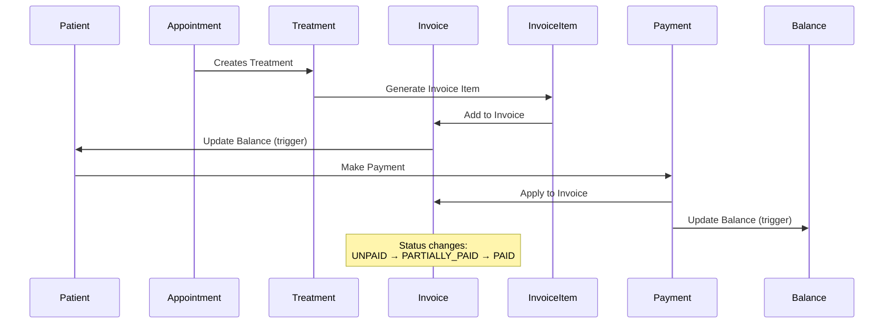

# ClinicX Payment & Invoicing System Architecture

## Entity Hierarchy Diagram



## Payment & Invoicing Relationships Analysis

### 1. Core Financial Flow



### 2. Entity Relationships

#### Patient (Core Aggregate Root)
```
Patient
├── Invoices (1:N)
│   └── InvoiceItems (1:N)
│       └── Treatment (1:1)
├── Payments (1:N)
│   ├── Type: PAYMENT | CREDIT | REFUND
│   └── Links to Invoice (optional)
├── Treatments (1:N)
│   ├── Links to Appointment
│   ├── Links to Procedure
│   └── Materials (1:N)
└── Balance (calculated field)
```

#### Invoice Lifecycle
```
DRAFT → OPEN → UNPAID → PARTIALLY_PAID → PAID
                    ↓
                OVERDUE
                    ↓
               CANCELLED
```

#### Payment Types
- **PAYMENT**: Regular payment against invoice
- **CREDIT**: Advance payment (can be applied later)
- **REFUND**: Money returned to patient

### 3. Key Business Rules

1. **Balance Calculation**
   - Patient balance = Sum(Invoice.totalAmount) - Sum(Payment.amount where type='PAYMENT')
   - Automatically updated via database triggers

2. **Invoice Status Management**
   - Status changes based on payment totals
   - Cannot modify PAID or CANCELLED invoices
   - OVERDUE status set automatically based on due_date

3. **Payment Application**
   - Payments can be linked to specific invoices
   - Credits (advance payments) can be applied to any unpaid invoice
   - Refunds decrease patient balance

4. **Treatment-Invoice Relationship**
   - Each treatment can only be billed once (unique constraint)
   - Invoice items automatically created from treatments
   - Treatment cost copied to invoice item amount

## Missing/Needed Controllers & Services

### Payment Management Enhancements

#### 1. PaymentController (New/Enhanced)
```java
@RestController
@RequestMapping("/api/v1/payments")
public interface PaymentControllerApi {
    
    // Get all payments (with filtering)
    @GetMapping
    Page<PaymentDto> getAllPayments(
        @RequestParam(required = false) UUID patientId,
        @RequestParam(required = false) UUID invoiceId,
        @RequestParam(required = false) PaymentType type,
        @RequestParam(required = false) LocalDate startDate,
        @RequestParam(required = false) LocalDate endDate,
        Pageable pageable
    );
    
    // Get payment by ID
    @GetMapping("/{paymentId}")
    PaymentDto getPayment(@PathVariable UUID paymentId);
    
    // Create direct payment (not linked to invoice)
    @PostMapping
    PaymentDto createPayment(@RequestBody PaymentCreateRequest request);
    
    // Update payment (for corrections)
    @PutMapping("/{paymentId}")
    PaymentDto updatePayment(
        @PathVariable UUID paymentId,
        @RequestBody PaymentUpdateRequest request
    );
    
    // Delete/void payment
    @DeleteMapping("/{paymentId}")
    void voidPayment(@PathVariable UUID paymentId);
    
    // Get payment statistics
    @GetMapping("/statistics")
    PaymentStatisticsDto getPaymentStatistics(
        @RequestParam(required = false) UUID patientId,
        @RequestParam(required = false) LocalDate startDate,
        @RequestParam(required = false) LocalDate endDate
    );
    
    // Bulk payment processing
    @PostMapping("/bulk")
    List<PaymentDto> processBulkPayments(@RequestBody BulkPaymentRequest request);
    
    // Payment method breakdown
    @GetMapping("/methods/breakdown")
    Map<String, BigDecimal> getPaymentMethodBreakdown(
        @RequestParam(required = false) UUID patientId,
        @RequestParam(required = false) LocalDate startDate,
        @RequestParam(required = false) LocalDate endDate
    );
}
```

#### 2. InvoiceManagementController (Enhanced)
```java
@RestController
@RequestMapping("/api/v1/invoice-management")
public interface InvoiceManagementControllerApi {
    
    // Generate invoice from treatments
    @PostMapping("/generate-from-treatments")
    InvoiceDto generateInvoiceFromTreatments(@RequestBody GenerateInvoiceRequest request);
    
    // Update invoice status
    @PutMapping("/{invoiceId}/status")
    InvoiceDto updateInvoiceStatus(
        @PathVariable UUID invoiceId,
        @RequestParam InvoiceStatus status
    );
    
    // Cancel invoice
    @PostMapping("/{invoiceId}/cancel")
    InvoiceDto cancelInvoice(
        @PathVariable UUID invoiceId,
        @RequestBody CancelInvoiceRequest reason
    );
    
    // Send invoice reminder
    @PostMapping("/{invoiceId}/reminder")
    void sendInvoiceReminder(@PathVariable UUID invoiceId);
    
    // Mark as overdue (batch process)
    @PostMapping("/mark-overdue")
    List<InvoiceDto> markOverdueInvoices();
    
    // Get unpaid invoices
    @GetMapping("/unpaid")
    Page<InvoiceDto> getUnpaidInvoices(
        @RequestParam(required = false) UUID patientId,
        Pageable pageable
    );
    
    // Invoice aging report
    @GetMapping("/aging-report")
    InvoiceAgingReportDto getAgingReport();
    
    // Apply discount
    @PostMapping("/{invoiceId}/discount")
    InvoiceDto applyDiscount(
        @PathVariable UUID invoiceId,
        @RequestBody DiscountRequest request
    );
}
```

#### 3. RefundController (New)
```java
@RestController
@RequestMapping("/api/v1/refunds")
public interface RefundControllerApi {
    
    // Process refund
    @PostMapping
    PaymentDto processRefund(@RequestBody RefundRequest request);
    
    // Get refunds
    @GetMapping
    Page<PaymentDto> getRefunds(
        @RequestParam(required = false) UUID patientId,
        @RequestParam(required = false) LocalDate startDate,
        @RequestParam(required = false) LocalDate endDate,
        Pageable pageable
    );
    
    // Approve refund
    @PostMapping("/{refundId}/approve")
    PaymentDto approveRefund(@PathVariable UUID refundId);
    
    // Cancel refund
    @PostMapping("/{refundId}/cancel")
    void cancelRefund(@PathVariable UUID refundId);
}
```

#### 4. BillingReportController (New)
```java
@RestController
@RequestMapping("/api/v1/billing-reports")
public interface BillingReportControllerApi {
    
    // Revenue report
    @GetMapping("/revenue")
    RevenueReportDto getRevenueReport(
        @RequestParam LocalDate startDate,
        @RequestParam LocalDate endDate,
        @RequestParam(required = false) String groupBy // day, week, month
    );
    
    // Outstanding balance report
    @GetMapping("/outstanding-balances")
    Page<PatientBalanceDto> getOutstandingBalances(Pageable pageable);
    
    // Payment collection report
    @GetMapping("/collections")
    CollectionReportDto getCollectionReport(
        @RequestParam LocalDate startDate,
        @RequestParam LocalDate endDate
    );
    
    // Insurance claims report
    @GetMapping("/insurance-claims")
    Page<InsuranceClaimDto> getInsuranceClaims(
        @RequestParam(required = false) String status,
        Pageable pageable
    );
    
    // Daily cash report
    @GetMapping("/daily-cash")
    DailyCashReportDto getDailyCashReport(@RequestParam LocalDate date);
}
```

## Service Layer Enhancements

### PaymentService (Enhanced)
```java
@Service
@Transactional
public class PaymentService {
    
    // Core payment operations
    public Payment createPayment(PaymentCreateRequest request);
    public Payment updatePayment(UUID paymentId, PaymentUpdateRequest request);
    public void voidPayment(UUID paymentId);
    public Payment applyPaymentToInvoice(UUID paymentId, UUID invoiceId);
    
    // Refund operations
    public Payment processRefund(RefundRequest request);
    public Payment approveRefund(UUID refundId);
    public void cancelRefund(UUID refundId);
    
    // Bulk operations
    public List<Payment> processBulkPayments(BulkPaymentRequest request);
    public void reconcilePayments(List<UUID> paymentIds);
    
    // Reporting
    public PaymentStatistics calculateStatistics(UUID patientId, DateRange range);
    public Map<String, BigDecimal> getPaymentMethodBreakdown(UUID patientId);
    public BigDecimal calculateTotalCollected(DateRange range);
}
```

### InvoiceService (Enhanced)
```java
@Service
@Transactional
public class InvoiceService {
    
    // Invoice generation
    public Invoice generateFromTreatments(List<UUID> treatmentIds);
    public Invoice createRecurringInvoice(RecurringInvoiceRequest request);
    
    // Status management
    public Invoice updateStatus(UUID invoiceId, InvoiceStatus status);
    public List<Invoice> markOverdueInvoices();
    public Invoice cancelInvoice(UUID invoiceId, String reason);
    
    // Payment application
    public Invoice applyPayment(UUID invoiceId, BigDecimal amount);
    public Invoice applyCredit(UUID invoiceId, UUID creditId);
    public Invoice applyDiscount(UUID invoiceId, DiscountRequest discount);
    
    // Notifications
    public void sendInvoiceReminder(UUID invoiceId);
    public void sendPaymentReceipt(UUID paymentId);
    
    // Reporting
    public InvoiceAgingReport generateAgingReport();
    public List<Invoice> getUnpaidInvoices(UUID patientId);
}
```

### BillingReportService (New)
```java
@Service
public class BillingReportService {
    
    public RevenueReport generateRevenueReport(DateRange range, GroupBy groupBy);
    public List<PatientBalance> getOutstandingBalances();
    public CollectionReport generateCollectionReport(DateRange range);
    public DailyCashReport generateDailyCashReport(LocalDate date);
    public InsuranceClaimsReport generateInsuranceReport(DateRange range);
}
```

## Repository Layer Enhancements

### InvoiceRepository (Enhanced)
```java
public interface InvoiceRepository extends JpaRepository<Invoice, UUID> {
    
    // Status queries
    List<Invoice> findByStatusAndDueDateBefore(InvoiceStatus status, LocalDate date);
    Page<Invoice> findByPatientIdAndStatusIn(UUID patientId, List<InvoiceStatus> statuses, Pageable pageable);
    
    // Aggregation queries
    @Query("SELECT SUM(i.totalAmount) FROM Invoice i WHERE i.status = :status")
    BigDecimal calculateTotalByStatus(@Param("status") InvoiceStatus status);
    
    @Query("SELECT i.patient.id, SUM(i.totalAmount) FROM Invoice i " +
           "WHERE i.status IN ('UNPAID', 'PARTIALLY_PAID', 'OVERDUE') " +
           "GROUP BY i.patient.id")
    List<Object[]> calculateOutstandingBalancesByPatient();
    
    // Aging report
    @Query("SELECT " +
           "SUM(CASE WHEN DATEDIFF(CURRENT_DATE, i.dueDate) <= 30 THEN i.totalAmount ELSE 0 END) as current, " +
           "SUM(CASE WHEN DATEDIFF(CURRENT_DATE, i.dueDate) BETWEEN 31 AND 60 THEN i.totalAmount ELSE 0 END) as days30, " +
           "SUM(CASE WHEN DATEDIFF(CURRENT_DATE, i.dueDate) BETWEEN 61 AND 90 THEN i.totalAmount ELSE 0 END) as days60, " +
           "SUM(CASE WHEN DATEDIFF(CURRENT_DATE, i.dueDate) > 90 THEN i.totalAmount ELSE 0 END) as days90 " +
           "FROM Invoice i WHERE i.status IN ('UNPAID', 'PARTIALLY_PAID', 'OVERDUE')")
    Object[] calculateAgingReport();
}
```

### PaymentRepository (Already Enhanced)
The existing PaymentRepository is already well-structured with necessary queries.

## DTOs Required

### Request DTOs
```java
// PaymentCreateRequest
public class PaymentCreateRequest {
    private UUID patientId;
    private UUID invoiceId; // optional
    private BigDecimal amount;
    private LocalDate paymentDate;
    private String paymentMethod;
    private PaymentType type;
    private String description;
    private String referenceNumber;
}

// GenerateInvoiceRequest
public class GenerateInvoiceRequest {
    private UUID patientId;
    private List<UUID> treatmentIds;
    private LocalDate issueDate;
    private LocalDate dueDate;
    private String notes;
}

// RefundRequest
public class RefundRequest {
    private UUID patientId;
    private UUID invoiceId; // optional
    private BigDecimal amount;
    private String reason;
    private String paymentMethod;
}

// BulkPaymentRequest
public class BulkPaymentRequest {
    private List<PaymentCreateRequest> payments;
    private boolean validateBalance;
}
```

### Response DTOs
```java
// PaymentDto
public class PaymentDto {
    private UUID id;
    private UUID patientId;
    private String patientName;
    private UUID invoiceId;
    private String invoiceNumber;
    private BigDecimal amount;
    private LocalDate paymentDate;
    private String paymentMethod;
    private PaymentType type;
    private String description;
    private String referenceNumber;
    private String createdBy;
    private Instant createdAt;
}

// PaymentStatisticsDto
public class PaymentStatisticsDto {
    private BigDecimal totalCollected;
    private BigDecimal totalRefunded;
    private BigDecimal totalCredits;
    private BigDecimal netAmount;
    private Integer paymentCount;
    private Map<String, BigDecimal> byPaymentMethod;
    private Map<String, BigDecimal> byMonth;
}

// InvoiceAgingReportDto
public class InvoiceAgingReportDto {
    private BigDecimal current;
    private BigDecimal days30;
    private BigDecimal days60;
    private BigDecimal days90Plus;
    private BigDecimal total;
    private List<AgingDetail> details;
}

// RevenueReportDto
public class RevenueReportDto {
    private BigDecimal totalRevenue;
    private BigDecimal totalCollected;
    private BigDecimal totalOutstanding;
    private List<RevenueByPeriod> periods;
    private Map<String, BigDecimal> byProcedure;
    private Map<String, BigDecimal> byDoctor;
}
```

## Implementation Priority

1. **Phase 1: Core Payment Management** (High Priority)
   - PaymentController with CRUD operations
   - Enhanced PaymentService
   - Payment DTOs and mappers

2. **Phase 2: Invoice Management** (High Priority)
   - InvoiceManagementController
   - Invoice status management
   - Invoice generation from treatments

3. **Phase 3: Refunds & Credits** (Medium Priority)
   - RefundController
   - Credit application logic
   - Refund approval workflow

4. **Phase 4: Reporting** (Medium Priority)
   - BillingReportController
   - Revenue reports
   - Aging reports
   - Collection reports

5. **Phase 5: Advanced Features** (Low Priority)
   - Bulk payment processing
   - Recurring invoices
   - Insurance claim management
   - Payment plans

## Security Considerations

1. **Authorization**
   - ADMIN/STAFF can create/modify payments
   - DOCTOR can view payment information
   - Patient portal (future) can view own payments

2. **Audit Trail**
   - All financial transactions logged
   - Created_by and updated_by tracking
   - Immutable payment records (void instead of delete)

3. **Data Validation**
   - Amount must be positive
   - Payment date cannot be future
   - Invoice must exist and be unpaid for payment application

## Next Steps

1. Create PaymentController implementation
2. Enhance PaymentService with new methods
3. Create necessary DTOs and mappers
4. Add validation and error handling
5. Implement audit logging
6. Create unit and integration tests
7. Update API documentation