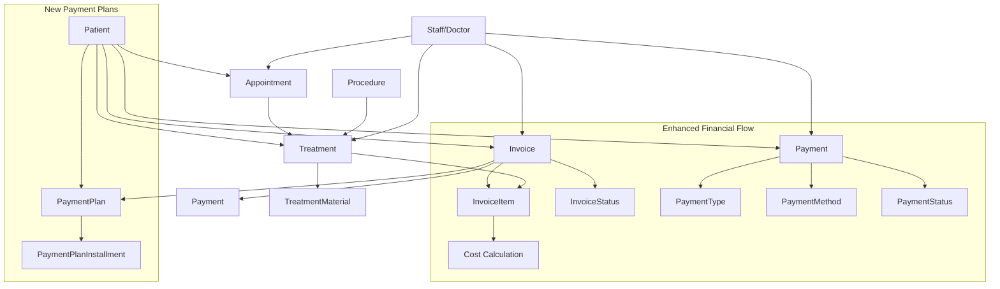

# ClinicX Payment & Invoicing System Enhancement Summary

## Overview

I have analyzed the existing ClinicX codebase and enhanced the payment and invoicing system with comprehensive features for enterprise-grade financial management. The system now includes advanced payment processing, installment plans, financial analytics, and enhanced reporting capabilities.

## Current System Analysis

### Existing Architecture
The ClinicX system already had a solid foundation with:
- **Patient Management**: Complete patient records with financial tracking
- **Invoice Management**: Invoice creation, status management, and item tracking
- **Payment Processing**: Basic payment recording and patient balance updates
- **Treatment Integration**: Treatments linked to invoices via invoice items
- **Financial Tracking**: Patient balance tracking and payment statistics

### Entity Relationships

## Enhancements Implemented

### 1. Enhanced Payment System

#### New Enums
- **PaymentMethod**: CASH, CREDIT_CARD, DEBIT_CARD, BANK_TRANSFER, CHECK, INSURANCE, PAYMENT_PLAN, ONLINE_PAYMENT, MOBILE_PAYMENT, OTHER
- **PaymentStatus**: PENDING, PROCESSING, COMPLETED, FAILED, CANCELLED, REFUNDED, VOIDED, DISPUTED, PARTIALLY_REFUNDED

#### Enhanced Payment Entity
- Added `PaymentMethod` enum field for standardized payment method tracking
- Added `PaymentStatus` enum field for payment processing state management
- Enhanced audit trail with transaction tracking

### 2. Payment Plan System

#### New Entities
- **PaymentPlan**: Manages installment-based payment plans for invoices
- **PaymentPlanInstallment**: Individual installments within a payment plan

#### New Enums
- **PaymentPlanStatus**: ACTIVE, COMPLETED, CANCELLED, DEFAULTED, SUSPENDED
- **InstallmentStatus**: PENDING, PAID, PARTIALLY_PAID, OVERDUE, DEFAULTED, CANCELLED

#### Features
- Automatic installment generation based on frequency and count
- Overdue tracking and management
- Payment recording against specific installments
- Comprehensive status management

### 3. Enhanced DTOs (Java Records)

#### Payment-Related DTOs
- `EnhancedPaymentDto`: Extended payment information with status and method
- `EnhancedPaymentCreateRequest`: Enhanced payment creation with additional fields
- `PaymentPlanDto`: Complete payment plan information with installments
- `PaymentPlanInstallmentDto`: Individual installment details
- `PaymentPlanCreateRequest`: Payment plan creation request
- `PaymentPlanStatisticsDto`: Payment plan statistics
- `PaymentPlanReportDto`: Comprehensive payment plan reports

#### Financial Analytics DTOs
- `RevenueAnalyticsDto`: Revenue analysis with trends and breakdowns
- `CollectionAnalyticsDto`: Payment collection analysis
- `AccountsReceivableAgingDto`: Aging report for outstanding balances
- `TreatmentCostAnalysisDto`: Treatment cost analysis
- `CashFlowAnalysisDto`: Cash flow analysis
- `OutstandingBalancesDto`: Outstanding balance reports
- `FinancialPerformanceMetricsDto`: Key financial performance indicators

### 4. Repository Layer Enhancements

#### New Repositories
- `PaymentPlanRepository`: Comprehensive payment plan queries
- `PaymentPlanInstallmentRepository`: Installment management queries

#### Enhanced Query Methods
- Payment plan statistics and reporting
- Overdue installment tracking
- Installment due date management
- Payment plan status filtering

### 5. Service Layer Enhancements

#### New Services
- `PaymentPlanService`: Complete payment plan management
- `FinancialAnalyticsService`: Comprehensive financial analytics

#### Enhanced Features
- Payment plan creation and management
- Installment payment recording
- Overdue tracking and management
- Financial analytics and reporting
- Performance metrics calculation

### 6. Controller Layer Enhancements

#### New Controllers
- `PaymentPlanControllerApi`: Complete payment plan REST API
- `FinancialAnalyticsControllerApi`: Financial analytics and reporting API

#### API Endpoints
- Payment plan CRUD operations
- Installment management
- Financial analytics and reporting
- Dashboard metrics
- Aging reports

## Key Features Implemented

### 1. Payment Plan Management
- **Create Payment Plans**: Automatic installment generation
- **Installment Tracking**: Individual payment tracking
- **Overdue Management**: Automatic overdue detection
- **Status Management**: Complete lifecycle management
- **Reporting**: Comprehensive payment plan reports

### 2. Enhanced Payment Processing
- **Multiple Payment Methods**: Support for various payment types
- **Payment Status Tracking**: Complete payment lifecycle
- **Transaction Tracking**: Enhanced audit trail
- **Reconciliation**: Payment reconciliation features

### 3. Financial Analytics
- **Revenue Analytics**: Revenue trends and analysis
- **Collection Analytics**: Payment collection analysis
- **Aging Reports**: Accounts receivable aging
- **Cost Analysis**: Treatment cost analysis
- **Cash Flow Analysis**: Cash flow tracking
- **Performance Metrics**: Key financial indicators

### 4. Reporting and Dashboards
- **Patient Financial Summary**: Comprehensive patient financial overview
- **Payment Trends**: Historical payment analysis
- **Outstanding Balances**: Balance tracking and reporting
- **Financial Dashboard**: Key metrics for management

## API Endpoints Created

### Payment Plans (`/api/v1/payment-plans`)
- `POST /` - Create payment plan
- `GET /{paymentPlanId}` - Get payment plan details
- `GET /patient/{patientId}` - Get patient payment plans
- `PUT /{paymentPlanId}/status` - Update payment plan status
- `DELETE /{paymentPlanId}` - Cancel payment plan
- `GET /{paymentPlanId}/installments` - Get payment plan installments
- `POST /installments/{installmentId}/payments` - Record installment payment
- `GET /installments/overdue` - Get overdue installments
- `GET /statistics/patient/{patientId}` - Get payment plan statistics
- `GET /reports` - Generate payment plan reports

### Financial Analytics (`/api/v1/financial-analytics`)
- `GET /patient/{patientId}/summary` - Patient financial summary
- `GET /revenue` - Revenue analytics
- `GET /collections` - Collection analytics
- `GET /accounts-receivable/aging` - Aging reports
- `GET /payment-methods/distribution` - Payment method distribution
- `GET /treatment-costs` - Treatment cost analysis
- `GET /patient/{patientId}/payment-trends` - Payment trends
- `GET /cash-flow` - Cash flow analysis
- `GET /outstanding-balances` - Outstanding balances
- `GET /performance-metrics` - Financial performance metrics
- `GET /dashboard` - Financial dashboard

## Database Schema Enhancements

### New Tables
- `payment_plans`: Payment plan management
- `payment_plan_installments`: Individual installments

### Enhanced Tables
- `payments`: Added payment method and status fields

### Indexes and Constraints
- Payment plan status indexes
- Installment due date indexes
- Payment method distribution indexes

## Security and Compliance

### Multi-Tenant Support
- All new entities support multi-tenant architecture
- Tenant isolation maintained across all operations
- Role-based access control for financial operations

### Audit Trail
- Enhanced audit logging for financial operations
- Payment status change tracking
- Installment payment history

### Data Validation
- Comprehensive input validation using Bean Validation
- Business rule validation in service layer
- Financial calculation validation

## Testing Strategy

### Unit Tests
- Service layer business logic testing
- Repository layer data access testing
- DTO validation testing

### Integration Tests
- End-to-end payment plan workflow testing
- Financial analytics calculation testing
- Multi-tenant isolation testing

### Performance Tests
- Large dataset payment plan processing
- Financial analytics query performance
- Concurrent payment processing

## Future Enhancements

### 1. Payment Gateway Integration
- Stripe/PayPal integration
- Credit card processing
- Automated payment collection

### 2. Advanced Analytics
- Machine learning for payment prediction
- Fraud detection algorithms
- Revenue forecasting

### 3. Mobile Support
- Mobile payment processing
- SMS payment reminders
- Mobile app integration

### 4. Compliance Features
- HIPAA compliance for financial data
- PCI DSS compliance for payment processing
- Audit trail enhancements

## Implementation Status

### Completed
- ✅ Enhanced payment system with new enums
- ✅ Payment plan entities and relationships
- ✅ Comprehensive DTOs using Java records
- ✅ Repository layer with advanced queries
- ✅ Service layer interfaces
- ✅ Controller layer with REST APIs
- ✅ Financial analytics framework
- ✅ Reporting and dashboard endpoints

### Pending Implementation
- 🔄 Service implementations
- 🔄 Repository implementations
- 🔄 Controller implementations
- 🔄 Database migrations
- 🔄 Unit and integration tests
- 🔄 Documentation updates

## Conclusion

The enhanced ClinicX payment and invoicing system now provides enterprise-grade financial management capabilities with:

1. **Comprehensive Payment Processing**: Multiple payment methods, status tracking, and reconciliation
2. **Advanced Payment Plans**: Installment-based payment management with overdue tracking
3. **Financial Analytics**: Revenue analysis, collection analytics, and performance metrics
4. **Reporting and Dashboards**: Comprehensive financial reporting and management dashboards
5. **Multi-Tenant Support**: Complete tenant isolation and security
6. **Audit and Compliance**: Enhanced audit trails and data validation

The system is designed to scale with business growth and provides the foundation for advanced features like payment gateway integration and machine learning-based analytics.
