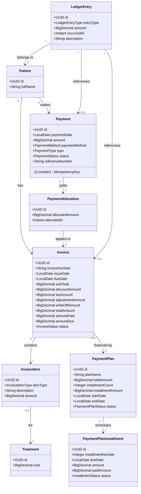
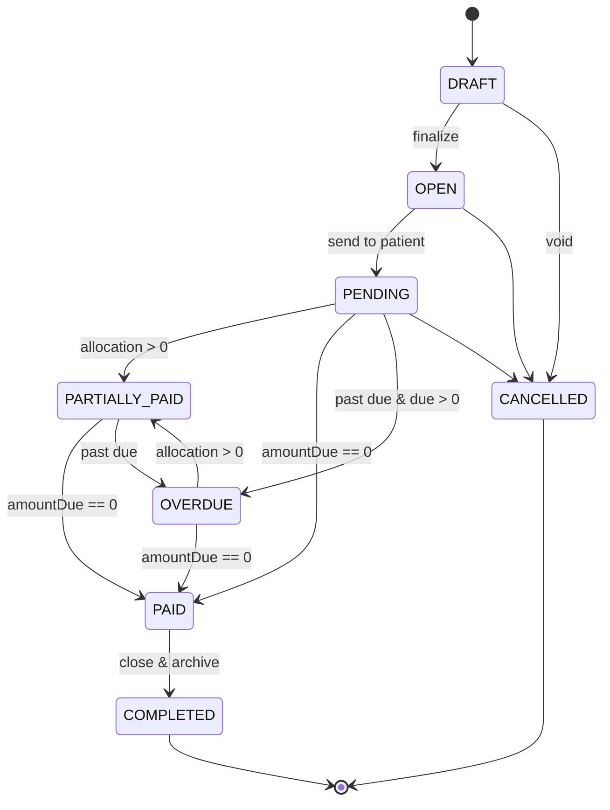
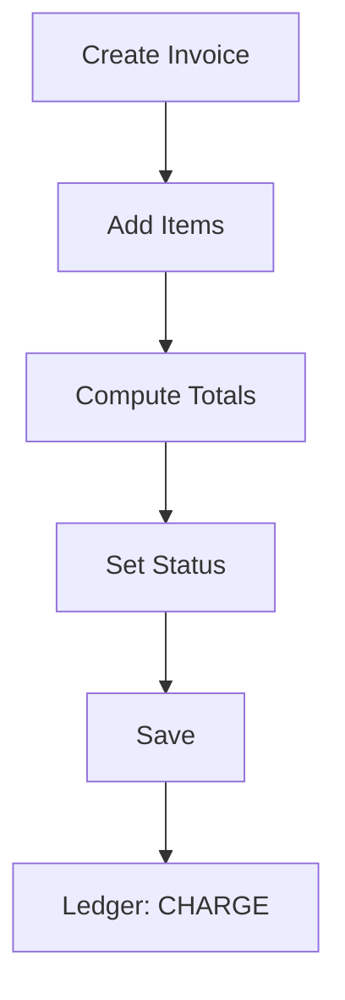
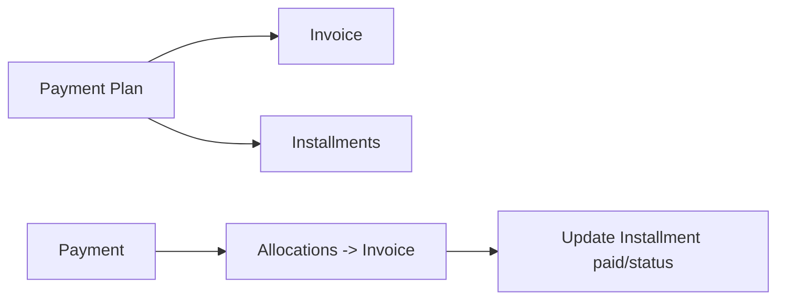
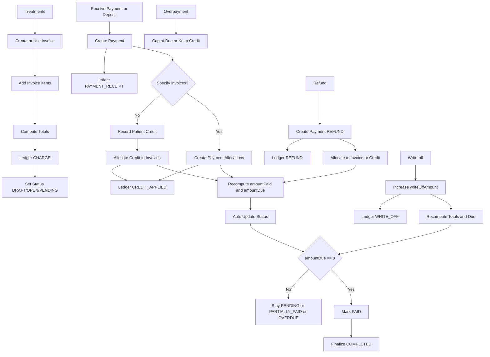

# ClinicX Finance Architecture and Workflows

This document explains how finance entities relate to each other and how to handle invoicing, payment application, split payments, patient deposits/credits, refunds, and write-offs — aligned with the current invoicing process doc.

## Are `Payment` and `PaymentAllocation` both needed?

Yes — they serve different purposes and complement each other:
- `Payment`: Represents the receipt (or refund) of money from/to a patient with method, status, reference, audit data. It is the financial event at the time funds move.
- `PaymentAllocation`: Maps a payment to one or more invoices and amounts. It models the business rule that a single payment can cover multiple invoices and an invoice can be paid by multiple payments (many-to-many).

Recommendation:
- Standardize on `PaymentAllocation` for applying payments. Treat `Payment.invoice` (direct link) as optional/legacy; avoid using it to prevent double-application. Prefer only allocations to affect invoice balances.

## Domain Model (Overview)



## Core Invariants

- Invoice amounts: `totalAmount = subTotal - discountAmount + taxAmount + adjustmentAmount - writeOffAmount`.
- Due calculation: `amountDue = totalAmount - amountPaid - writeOffAmount`.
- Paid calculation: `amountPaid = SUM(PaymentAllocation.allocatedAmount WHERE invoice = X)`.
- Allocation bounds: `SUM(PaymentAllocation.allocatedAmount WHERE payment = Y) <= payment.amount`.
- Payment plan consistency: `installmentCount * installmentAmount ≈ totalAmount` (define rounding policy).
- All amounts are non-negative (except refunds, which are modeled via `Payment.type = REFUND` and negative ledger impact).

## Invoice Lifecycle (Summary)

States align with the invoicing doc: `DRAFT → OPEN → PENDING → (PARTIALLY_PAID|PAID|OVERDUE) → (CANCELLED|COMPLETED)`.
Automatic transitions:
- Any allocation sets to `PARTIALLY_PAID` unless fully paid.
- Fully allocated (`amountDue = 0`) sets to `PAID` and then `COMPLETED` when finalized.
- Past `dueDate` with `amountDue > 0` sets to `OVERDUE`.



## Invoicing Flow (Recap)

- Create invoice (possibly from one or more treatments as items).
- Compute totals per formula; create `LedgerEntry(CHARGE, totalAmount)`.
- Optionally, ledger entries for DISCOUNT/TAX/ADJUSTMENT/WRITE_OFF when these fields change.



## Payment Posting and Allocation

Payments represent money received; allocations apply that money to invoices.

```mermaid
flowchart TD
    S[Receive Payment] --> P[Create Payment]
    P --> Q{Target Invoices?}
    Q -- Yes --> A1[Create PaymentAllocation(s)]
    A1 --> R[Recompute Invoice Paid/Due + Status]
    R --> L[Ledger: PAYMENT_RECEIPT]
    Q -- No --> C1[Record as Credit (Unallocated)]
    C1 --> L
```

- If invoices are specified, split `payment.amount` across them via multiple `PaymentAllocation` rows.
- If none are specified, treat as a patient credit (unallocated payment). It can be allocated later.
- Always create `LedgerEntry(PAYMENT_RECEIPT, amount)` for audit.

## Split Payment Across Multiple Invoices (Example)

```mermaid
sequenceDiagram
    participant User
    participant Service
    participant DB

    User->>Service: Pay 300 for invoices A=200, B=100
    Service->>DB: INSERT Payment(amount=300)
    Service->>DB: INSERT Allocation(payment, invoice A, 200)
    Service->>DB: INSERT Allocation(payment, invoice B, 100)
    Service->>DB: UPDATE Invoice A: amountPaid += 200; recalc status
    Service->>DB: UPDATE Invoice B: amountPaid += 100; recalc status
    Service->>DB: INSERT LedgerEntry PAYMENT_RECEIPT 300
    Service-->>User: Success (both invoices updated)
```

## Patient Deposits / Credits

A deposit (advance payment) is a `Payment` with no allocations yet. Later, it can be applied to invoices.

```mermaid
flowchart LR
    D[Deposit Payment (Unallocated)] -->|later| A[Create Allocations]
    A --> U[Update Invoice Paid/Due]
    D --> L[Ledger: PAYMENT_RECEIPT]
    A --> LA[Ledger: CREDIT_APPLIED for each allocation]
```

- Represent the patient’s credit balance as `SUM(unallocated payments) - SUM(refunds of credits)` or via ledger aggregation of `PAYMENT_RECEIPT` minus allocations (`CREDIT_APPLIED`).
- When applying credit, create allocations from the existing credit payment(s). If splitting a single credit over many invoices, use multiple allocations.

## Overpayments

If an allocation attempt would exceed `amountDue`:
- Cap allocation at `amountDue` and leave the remainder as unallocated credit; or
- Apply excess to the next oldest open invoice automatically (AR policy).

## Refunds

Refunds can be modeled as `Payment(type = REFUND, amount = X)` with allocations to the original invoice (or to the original credit payment if refunding a deposit).

```mermaid
flowchart TD
    R1[Create REFUND Payment] --> R2{Invoice-linked?}
    R2 -- Yes --> RA[Allocations to that invoice (negative effect)]
    R2 -- No (Deposit) --> RC[Reference original credit payment]
    RA --> RU[Recompute Invoice Paid/Due]
    RC --> RL[Reduce credit balance]
    R1 --> LE[Ledger: REFUND]
```

Note: Use service logic to ensure that the sum of allocations for refunds does not exceed prior applied amounts.

## Write-offs

A write-off reduces the collectible amount of an invoice:
- Increase `writeOffAmount` and recompute `totalAmount` / `amountDue`.
- Create `LedgerEntry(WRITE_OFF, amount)`.
- If `amountDue` becomes 0, mark invoice `PAID` then `COMPLETED`.

## Payment Plan Interaction

- A `PaymentPlan` references a single `Invoice`. Installments are scheduled payments toward that invoice.
- When a real `Payment` arrives for a plan installment, allocate it to the same invoice and update the corresponding `PaymentPlanInstallment.paidAmount` and status.
- Consider adding a reconciliation reference from installment to payment/allocation for audit clarity.



## Service-Level Rules and Validation

- Prevent mixing direct `payment.invoice` assignment with allocations that would double-count paid amounts.
- Enforce invariants in service methods with transactional boundaries.
- Idempotency: Add and enforce an `idempotencyKey` (or `externalTxnId`) on `Payment` to avoid duplicates from gateways.
- Rounding: Centralize rounding policy (e.g., HALF_UP) across taxes, allocations, and installment splits.
- Optimistic locking: Add `@Version` to `Invoice` to avoid racing payment posts.

## Delete/Cancel Policies

- Do not hard-delete invoices that have allocations, are in a payment plan, or have ledger entries; use cancel/void.
- Do not cascade delete payments/allocations when deleting invoices; block deletion at the service layer and DB (FK) instead.

## Suggested Implementation Adjustments

- Prefer allocations as the single source of truth for `amountPaid` per invoice; deprecate using `Payment.invoice`.
- Automate `InvoiceStatus` updates based on amounts and dates.
- Post ledger entries for each monetary change: CHARGE, DISCOUNT, TAX, ADJUSTMENT, WRITE_OFF, PAYMENT_RECEIPT, REFUND, CREDIT_APPLIED.
- Add indexes: `invoice(patient_id, status)`, `payment(patient_id, payment_date)`, `payment_allocation(invoice_id)`, `payment_allocation(payment_id)`, `ledger_entry(patient_id, occurred_at)`.
- Add validation annotations (`@Positive`, `@PositiveOrZero`) on monetary fields and DB CHECK constraints where supported.

---

References:
- Invoicing doc: `docs/financ/invoicing-process-explained.md`
- Patient finance models in `src/main/java/sy/sezar/clinicx/patient/model`

## Recommendations

- Use `PaymentAllocation` exclusively to affect invoice paid/due; treat `Payment.invoice` as deprecated to avoid double counting.
- Automate invoice status transitions (PARTIALLY_PAID/PAID/OVERDUE) based on amounts and dates; avoid manual status edits.
- Recompute `subTotal`, `totalAmount`, `amountPaid`, and `amountDue` in one place (service/helper) on every change to items/discount/tax/adjustments/write-offs/allocations.
- Create ledger entries for every monetary change: CHARGE, DISCOUNT, TAX, ADJUSTMENT, WRITE_OFF, PAYMENT_RECEIPT, REFUND, CREDIT_APPLIED.
- Enforce invariants and bounds (allocations ≤ payment.amount; sum allocations per invoice = amountPaid) with validation and transactions.
- Add idempotency for payments, optimistic locking on invoices, and centralized rounding policy.
- Prevent destructive cascades: block deletes for financial objects; prefer cancel/void + audit trail.

## Prescribed Financial Workflow

The following workflow should be the standard path for all invoicing and payments.



Step-by-step guidelines:
- Create invoices from completed treatments or manually; compute all totals and post a CHARGE ledger entry.
- When receiving money, always create a `Payment`. If specific invoices are known, create `PaymentAllocation` rows immediately; otherwise, keep it as a patient credit (unallocated) for later application.
- Every allocation triggers invoice recomputation and status updates. Maintain strict invariants and transactional safety.
- Handle exceptions explicitly: cap overpayments; create `REFUND` payments for returns; use `writeOffAmount` for uncollectible balances.
- Close invoices automatically when due hits zero; archive as `COMPLETED`.
