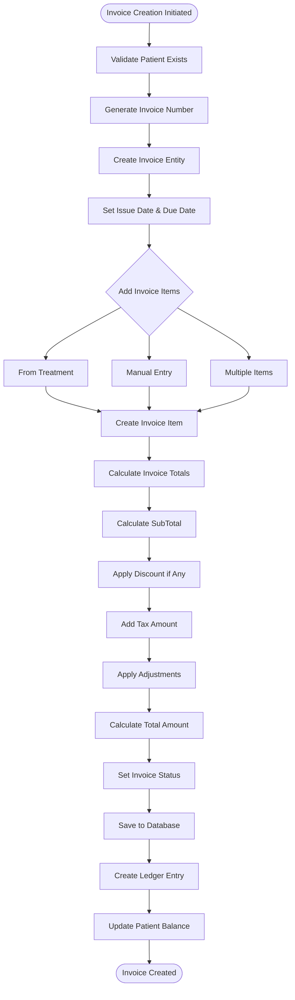
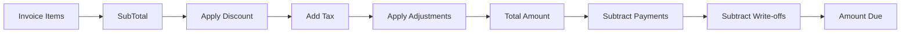
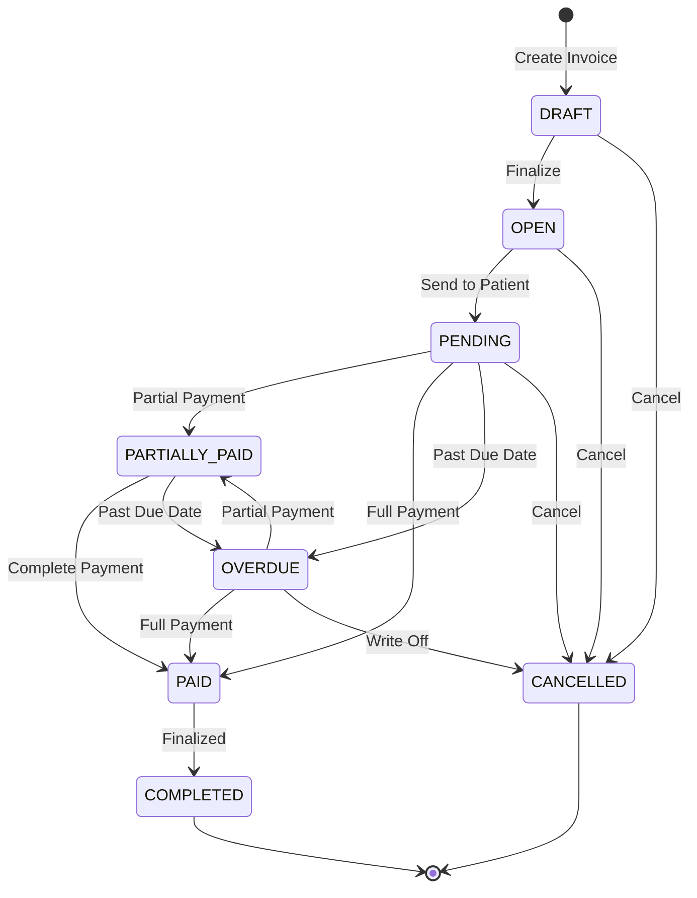
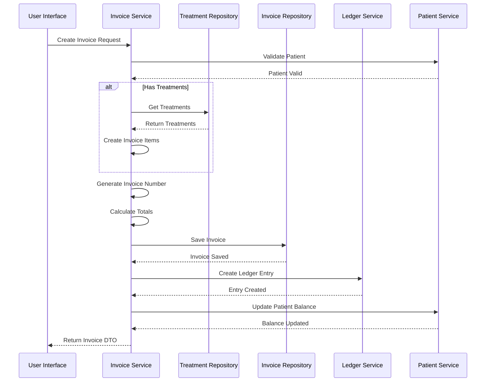

# Invoice Creation and Issuance Process - ClinicX

## Overview
This document explains the complete invoicing process in the ClinicX system, from creation triggers to payment allocation and status management.

## 1. Invoice Creation Triggers

The invoice can be created through multiple pathways:

### A. Treatment-Based Invoice Creation
```
Treatment Completed → Generate Invoice → Link Treatment to Invoice Item
```

When a treatment is completed:
1. A new invoice is created or an existing draft invoice is used
2. The treatment is converted to an `InvoiceItem`
3. The treatment cost becomes the invoice item amount
4. Treatment details are stored in the item description

### B. Manual Invoice Creation
Staff can create invoices directly through the `InvoiceService`:
- Specify patient, amount, and description
- System generates unique invoice number
- Invoice starts with status `DRAFT` or `OPEN`

## 2. Invoice Generation Flow



## 3. Key Components in Invoice Creation

### Invoice Entity Structure
```java
Invoice {
    - invoiceNumber (unique, auto-generated)
    - patient (linked patient)
    - issueDate (when created)
    - dueDate (payment deadline)
    - status (DRAFT → OPEN → PENDING → PAID)
    - Financial Fields:
        * subTotal (sum of all items)
        * discountAmount
        * taxAmount
        * adjustmentAmount
        * writeOffAmount
        * totalAmount (final amount)
        * amountPaid (payments received)
        * amountDue (remaining balance)
}
```

### Invoice Item Types
- `PROCEDURE` - Medical/dental procedures
- `TREATMENT` - Completed treatments
- `MATERIAL` - Treatment materials used
- `CONSULTATION` - Doctor consultations
- `LAB_WORK` - Laboratory services
- `OTHER` - Miscellaneous charges

## 4. Invoice Number Generation

The system generates unique invoice numbers using a pattern-based approach:

```java
private String getNextInvoiceNumber() {
    // Format: INV-YYYY-MM-XXXXX
    // Example: INV-2024-01-00001
    String prefix = "INV-" + LocalDate.now().format(DateTimeFormatter.ofPattern("yyyy-MM"));
    Long count = invoiceRepository.countByInvoiceNumberStartingWith(prefix);
    return String.format("%s-%05d", prefix, count + 1);
}
```

### Invoice Number Format
- **Prefix**: "INV-"
- **Year-Month**: Current year and month (YYYY-MM)
- **Sequential Number**: 5-digit zero-padded counter
- **Example**: INV-2024-01-00001, INV-2024-01-00002

## 5. Invoice Calculation Process

The invoice total is calculated through a series of steps:

```
1. SubTotal = Sum of all InvoiceItems
2. After Discount = SubTotal - DiscountAmount
3. After Tax = After Discount + TaxAmount
4. After Adjustments = After Tax ± AdjustmentAmount
5. Total Amount = After Adjustments
6. Amount Due = Total Amount - AmountPaid - WriteOffAmount
```

### Calculation Flow Diagram



## 6. Ledger Entry Creation

When an invoice is created, a ledger entry is automatically generated:

```java
LedgerEntry {
    - patient: The patient being charged
    - invoice: The created invoice
    - entryType: CHARGE
    - amount: Total invoice amount
    - description: "Invoice #INV-2024-01-00001"
    - occurredAt: Timestamp
}
```

### Ledger Entry Types for Invoicing
- `CHARGE` - Initial invoice creation
- `DISCOUNT` - When discount is applied
- `TAX` - Tax amount added
- `ADJUSTMENT` - Manual adjustments
- `WRITE_OFF` - Bad debt write-off

## 7. Invoice Status Lifecycle



### Status Descriptions
- **DRAFT**: Initial creation, can be edited freely
- **OPEN**: Finalized, ready to send to patient
- **PENDING**: Sent to patient, awaiting payment
- **PARTIALLY_PAID**: Some payment received but not complete
- **PAID**: Fully paid
- **OVERDUE**: Past due date without full payment
- **CANCELLED**: Voided invoice
- **COMPLETED**: Closed and archived

## 8. Integration Points

### With Treatments
- Treatments automatically create invoice items
- Treatment cost flows to invoice amount
- Materials used in treatment can be itemized
- Multiple treatments can be grouped in one invoice

### With Payments
- Payments are allocated to invoices via `PaymentAllocation`
- Multiple payments can be applied to one invoice
- One payment can be split across multiple invoices
- Advance payments (credits) can be applied

### With Payment Plans
- Invoices can be linked to payment plans
- Installments are tracked separately
- Partial payments update invoice status
- Plan creation requires invoice reference

## 9. Business Rules

### Invoice Cannot be Deleted if:
- Has any payments allocated
- Is part of a payment plan
- Status is COMPLETED
- Has ledger entries recorded

### Invoice Can be Modified only if:
- Status is DRAFT
- No payments have been applied
- Not linked to payment plan
- User has appropriate permissions

### Automatic Status Updates:
- When fully paid → Status changes to PAID
- When past due date → Status changes to OVERDUE
- When partially paid → Status changes to PARTIALLY_PAID
- When payment plan created → Status remains PENDING

## 10. Example Invoice Creation Code Flow

### Basic Invoice Creation
```java
// InvoiceServiceImpl.java
@Transactional
public FinancialRecordDto createInvoice(UUID patientId, BigDecimal amount, String description) {
    // 1. Validate patient
    Patient patient = findPatientById(patientId);
    
    // 2. Generate invoice number
    String invoiceNumber = getNextInvoiceNumber();
    
    // 3. Create invoice entity
    Invoice invoice = new Invoice();
    invoice.setPatient(patient);
    invoice.setInvoiceNumber(invoiceNumber);
    invoice.setTotalAmount(amount);
    invoice.setIssueDate(LocalDate.now());
    invoice.setDueDate(LocalDate.now().plusDays(30)); // 30-day payment terms
    invoice.setStatus(InvoiceStatus.OPEN);
    
    // 4. Save invoice
    Invoice savedInvoice = invoiceRepository.save(invoice);
    
    // 5. Create ledger entry
    ledgerService.record(
        patient.getId(), 
        savedInvoice, 
        null,
        LedgerEntryType.CHARGE,
        amount, 
        description
    );
    
    // 6. Update patient balance
    BigDecimal newBalance = recalculatePatientBalance(patientId);
    
    return mapToFinancialRecordDto(savedInvoice);
}
```

### Multi-Item Invoice Creation
```java
// Create invoice with multiple items
Invoice invoice = new Invoice();
invoice.setPatient(patient);
invoice.setInvoiceNumber(generateNumber());
invoice.setIssueDate(LocalDate.now());
invoice.setDueDate(LocalDate.now().plusDays(30));

// Add treatment items
for (Treatment treatment : treatments) {
    InvoiceItem item = new InvoiceItem();
    item.setInvoice(invoice);
    item.setTreatment(treatment);
    item.setItemType(InvoiceItemType.TREATMENT);
    item.setDescription(treatment.getProcedure().getName());
    item.setAmount(treatment.getCost());
    invoice.getItems().add(item);
}

// Calculate totals
BigDecimal subTotal = invoice.getItems().stream()
    .map(InvoiceItem::getAmount)
    .reduce(BigDecimal.ZERO, BigDecimal::add);

invoice.setSubTotal(subTotal);

// Apply discount if any
if (discountAmount != null && discountAmount.compareTo(BigDecimal.ZERO) > 0) {
    invoice.setDiscountAmount(discountAmount);
    subTotal = subTotal.subtract(discountAmount);
}

// Apply tax
BigDecimal taxAmount = subTotal.multiply(TAX_RATE);
invoice.setTaxAmount(taxAmount);

// Final total
invoice.setTotalAmount(subTotal.add(taxAmount));
invoice.setAmountDue(invoice.getTotalAmount());

// Save invoice with items
invoiceRepository.save(invoice);
```

## 11. Invoice Processing Workflow

### Complete Invoice Processing Flow



## 12. Error Handling and Validation

### Common Validation Rules
1. **Patient Validation**
   - Patient must exist and be active
   - Patient must belong to current tenant

2. **Amount Validation**
   - Total amount must be positive
   - Discount cannot exceed subtotal
   - Tax rate must be valid

3. **Date Validation**
   - Due date must be after issue date
   - Issue date cannot be in the future

4. **Status Validation**
   - Status transitions must follow lifecycle rules
   - Cannot skip status states

### Error Responses
```java
// Common exceptions
- PatientNotFoundException
- InvalidAmountException
- InvalidInvoiceStatusException
- InsufficientPermissionsException
- DuplicateInvoiceNumberException
```

## 13. Performance Considerations

### Database Indexes
- `invoice_number` - Unique index for fast lookup
- `patient_id` - Foreign key index for patient queries
- `status` - Index for filtering by status
- `issue_date` - Index for date range queries
- `(patient_id, status)` - Composite index for patient invoice listing

### Caching Strategy
- Cache invoice number generation counter
- Cache patient balance calculations
- Cache frequently accessed invoices
- Use optimistic locking for concurrent updates

## 14. Security and Audit

### Access Control
```java
@PreAuthorize("hasRole('ROLE_STAFF') or hasRole('ROLE_ADMIN')")
public Invoice createInvoice(...)

@PreAuthorize("hasRole('ROLE_ADMIN')")
public void deleteInvoice(...)

@PreAuthorize("hasRole('ROLE_STAFF')")
public Invoice updateInvoice(...)
```

### Audit Trail
Every invoice operation creates an audit entry:
- Who: User/Staff ID
- What: Operation type (CREATE, UPDATE, DELETE)
- When: Timestamp
- Why: Reason/Description
- Before/After: State changes

## 15. Best Practices

### Invoice Creation
1. Always validate patient before creating invoice
2. Use database transactions for atomicity
3. Generate invoice numbers sequentially without gaps
4. Create ledger entries immediately after invoice creation
5. Update patient balance in the same transaction

### Invoice Management
1. Never hard-delete invoices (use CANCELLED status)
2. Maintain complete audit trail
3. Validate all status transitions
4. Ensure payment allocations are tracked
5. Handle concurrent updates with optimistic locking

### Performance Optimization
1. Batch process multiple invoice items
2. Use database views for complex calculations
3. Implement pagination for invoice listings
4. Cache frequently accessed data
5. Use async processing for notifications

## Conclusion

The ClinicX invoicing system provides a robust, auditable, and flexible solution for medical billing. It handles complex scenarios including:
- Multi-item invoices
- Various payment methods
- Payment plans and installments
- Discounts and adjustments
- Complete audit trails
- Integration with treatments and payments

The system ensures data integrity through comprehensive validation, maintains financial accuracy through the ledger system, and provides flexibility for various billing scenarios common in medical practices.

---
*Document Version: 1.0*  
*Last Updated: 2025-01-24*  
*Author: Claude Code Assistant*