# ClinicX Patient Financial Architecture - Deep Analysis

## Table of Contents
1. [Executive Summary](#executive-summary)
2. [Entity Model Overview](#entity-model-overview)
3. [Financial Flow Architecture](#financial-flow-architecture)
4. [Entity Relationship Diagrams](#entity-relationship-diagrams)
5. [Payment Processing Workflow](#payment-processing-workflow)
6. [Invoice Management System](#invoice-management-system)
7. [Ledger System Architecture](#ledger-system-architecture)
8. [Payment Plans and Installments](#payment-plans-and-installments)
9. [Financial Calculations and Balance Management](#financial-calculations-and-balance-management)
10. [Security and Audit Trail](#security-and-audit-trail)

## Executive Summary

The ClinicX patient financial system is a sophisticated, multi-layered architecture designed to handle complex medical billing scenarios. The system supports multiple payment methods, payment plans, advance payments, refunds, and comprehensive financial tracking through a double-entry ledger system.

### Key Features
- **Comprehensive Invoice Management**: Multi-item invoices with support for treatments, procedures, and custom items
- **Flexible Payment Processing**: Multiple payment methods including cash, cards, insurance, and payment plans
- **Advance Payment System**: Patient credits that can be applied to future invoices
- **Payment Allocation**: Intelligent distribution of payments across multiple invoices
- **Double-Entry Ledger**: Complete audit trail of all financial transactions
- **Payment Plans**: Installment-based payment options with automated tracking
- **Real-time Balance Calculation**: Automatic patient balance updates based on transactions

## Entity Model Overview

### Core Financial Entities

## Financial Flow Architecture

### Payment Processing Flow

### Invoice Creation and Treatment Billing Flow

## Entity Relationship Diagrams

### Complete Financial ERD

## Payment Processing Workflow

### Standard Payment Flow

### Advance Payment Application Flow

## Invoice Management System

### Invoice Status Lifecycle

### Invoice Total Calculation

```mermaid
flowchart TB
    Start([Invoice Items])
    
    Start --> SumItems[Sum All Item Amounts]
    SumItems --> SubTotal[SubTotal = Sum of Items]
    
    SubTotal --> ApplyDiscount{Discount?}
    ApplyDiscount -->|Yes| CalcDiscount[Total - Discount Amount]
    ApplyDiscount -->|No| NoDiscount[Keep SubTotal]
    
    CalcDiscount --> ApplyTax{Tax?}
    NoDiscount --> ApplyTax
    
    ApplyTax -->|Yes| CalcTax[Add Tax Amount]
    ApplyTax -->|No| NoTax[No Tax Added]
    
    CalcTax --> ApplyAdjustment{Adjustment?}
    NoTax --> ApplyAdjustment
    
    ApplyAdjustment -->|Yes| CalcAdjustment[Apply Adjustment ±]
    ApplyAdjustment -->|No| NoAdjustment[No Adjustment]
    
    CalcAdjustment --> FinalTotal[Total Amount]
    NoAdjustment --> FinalTotal
    
    FinalTotal --> CalcPaid[Amount Paid = Sum of Payments]
    CalcPaid --> CalcDue[Amount Due = Total - Paid - WriteOff]
    
    CalcDue --> End([Invoice Totals Complete])
```

## Ledger System Architecture

### Ledger Entry Types and Flow

### Double-Entry Ledger Pattern

## Payment Plans and Installments

### Payment Plan Lifecycle

### Installment Processing Flow

## Financial Calculations and Balance Management

### Patient Balance Calculation Algorithm

### Invoice Payment Allocation Strategy

## Security and Audit Trail

### Financial Transaction Audit

### Role-Based Financial Access Control

## Implementation Details

### Key Service Layer Components

1. **PaymentService**
   - Handles all payment operations
   - Manages payment allocations
   - Processes refunds and credits
   - Integrates with LedgerService

2. **InvoiceService**
   - Creates and manages invoices
   - Handles invoice items
   - Calculates totals and taxes
   - Manages invoice lifecycle

3. **LedgerService**
   - Records all financial transactions
   - Maintains audit trail
   - Provides transaction history
   - Calculates balances

4. **AdvancePaymentService**
   - Manages patient credits
   - Applies credits to invoices
   - Tracks credit balance
   - Handles credit refunds

5. **PaymentPlanService**
   - Creates payment plans
   - Manages installments
   - Tracks payment schedule
   - Handles plan modifications

### Database Optimization

- **Indexes**: On patient_id, invoice_id, payment_date for fast queries
- **Triggers**: For automatic balance calculation
- **Views**: For pre-aggregated financial summaries
- **Partitioning**: Considered for large-scale deployments

### Transaction Management

- All financial operations are wrapped in database transactions
- Optimistic locking on critical entities (Invoice, Payment)
- Compensation transactions for rollback scenarios
- Idempotent payment processing to prevent duplicates

## Best Practices and Recommendations

### Data Integrity
1. Always use database transactions for financial operations
2. Implement optimistic locking on Invoice and Payment entities
3. Validate all amounts are positive before processing
4. Ensure referential integrity through foreign key constraints

### Performance Optimization
1. Use batch processing for bulk payment operations
2. Implement caching for frequently accessed financial data
3. Consider async processing for non-critical operations
4. Use database views for complex financial reports

### Security Measures
1. Encrypt sensitive payment information
2. Implement comprehensive audit logging
3. Use role-based access control for financial operations
4. Regular security audits of financial workflows

### Business Logic
1. Centralize financial calculations in service layer
2. Implement configurable business rules
3. Support multiple currencies (future enhancement)
4. Provide flexible payment allocation strategies

## Conclusion

The ClinicX financial architecture provides a robust, scalable, and secure foundation for managing complex medical billing scenarios. The system's strength lies in its:

- **Comprehensive tracking** through the ledger system
- **Flexible payment options** including plans and advances
- **Strong audit trail** for compliance
- **Scalable architecture** supporting multi-tenant operations
- **Clear separation of concerns** between entities and services

The architecture is well-positioned to handle the complex requirements of modern medical practice management while maintaining data integrity, security, and performance.

---
*Document Version: 1.0*  
*Last Updated: 2025-01-24*  
*Generated by: Claude Code Assistant*