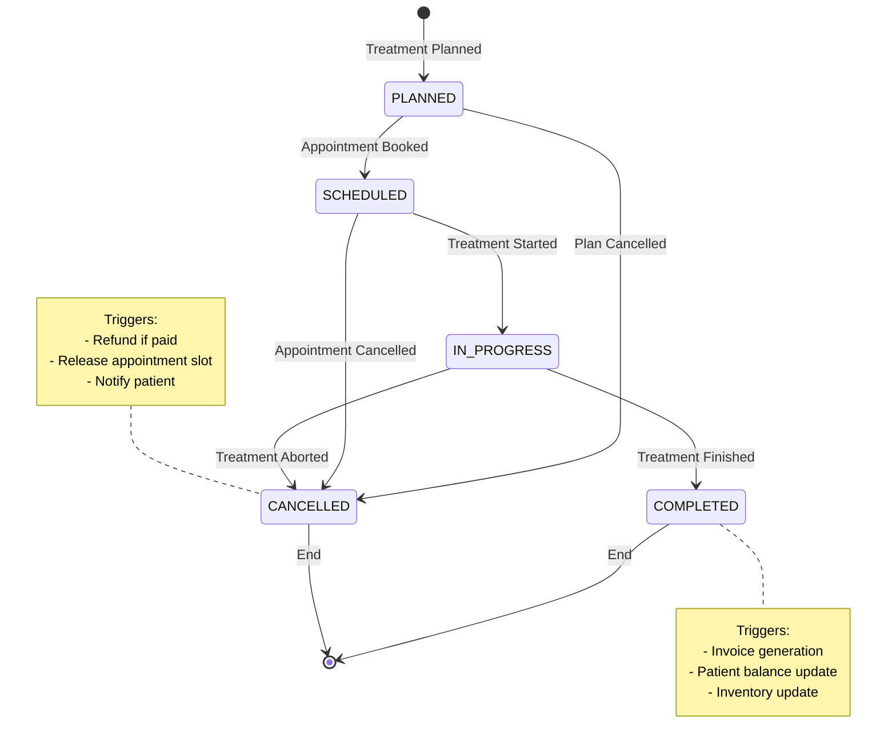
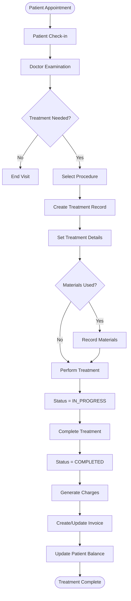
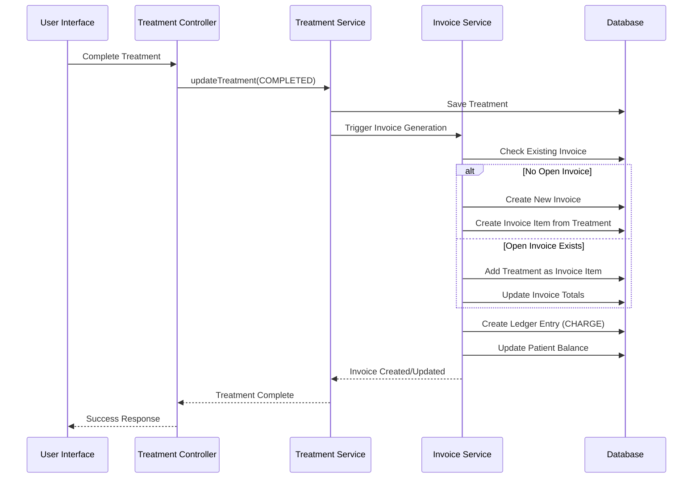
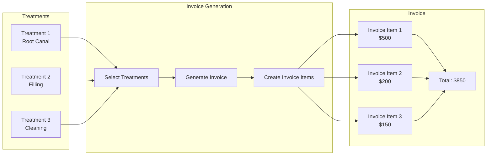
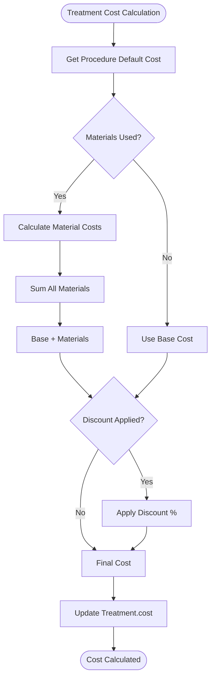
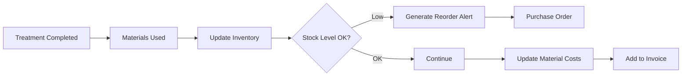

# Treatment Workflow Analysis - ClinicX System

## Executive Summary
The Treatment entity is a core component of the ClinicX patient management system that bridges medical procedures with financial billing. It tracks all medical interventions performed on patients and seamlessly integrates with the appointment, invoicing, and payment systems.

## Table of Contents
1. [Treatment Entity Structure](#treatment-entity-structure)
2. [Treatment Lifecycle](#treatment-lifecycle)
3. [Workflow Diagrams](#workflow-diagrams)
4. [Integration Points](#integration-points)
5. [Business Rules and Validations](#business-rules-and-validations)
6. [Financial Integration](#financial-integration)
7. [API Endpoints](#api-endpoints)
8. [Implementation Details](#implementation-details)

## Treatment Entity Structure

### Core Treatment Model
```java
@Entity
@Table(name = "treatments")
public class Treatment extends BaseEntity {
    // Relationships
    @ManyToOne Appointment appointment     // Links to appointment
    @ManyToOne Patient patient            // Direct patient reference
    @ManyToOne Procedure procedure        // Medical procedure performed
    @ManyToOne Staff doctor               // Performing doctor
    
    // Treatment Details
    Integer toothNumber                   // For dental procedures (11-48)
    TreatmentStatus status                // PLANNED, IN_PROGRESS, COMPLETED, etc.
    BigDecimal cost                       // Treatment cost
    String treatmentNotes                 // Clinical notes
    LocalDate treatmentDate               // When performed
    
    // Audit
    @ManyToOne Staff createdBy           // Who created the record
    
    // Materials Used
    @OneToMany Set<TreatmentMaterial> materials  // Materials used in treatment
}
```

### Treatment Status Enum
```java
public enum TreatmentStatus {
    PLANNED,       // Treatment is planned for future
    SCHEDULED,     // Scheduled with appointment
    IN_PROGRESS,   // Currently being performed
    COMPLETED,     // Successfully completed
    CANCELLED      // Cancelled treatment
}
```

### Related Entities

#### TreatmentMaterial
```java
@Entity
public class TreatmentMaterial {
    @ManyToOne Treatment treatment
    String materialName
    BigDecimal quantity
    String unit
    BigDecimal costPerUnit
    BigDecimal totalCost        // Auto-calculated: quantity × costPerUnit
    String supplier
    String batchNumber
}
```

## Treatment Lifecycle



## Workflow Diagrams

### Treatment Creation Flow



### Treatment to Invoice Flow



### Multi-Treatment Invoice Generation



## Integration Points

### 1. Appointment Integration
```java
// Treatment is linked to Appointment
@ManyToOne
@JoinColumn(name = "appointment_id", nullable = false)
private Appointment appointment;

// Appointment can have multiple treatments
@OneToMany(mappedBy = "appointment")
private Set<Treatment> treatments;
```

**Workflow:**
1. Patient books appointment
2. During appointment, treatments are performed
3. Each treatment is linked to the appointment
4. Appointment status updated when all treatments complete

### 2. Procedure Integration
```java
// Treatment must have a procedure
@ManyToOne
@JoinColumn(name = "procedure_id", nullable = false)
private Procedure procedure;
```

**Procedure provides:**
- Default cost
- Default duration
- Procedure code for insurance
- Required materials list

### 3. Invoice Integration
```java
// InvoiceItem can link to Treatment
@OneToOne
@JoinColumn(name = "treatment_id", unique = true)
private Treatment treatment;
```

**Invoice Generation Process:**
1. Treatment marked as COMPLETED
2. System checks for open invoice
3. Creates InvoiceItem from Treatment
4. Links Treatment cost to Invoice
5. Updates patient balance

### 4. Material Tracking
```java
// Treatment tracks materials used
@OneToMany(mappedBy = "treatment", cascade = CascadeType.ALL)
private Set<TreatmentMaterial> materials;
```

**Material Management:**
- Records materials used per treatment
- Calculates material costs
- Updates inventory (if integrated)
- Adds to treatment total cost

## Business Rules and Validations

### Treatment Creation Rules
1. **Required Fields:**
   - Patient ID (must exist)
   - Procedure ID (must be active)
   - Doctor ID (must be active staff)
   - Treatment Date (cannot be future)
   - Cost (must be positive)
   - Status (default: PLANNED)

2. **Validation Rules:**
   ```java
   // Cost must be positive
   @Positive
   BigDecimal cost;
   
   // Tooth number validation (for dental)
   if (toothNumber != null) {
       assert toothNumber >= 11 && toothNumber <= 48;
   }
   
   // Treatment date cannot be in future
   assert !treatmentDate.isAfter(LocalDate.now());
   ```

3. **Status Transition Rules:**
   - PLANNED → SCHEDULED (when appointment booked)
   - SCHEDULED → IN_PROGRESS (when treatment starts)
   - IN_PROGRESS → COMPLETED (when finished)
   - Any status → CANCELLED (with reason)

### Treatment Update Rules
1. **Editable in Status:**
   - PLANNED: All fields editable
   - SCHEDULED: Limited edits (notes, materials)
   - IN_PROGRESS: Only notes and materials
   - COMPLETED: Only notes (audit trail maintained)
   - CANCELLED: No edits allowed

2. **Cost Modifications:**
   - Allowed until invoice is PAID
   - Triggers invoice recalculation
   - Creates adjustment ledger entry

### Treatment Deletion Rules
1. **Can Delete if:**
   - Status is PLANNED
   - No invoice items linked
   - No payments received

2. **Cannot Delete if:**
   - Invoice exists (any status)
   - Status is COMPLETED
   - Part of payment plan

## Financial Integration

### Cost Calculation Flow



### Invoice Item Creation
```java
public InvoiceItem createFromTreatment(Treatment treatment) {
    InvoiceItem item = new InvoiceItem();
    item.setTreatment(treatment);
    item.setItemType(InvoiceItemType.TREATMENT);
    item.setDescription(formatDescription(treatment));
    item.setAmount(calculateTotalCost(treatment));
    return item;
}

private String formatDescription(Treatment treatment) {
    return String.format("%s - %s (Tooth: %s)",
        treatment.getProcedure().getName(),
        treatment.getTreatmentDate(),
        treatment.getToothNumber() != null ? 
            treatment.getToothNumber() : "N/A");
}

private BigDecimal calculateTotalCost(Treatment treatment) {
    BigDecimal baseCost = treatment.getCost();
    BigDecimal materialCost = treatment.getMaterials().stream()
        .map(TreatmentMaterial::getTotalCost)
        .reduce(BigDecimal.ZERO, BigDecimal::add);
    return baseCost.add(materialCost);
}
```

### Ledger Entry Creation
```java
// When treatment is completed and invoiced
LedgerEntry entry = new LedgerEntry();
entry.setPatient(treatment.getPatient());
entry.setEntryType(LedgerEntryType.CHARGE);
entry.setAmount(treatment.getCost());
entry.setDescription("Treatment: " + treatment.getProcedure().getName());
entry.setOccurredAt(Instant.now());
```

## API Endpoints

### Treatment Management APIs

```typescript
// Treatment Controller Endpoints
interface TreatmentAPI {
    // CRUD Operations
    'POST   /api/v1/patients/{patientId}/treatments': CreateTreatment;
    'GET    /api/v1/treatments/{id}': GetTreatment;
    'PUT    /api/v1/treatments/{id}': UpdateTreatment;
    'DELETE /api/v1/treatments/{id}': DeleteTreatment;
    
    // Patient History
    'GET    /api/v1/patients/{patientId}/treatments': GetPatientTreatments;
    
    // Search and Filter
    'POST   /api/v1/treatments/search': SearchTreatments;
    
    // Financial Integration
    'POST   /api/v1/treatments/generate-invoice': GenerateInvoiceFromTreatments;
    'GET    /api/v1/treatments/{id}/invoice-status': GetInvoiceStatus;
    
    // Materials
    'POST   /api/v1/treatments/{id}/materials': AddMaterials;
    'DELETE /api/v1/treatments/{id}/materials/{materialId}': RemoveMaterial;
}
```

### Request/Response DTOs

#### TreatmentCreateRequest
```java
public record TreatmentCreateRequest(
    @NotNull LocalDate treatmentDate,
    @NotNull LocalTime treatmentTime,
    Integer toothNumber,
    @NotNull UUID procedureId,
    String materialUsed,
    @Positive Integer quantity,
    @NotNull @Positive BigDecimal cost,
    @NotNull TreatmentStatus status,
    @NotNull UUID doctorId,
    String assistantName,
    String sessionNumber,
    @Positive Integer durationMinutes,
    String treatmentNotes,
    String postTreatmentInstructions
) {}
```

#### TreatmentLogDto
```java
public record TreatmentLogDto(
    UUID treatmentId,
    UUID patientId,
    String patientName,
    UUID appointmentId,
    LocalDate treatmentDate,
    String procedureName,
    String procedureCode,
    Integer toothNumber,
    BigDecimal cost,
    TreatmentStatus status,
    String doctorName,
    String treatmentNotes,
    List<MaterialDto> materials,
    InvoiceStatus invoiceStatus,
    UUID invoiceId,
    Instant createdAt,
    Instant updatedAt
) {}
```

## Implementation Details

### Service Layer Implementation

```java
@Service
@Transactional
public class TreatmentServiceImpl implements TreatmentService {
    
    @Override
    public TreatmentLogDto createTreatment(UUID patientId, TreatmentCreateRequest request) {
        // 1. Validate patient exists
        Patient patient = patientRepository.findById(patientId)
            .orElseThrow(() -> new NotFoundException("Patient not found"));
        
        // 2. Validate procedure exists and is active
        Procedure procedure = procedureRepository.findById(request.procedureId())
            .orElseThrow(() -> new NotFoundException("Procedure not found"));
        
        // 3. Validate doctor exists and is active
        Staff doctor = staffRepository.findById(request.doctorId())
            .orElseThrow(() -> new NotFoundException("Doctor not found"));
        
        // 4. Create treatment
        Treatment treatment = new Treatment();
        treatment.setPatient(patient);
        treatment.setProcedure(procedure);
        treatment.setDoctor(doctor);
        treatment.setTreatmentDate(request.treatmentDate());
        treatment.setCost(request.cost());
        treatment.setStatus(request.status());
        treatment.setToothNumber(request.toothNumber());
        treatment.setTreatmentNotes(request.treatmentNotes());
        
        // 5. Save treatment
        Treatment saved = treatmentRepository.save(treatment);
        
        // 6. If completed, trigger invoice generation
        if (saved.getStatus() == TreatmentStatus.COMPLETED) {
            invoiceService.createInvoiceItemFromTreatment(saved);
        }
        
        // 7. Return DTO
        return treatmentMapper.toDto(saved);
    }
    
    @Override
    public void completeTreatment(UUID treatmentId) {
        Treatment treatment = treatmentRepository.findById(treatmentId)
            .orElseThrow(() -> new NotFoundException("Treatment not found"));
        
        // Update status
        treatment.setStatus(TreatmentStatus.COMPLETED);
        treatmentRepository.save(treatment);
        
        // Generate invoice
        invoiceService.createInvoiceItemFromTreatment(treatment);
        
        // Update appointment status if all treatments completed
        updateAppointmentStatus(treatment.getAppointment());
        
        // Send notifications
        notificationService.sendTreatmentCompleteNotification(treatment);
    }
}
```

### Database Queries

```sql
-- Get treatments pending invoice
SELECT t.* FROM treatments t
LEFT JOIN invoice_items ii ON ii.treatment_id = t.id
WHERE t.status = 'COMPLETED' 
  AND ii.id IS NULL
  AND t.patient_id = ?;

-- Get treatment cost summary by period
SELECT 
    DATE_TRUNC('month', treatment_date) as month,
    COUNT(*) as treatment_count,
    SUM(cost) as total_cost,
    AVG(cost) as avg_cost
FROM treatments
WHERE treatment_date BETWEEN ? AND ?
  AND status = 'COMPLETED'
GROUP BY DATE_TRUNC('month', treatment_date)
ORDER BY month;

-- Get doctor performance metrics
SELECT 
    s.full_name as doctor_name,
    COUNT(t.id) as treatments_performed,
    SUM(t.cost) as revenue_generated,
    AVG(t.cost) as avg_treatment_cost
FROM treatments t
JOIN staff s ON t.doctor_id = s.id
WHERE t.treatment_date BETWEEN ? AND ?
  AND t.status = 'COMPLETED'
GROUP BY s.id, s.full_name
ORDER BY revenue_generated DESC;
```

## Treatment Material Management

### Material Cost Calculation
```java
@Entity
public class TreatmentMaterial {
    @PrePersist
    @PreUpdate
    private void calculateTotalCost() {
        if (quantity != null && costPerUnit != null) {
            this.totalCost = quantity.multiply(costPerUnit);
        }
    }
}
```

### Inventory Integration (Future Enhancement)


## Security and Audit

### Role-Based Access
```java
@PreAuthorize("hasRole('DOCTOR') or hasRole('ADMIN')")
public TreatmentLogDto createTreatment(...) { }

@PreAuthorize("hasRole('ADMIN')")
public void deleteTreatment(...) { }

@PreAuthorize("hasAnyRole('DOCTOR', 'STAFF', 'ADMIN')")
public TreatmentLogDto getTreatment(...) { }
```

### Audit Trail
- All treatment modifications logged
- Tracks who performed treatment
- Records status changes with timestamps
- Maintains cost modification history
- Links to financial transactions

## Performance Optimization

### Caching Strategy
```java
@Cacheable(value = "treatments", key = "#treatmentId")
public TreatmentLogDto findTreatmentById(UUID treatmentId) { }

@CacheEvict(value = "treatments", key = "#treatmentId")
public TreatmentLogDto updateTreatment(UUID treatmentId, ...) { }
```

### Query Optimization
- Lazy loading for relationships
- Batch fetching for materials
- Indexed columns: patient_id, doctor_id, treatment_date, status
- Composite index on (patient_id, treatment_date)

## Reporting and Analytics

### Key Metrics
1. **Treatment Volume**: Treatments per day/week/month
2. **Revenue Analysis**: Revenue by procedure type
3. **Doctor Performance**: Treatments and revenue per doctor
4. **Material Usage**: Most used materials and costs
5. **Treatment Duration**: Average time per procedure
6. **Success Rate**: Completed vs cancelled treatments

### Sample Reports
```sql
-- Daily Treatment Summary
SELECT 
    treatment_date,
    COUNT(*) as total_treatments,
    COUNT(DISTINCT patient_id) as unique_patients,
    COUNT(DISTINCT doctor_id) as active_doctors,
    SUM(cost) as total_revenue,
    AVG(cost) as average_cost
FROM treatments
WHERE treatment_date = CURRENT_DATE
  AND status = 'COMPLETED'
GROUP BY treatment_date;
```

## Best Practices

### 1. Treatment Creation
- Always link to appointment when applicable
- Validate procedure is appropriate for specialty
- Check doctor availability and qualifications
- Record all materials used immediately
- Set accurate cost including materials

### 2. Status Management
- Follow status transition rules strictly
- Document reason for cancellations
- Trigger appropriate workflows on status change
- Maintain audit trail for compliance

### 3. Financial Integration
- Generate invoice items immediately upon completion
- Never modify costs after invoice is paid
- Track all cost adjustments in ledger
- Reconcile treatments with payments regularly

### 4. Data Integrity
- Use database transactions for multi-table updates
- Implement optimistic locking for concurrent edits
- Validate all foreign key relationships
- Maintain referential integrity

## Conclusion

The Treatment workflow in ClinicX is a comprehensive system that:
- **Tracks** all medical procedures performed
- **Integrates** seamlessly with appointments and billing
- **Manages** materials and costs accurately
- **Provides** complete audit trail for compliance
- **Supports** flexible status management
- **Enables** detailed reporting and analytics

The architecture ensures data integrity, financial accuracy, and provides a smooth workflow from patient appointment to payment collection.

---
*Document Version: 1.0*  
*Last Updated: 2025-01-26*  
*Author: Claude Code Assistant*