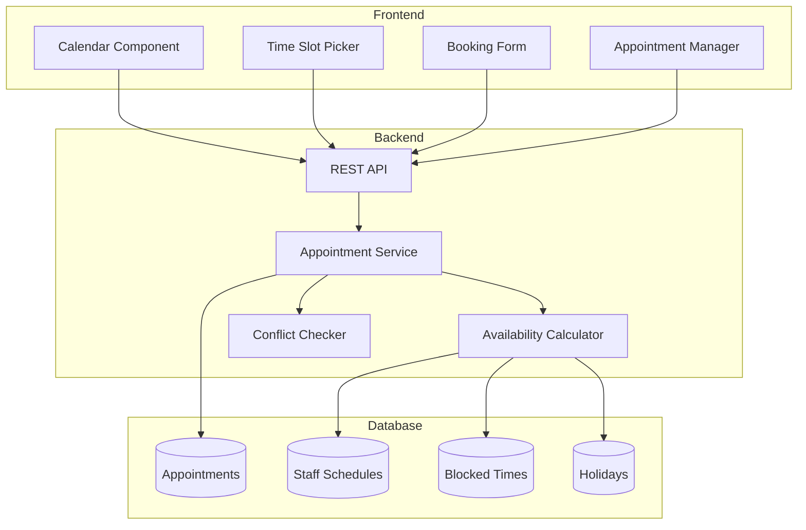

# Custom Appointment Calendar Implementation Guide for Angular

## Overview
This guide provides a complete implementation strategy for building a professional appointment booking calendar system in Angular, similar to commercial solutions but without the recurring costs.

## Table of Contents
1. [Architecture Overview](#architecture-overview)
2. [Required Dependencies](#required-dependencies)
3. [Database Schema](#database-schema)
4. [Backend API Design](#backend-api-design)
5. [Frontend Components Structure](#frontend-components-structure)
6. [Implementation Steps](#implementation-steps)
7. [Advanced Features](#advanced-features)

## Architecture Overview

### System Components


## Required Dependencies

### Angular Dependencies
```json
{
  "dependencies": {
    "@angular/core": "^17.0.0",
    "@angular/material": "^17.0.0",
    "@angular/cdk": "^17.0.0",
    "date-fns": "^2.30.0",
    "date-fns-tz": "^2.0.0",
    "@fullcalendar/angular": "^6.1.10",
    "@fullcalendar/core": "^6.1.10",
    "@fullcalendar/daygrid": "^6.1.10",
    "@fullcalendar/timegrid": "^6.1.10",
    "@fullcalendar/interaction": "^6.1.10",
    "@fullcalendar/list": "^6.1.10",
    "rrule": "^2.7.2"
  }
}
```

### Alternative: Build Without External Calendar Library
If you want to avoid FullCalendar dependency, you can build a custom calendar using Angular Material's DatePicker and CDK.

## Database Schema

### Extended Appointment Schema
```sql
-- Staff availability schedule
CREATE TABLE staff_schedules (
    id UUID PRIMARY KEY DEFAULT gen_random_uuid(),
    staff_id UUID NOT NULL REFERENCES staff(id),
    day_of_week INTEGER NOT NULL, -- 0=Sunday, 6=Saturday
    start_time TIME NOT NULL,
    end_time TIME NOT NULL,
    is_active BOOLEAN DEFAULT true,
    effective_from DATE,
    effective_to DATE,
    created_at TIMESTAMP DEFAULT now(),
    updated_at TIMESTAMP DEFAULT now()
);

-- Time slots configuration
CREATE TABLE appointment_slots (
    id UUID PRIMARY KEY DEFAULT gen_random_uuid(),
    specialty_id UUID REFERENCES specialties(id),
    slot_duration INTEGER NOT NULL, -- in minutes
    buffer_time INTEGER DEFAULT 0, -- buffer between appointments
    max_advance_days INTEGER DEFAULT 90, -- how far ahead can book
    min_advance_hours INTEGER DEFAULT 24, -- minimum notice required
    created_at TIMESTAMP DEFAULT now()
);

-- Blocked time slots (holidays, breaks, etc.)
CREATE TABLE blocked_slots (
    id UUID PRIMARY KEY DEFAULT gen_random_uuid(),
    staff_id UUID REFERENCES staff(id),
    start_datetime TIMESTAMP NOT NULL,
    end_datetime TIMESTAMP NOT NULL,
    reason VARCHAR(255),
    is_recurring BOOLEAN DEFAULT false,
    recurrence_rule TEXT, -- RRule format
    created_at TIMESTAMP DEFAULT now()
);

-- Appointment updates for existing table
ALTER TABLE appointments 
ADD COLUMN IF NOT EXISTS end_datetime TIMESTAMP,
ADD COLUMN IF NOT EXISTS is_confirmed BOOLEAN DEFAULT false,
ADD COLUMN IF NOT EXISTS confirmation_token VARCHAR(100),
ADD COLUMN IF NOT EXISTS reminder_sent BOOLEAN DEFAULT false,
ADD COLUMN IF NOT EXISTS rescheduled_from UUID REFERENCES appointments(id),
ADD COLUMN IF NOT EXISTS cancellation_reason TEXT;

-- Appointment availability cache (optional for performance)
CREATE TABLE availability_cache (
    id UUID PRIMARY KEY DEFAULT gen_random_uuid(),
    staff_id UUID NOT NULL REFERENCES staff(id),
    date DATE NOT NULL,
    available_slots JSONB NOT NULL,
    last_calculated TIMESTAMP DEFAULT now(),
    UNIQUE(staff_id, date)
);
```

## Backend API Design

### Appointment Endpoints
```typescript
// API Endpoints Structure
interface AppointmentAPI {
  // Availability
  'GET /api/appointments/availability/:staffId': AvailabilityResponse;
  'GET /api/appointments/availability/:staffId/:date': DayAvailabilityResponse;
  'GET /api/appointments/available-slots': AvailableSlotsQuery;
  
  // Booking
  'POST /api/appointments/book': BookAppointmentRequest;
  'POST /api/appointments/confirm/:token': ConfirmAppointmentRequest;
  'PUT /api/appointments/:id/reschedule': RescheduleRequest;
  'DELETE /api/appointments/:id/cancel': CancelRequest;
  
  // Management
  'GET /api/appointments/calendar': CalendarViewResponse;
  'GET /api/appointments/upcoming': UpcomingAppointmentsResponse;
  'POST /api/appointments/block-time': BlockTimeRequest;
  
  // Staff Schedule
  'GET /api/staff/:id/schedule': StaffScheduleResponse;
  'PUT /api/staff/:id/schedule': UpdateScheduleRequest;
  'POST /api/staff/:id/schedule/override': ScheduleOverrideRequest;
}
```

### Data Models
```typescript
// DTOs for API
export interface AvailabilityResponse {
  staffId: string;
  dateRange: {
    start: Date;
    end: Date;
  };
  availableDays: AvailableDay[];
  timezone: string;
}

export interface AvailableDay {
  date: string;
  slots: TimeSlot[];
  isFullyBooked: boolean;
}

export interface TimeSlot {
  startTime: string;
  endTime: string;
  isAvailable: boolean;
  staffId?: string;
  staffName?: string;
}

export interface BookAppointmentRequest {
  patientId: string;
  staffId: string;
  specialtyId: string;
  startDateTime: Date;
  duration: number;
  notes?: string;
  isFirstVisit?: boolean;
}
```

## Frontend Components Structure

### 1. Calendar Module Structure
```typescript
// calendar.module.ts
@NgModule({
  declarations: [
    AppointmentCalendarComponent,
    TimeSlotSelectorComponent,
    BookingFormComponent,
    AvailabilityViewComponent,
    AppointmentDetailsComponent,
    CalendarHeaderComponent,
    CalendarDayViewComponent,
    CalendarWeekViewComponent,
    CalendarMonthViewComponent
  ],
  imports: [
    CommonModule,
    ReactiveFormsModule,
    MatDatepickerModule,
    MatCardModule,
    MatButtonModule,
    MatIconModule,
    MatDialogModule,
    MatSelectModule,
    MatProgressSpinnerModule,
    MatChipsModule,
    MatTooltipModule
  ]
})
export class CalendarModule { }
```

### 2. Main Calendar Component
```typescript
// appointment-calendar.component.ts
import { Component, OnInit, ViewChild } from '@angular/core';
import { FormBuilder, FormGroup } from '@angular/forms';
import { MatCalendar } from '@angular/material/datepicker';
import { BehaviorSubject, Observable } from 'rxjs';

@Component({
  selector: 'app-appointment-calendar',
  template: `
    <div class="appointment-calendar-container">
      <!-- Calendar Header -->
      <div class="calendar-header">
        <h2>Book an Appointment</h2>
        <div class="view-switcher">
          <button mat-button [class.active]="view === 'month'" 
                  (click)="switchView('month')">Month</button>
          <button mat-button [class.active]="view === 'week'" 
                  (click)="switchView('week')">Week</button>
          <button mat-button [class.active]="view === 'day'" 
                  (click)="switchView('day')">Day</button>
        </div>
      </div>

      <!-- Staff/Service Selection -->
      <div class="selection-row">
        <mat-form-field>
          <mat-label>Select Service</mat-label>
          <mat-select [(value)]="selectedService" (selectionChange)="onServiceChange($event)">
            <mat-option *ngFor="let service of services$ | async" [value]="service">
              {{ service.name }} ({{ service.duration }} mins)
            </mat-option>
          </mat-select>
        </mat-form-field>

        <mat-form-field>
          <mat-label>Select Doctor</mat-label>
          <mat-select [(value)]="selectedStaff" (selectionChange)="loadAvailability()">
            <mat-option *ngFor="let staff of availableStaff$ | async" [value]="staff">
              Dr. {{ staff.fullName }}
            </mat-option>
          </mat-select>
        </mat-form-field>
      </div>

      <!-- Calendar View -->
      <div class="calendar-view" [ngSwitch]="view">
        <!-- Month View -->
        <div *ngSwitchCase="'month'" class="month-view">
          <mat-calendar 
            [selected]="selectedDate"
            [dateFilter]="dateFilter"
            [dateClass]="dateClass"
            (selectedChange)="onDateSelect($event)">
          </mat-calendar>
          
          <!-- Custom overlay for available slots count -->
          <div class="availability-overlay">
            <div *ngFor="let day of availabilityData$ | async" 
                 [attr.data-date]="day.date"
                 class="day-availability">
              <span class="slot-count" 
                    [class.fully-booked]="day.isFullyBooked">
                {{ day.availableSlots }} slots
              </span>
            </div>
          </div>
        </div>

        <!-- Week View -->
        <div *ngSwitchCase="'week'" class="week-view">
          <app-calendar-week-view
            [startDate]="weekStartDate"
            [appointments]="appointments$ | async"
            [availability]="weekAvailability$ | async"
            (slotClick)="onTimeSlotClick($event)">
          </app-calendar-week-view>
        </div>

        <!-- Day View -->
        <div *ngSwitchCase="'day'" class="day-view">
          <app-calendar-day-view
            [date]="selectedDate"
            [appointments]="dayAppointments$ | async"
            [timeSlots]="dayTimeSlots$ | async"
            (slotSelect)="onTimeSlotSelect($event)">
          </app-calendar-day-view>
        </div>
      </div>

      <!-- Time Slot Selection (shown after date selection) -->
      <div class="time-slots-container" *ngIf="selectedDate && showTimeSlots">
        <h3>Available Times for {{ selectedDate | date:'MMMM d, y' }}</h3>
        <div class="time-slots-grid">
          <button *ngFor="let slot of timeSlots$ | async"
                  mat-stroked-button
                  [disabled]="!slot.isAvailable"
                  [class.selected]="slot === selectedTimeSlot"
                  (click)="selectTimeSlot(slot)">
            {{ slot.startTime }}
            <span class="slot-status" *ngIf="!slot.isAvailable">Booked</span>
          </button>
        </div>
      </div>

      <!-- Booking Summary -->
      <mat-card class="booking-summary" *ngIf="selectedTimeSlot">
        <mat-card-header>
          <mat-card-title>Appointment Summary</mat-card-title>
        </mat-card-header>
        <mat-card-content>
          <div class="summary-item">
            <span class="label">Service:</span>
            <span>{{ selectedService?.name }}</span>
          </div>
          <div class="summary-item">
            <span class="label">Doctor:</span>
            <span>Dr. {{ selectedStaff?.fullName }}</span>
          </div>
          <div class="summary-item">
            <span class="label">Date:</span>
            <span>{{ selectedDate | date:'fullDate' }}</span>
          </div>
          <div class="summary-item">
            <span class="label">Time:</span>
            <span>{{ selectedTimeSlot.startTime }} - {{ selectedTimeSlot.endTime }}</span>
          </div>
          <div class="summary-item">
            <span class="label">Duration:</span>
            <span>{{ selectedService?.duration }} minutes</span>
          </div>
        </mat-card-content>
        <mat-card-actions>
          <button mat-raised-button color="primary" (click)="proceedToBooking()">
            Continue to Patient Details
          </button>
          <button mat-button (click)="resetSelection()">Change Selection</button>
        </mat-card-actions>
      </mat-card>
    </div>
  `,
  styleUrls: ['./appointment-calendar.component.scss']
})
export class AppointmentCalendarComponent implements OnInit {
  view: 'month' | 'week' | 'day' = 'month';
  selectedDate: Date | null = null;
  selectedService: any;
  selectedStaff: any;
  selectedTimeSlot: any;
  showTimeSlots = false;

  services$: Observable<any[]>;
  availableStaff$: Observable<any[]>;
  timeSlots$: Observable<TimeSlot[]>;
  availabilityData$: Observable<any[]>;
  appointments$: Observable<any[]>;

  constructor(
    private appointmentService: AppointmentService,
    private fb: FormBuilder,
    private dialog: MatDialog
  ) {}

  ngOnInit() {
    this.loadServices();
    this.setupDateFilter();
  }

  // ... Implementation methods
}
```

### 3. Time Slot Service
```typescript
// appointment-availability.service.ts
import { Injectable } from '@angular/core';
import { HttpClient } from '@angular/common/http';
import { Observable, BehaviorSubject } from 'rxjs';
import { 
  addMinutes, 
  format, 
  isWithinInterval, 
  setHours, 
  setMinutes,
  isBefore,
  isAfter,
  addDays
} from 'date-fns';

@Injectable({
  providedIn: 'root'
})
export class AppointmentAvailabilityService {
  private availabilityCache = new Map<string, any>();

  constructor(private http: HttpClient) {}

  /**
   * Get available time slots for a specific date and staff member
   */
  getAvailableSlots(staffId: string, date: Date, duration: number): Observable<TimeSlot[]> {
    const dateStr = format(date, 'yyyy-MM-dd');
    const cacheKey = `${staffId}-${dateStr}-${duration}`;

    // Check cache first
    if (this.availabilityCache.has(cacheKey)) {
      return of(this.availabilityCache.get(cacheKey));
    }

    return this.http.get<TimeSlot[]>(`/api/appointments/slots`, {
      params: {
        staffId,
        date: dateStr,
        duration: duration.toString()
      }
    }).pipe(
      tap(slots => this.availabilityCache.set(cacheKey, slots)),
      map(slots => this.processTimeSlots(slots, duration))
    );
  }

  /**
   * Calculate available slots based on staff schedule and existing appointments
   */
  private calculateAvailableSlots(
    schedule: StaffSchedule,
    existingAppointments: Appointment[],
    date: Date,
    slotDuration: number
  ): TimeSlot[] {
    const slots: TimeSlot[] = [];
    const daySchedule = schedule.workingHours[date.getDay()];
    
    if (!daySchedule || !daySchedule.isWorking) {
      return slots;
    }

    // Parse working hours
    const [startHour, startMin] = daySchedule.startTime.split(':').map(Number);
    const [endHour, endMin] = daySchedule.endTime.split(':').map(Number);
    
    let currentSlot = setMinutes(setHours(date, startHour), startMin);
    const endTime = setMinutes(setHours(date, endHour), endMin);

    // Generate all possible slots
    while (isBefore(currentSlot, endTime)) {
      const slotEnd = addMinutes(currentSlot, slotDuration);
      
      if (isAfter(slotEnd, endTime)) {
        break;
      }

      // Check if slot conflicts with existing appointments
      const isAvailable = !this.hasConflict(
        currentSlot, 
        slotEnd, 
        existingAppointments
      );

      // Check if slot is in break time
      const isInBreak = this.isInBreakTime(currentSlot, slotEnd, daySchedule.breaks);

      slots.push({
        startTime: format(currentSlot, 'HH:mm'),
        endTime: format(slotEnd, 'HH:mm'),
        dateTime: currentSlot.toISOString(),
        isAvailable: isAvailable && !isInBreak,
        reason: !isAvailable ? 'booked' : (isInBreak ? 'break' : null)
      });

      // Move to next slot
      currentSlot = addMinutes(currentSlot, schedule.slotInterval || 15);
    }

    return slots;
  }

  /**
   * Check if a time slot conflicts with existing appointments
   */
  private hasConflict(
    slotStart: Date,
    slotEnd: Date,
    appointments: Appointment[]
  ): boolean {
    return appointments.some(apt => {
      const aptStart = new Date(apt.startDateTime);
      const aptEnd = new Date(apt.endDateTime);
      
      // Check for overlap
      return (
        (isWithinInterval(slotStart, { start: aptStart, end: aptEnd })) ||
        (isWithinInterval(slotEnd, { start: aptStart, end: aptEnd })) ||
        (isBefore(slotStart, aptStart) && isAfter(slotEnd, aptEnd))
      );
    });
  }

  /**
   * Get availability for multiple days
   */
  getMonthAvailability(
    staffId: string,
    year: number,
    month: number
  ): Observable<DayAvailability[]> {
    return this.http.get<DayAvailability[]>(
      `/api/appointments/availability/month`,
      {
        params: {
          staffId,
          year: year.toString(),
          month: month.toString()
        }
      }
    );
  }

  /**
   * Intelligent slot suggestion based on preferences
   */
  suggestBestSlots(
    staffId: string,
    dateRange: { start: Date; end: Date },
    preferences: {
      preferredTime?: 'morning' | 'afternoon' | 'evening';
      avoidDays?: number[];
      duration: number;
    }
  ): Observable<TimeSlot[]> {
    // Implementation for smart slot suggestions
    return this.http.post<TimeSlot[]>(
      '/api/appointments/suggest-slots',
      {
        staffId,
        dateRange,
        preferences
      }
    );
  }
}
```

### 4. Calendar Styling (SCSS)
```scss
// appointment-calendar.component.scss
.appointment-calendar-container {
  padding: 20px;
  max-width: 1200px;
  margin: 0 auto;

  .calendar-header {
    display: flex;
    justify-content: space-between;
    align-items: center;
    margin-bottom: 20px;

    h2 {
      margin: 0;
      font-size: 24px;
      color: #333;
    }

    .view-switcher {
      button {
        margin-left: 8px;

        &.active {
          background-color: var(--primary-color);
          color: white;
        }
      }
    }
  }

  .selection-row {
    display: flex;
    gap: 16px;
    margin-bottom: 20px;

    mat-form-field {
      flex: 1;
    }
  }

  .calendar-view {
    background: white;
    border-radius: 8px;
    box-shadow: 0 2px 8px rgba(0,0,0,0.1);
    padding: 20px;

    .month-view {
      position: relative;

      ::ng-deep .mat-calendar {
        width: 100%;
      }

      .availability-overlay {
        pointer-events: none;
        position: absolute;
        top: 0;
        left: 0;
        right: 0;
        bottom: 0;

        .day-availability {
          position: absolute;
          
          .slot-count {
            display: inline-block;
            padding: 2px 6px;
            border-radius: 12px;
            background: #4caf50;
            color: white;
            font-size: 10px;
            font-weight: 500;

            &.fully-booked {
              background: #f44336;
            }
          }
        }
      }
    }

    .week-view {
      min-height: 500px;
    }

    .day-view {
      min-height: 600px;
    }
  }

  .time-slots-container {
    margin-top: 30px;
    padding: 20px;
    background: #f5f5f5;
    border-radius: 8px;

    h3 {
      margin-top: 0;
      margin-bottom: 20px;
      color: #333;
    }

    .time-slots-grid {
      display: grid;
      grid-template-columns: repeat(auto-fill, minmax(120px, 1fr));
      gap: 10px;

      button {
        position: relative;
        padding: 12px 16px;
        border-radius: 4px;
        transition: all 0.3s ease;

        &:not([disabled]):hover {
          transform: translateY(-2px);
          box-shadow: 0 4px 8px rgba(0,0,0,0.15);
        }

        &.selected {
          background-color: var(--primary-color);
          color: white;
          border-color: var(--primary-color);
        }

        &[disabled] {
          opacity: 0.5;
          cursor: not-allowed;
        }

        .slot-status {
          display: block;
          font-size: 10px;
          color: #666;
          margin-top: 4px;
        }
      }
    }
  }

  .booking-summary {
    margin-top: 30px;
    max-width: 500px;

    .summary-item {
      display: flex;
      justify-content: space-between;
      margin-bottom: 12px;
      padding-bottom: 8px;
      border-bottom: 1px solid #e0e0e0;

      &:last-child {
        border-bottom: none;
      }

      .label {
        font-weight: 500;
        color: #666;
      }
    }

    mat-card-actions {
      display: flex;
      justify-content: space-between;
      padding: 16px;
    }
  }
}

// Responsive design
@media (max-width: 768px) {
  .appointment-calendar-container {
    padding: 10px;

    .selection-row {
      flex-direction: column;
    }

    .time-slots-grid {
      grid-template-columns: repeat(auto-fill, minmax(100px, 1fr));
    }

    .calendar-header {
      flex-direction: column;
      align-items: flex-start;

      .view-switcher {
        margin-top: 10px;
      }
    }
  }
}

// Calendar customization
::ng-deep {
  .mat-calendar-body-selected {
    background-color: var(--primary-color);
    color: white;
  }

  .mat-calendar-body-cell:not(.mat-calendar-body-disabled):hover > .mat-calendar-body-cell-content {
    background-color: rgba(var(--primary-color-rgb), 0.2);
  }

  // Custom date classes
  .has-appointments {
    position: relative;

    &::after {
      content: '';
      position: absolute;
      bottom: 2px;
      left: 50%;
      transform: translateX(-50%);
      width: 4px;
      height: 4px;
      border-radius: 50%;
      background-color: var(--primary-color);
    }
  }

  .fully-booked {
    .mat-calendar-body-cell-content {
      background-color: #ffebee;
      color: #c62828;
    }
  }

  .partially-available {
    .mat-calendar-body-cell-content {
      background-color: #fff3e0;
      color: #e65100;
    }
  }
}
```

## Implementation Steps

### Phase 1: Basic Calendar (Week 1)
1. Set up Angular module structure
2. Create basic calendar component with Material DatePicker
3. Implement date selection and navigation
4. Add basic styling and responsive design

### Phase 2: Backend Integration (Week 2)
1. Create appointment availability API endpoints
2. Implement staff schedule management
3. Add conflict detection logic
4. Create database tables and migrations

### Phase 3: Time Slot Selection (Week 3)
1. Build time slot grid component
2. Implement availability checking
3. Add real-time slot updates
4. Create slot booking mechanism

### Phase 4: Booking Flow (Week 4)
1. Create patient information form
2. Implement appointment confirmation
3. Add email/SMS notifications
4. Build confirmation page

### Phase 5: Advanced Features (Week 5-6)
1. Add recurring appointments
2. Implement rescheduling/cancellation
3. Create admin management panel
4. Add calendar synchronization

## Advanced Features

### 1. Recurring Appointments
```typescript
// Recurring appointment support using RRule
import { RRule } from 'rrule';

interface RecurringAppointment {
  rule: string; // RRule string
  exceptions: Date[]; // Excluded dates
  modifications: Map<Date, Appointment>; // Modified instances
}

// Generate occurrences
const rule = new RRule({
  freq: RRule.WEEKLY,
  interval: 2,
  byweekday: [RRule.MO, RRule.WE],
  dtstart: new Date(2024, 0, 1),
  until: new Date(2024, 11, 31)
});

const occurrences = rule.all();
```

### 2. Smart Conflict Detection
```typescript
class ConflictDetector {
  detectConflicts(
    newAppointment: Appointment,
    existingAppointments: Appointment[]
  ): Conflict[] {
    const conflicts: Conflict[] = [];

    // Time overlap detection
    const timeConflicts = existingAppointments.filter(apt => 
      this.hasTimeOverlap(newAppointment, apt)
    );

    // Resource conflicts (room, equipment)
    const resourceConflicts = this.checkResourceAvailability(
      newAppointment.resources,
      newAppointment.startDateTime,
      newAppointment.endDateTime
    );

    // Staff double-booking
    const staffConflicts = this.checkStaffAvailability(
      newAppointment.staffId,
      newAppointment.startDateTime,
      newAppointment.endDateTime
    );

    return [...timeConflicts, ...resourceConflicts, ...staffConflicts];
  }
}
```

### 3. Optimization Algorithm for Best Slots
```typescript
class SlotOptimizer {
  findOptimalSlots(
    requirements: AppointmentRequirements,
    preferences: UserPreferences
  ): OptimalSlot[] {
    const slots = this.getAllAvailableSlots(requirements);
    
    return slots
      .map(slot => ({
        ...slot,
        score: this.calculateScore(slot, preferences)
      }))
      .sort((a, b) => b.score - a.score)
      .slice(0, 5); // Top 5 recommendations
  }

  private calculateScore(slot: TimeSlot, preferences: UserPreferences): number {
    let score = 100;

    // Time of day preference
    if (preferences.preferredTime) {
      score += this.timeOfDayScore(slot.startTime, preferences.preferredTime);
    }

    // Day of week preference
    if (preferences.preferredDays) {
      score += this.dayOfWeekScore(slot.date, preferences.preferredDays);
    }

    // Minimize wait time
    score += this.waitTimeScore(slot.date);

    // Doctor preference
    if (preferences.preferredStaff) {
      score += slot.staffId === preferences.preferredStaff ? 20 : 0;
    }

    return score;
  }
}
```

### 4. Real-time Updates with WebSocket
```typescript
// Real-time availability updates
@Injectable()
export class AppointmentWebSocketService {
  private socket$ = new WebSocketSubject<any>('ws://localhost:8080/appointments');
  
  subscribeToAvailabilityUpdates(staffId: string): Observable<AvailabilityUpdate> {
    // Subscribe to specific staff member's availability
    this.socket$.next({ 
      action: 'subscribe', 
      staffId: staffId 
    });

    return this.socket$.pipe(
      filter(message => message.type === 'availability-update'),
      filter(message => message.staffId === staffId),
      map(message => message.data)
    );
  }

  notifySlotBooked(slot: TimeSlot): void {
    this.socket$.next({
      action: 'slot-booked',
      data: slot
    });
  }
}
```

### 5. Multi-Provider Booking
```typescript
interface MultiProviderBooking {
  // Allow booking with any available provider
  findAnyAvailable(
    service: Service,
    preferredDate: Date,
    timeRange?: TimeRange
  ): AvailableProvider[];

  // Book with first available
  bookFirstAvailable(
    service: Service,
    patientId: string,
    constraints: BookingConstraints
  ): Appointment;

  // Suggest alternative providers
  suggestAlternatives(
    unavailableProvider: string,
    requestedSlot: TimeSlot
  ): AlternativeProvider[];
}
```

## Testing Strategy

### Unit Tests
```typescript
// appointment-calendar.component.spec.ts
describe('AppointmentCalendarComponent', () => {
  let component: AppointmentCalendarComponent;
  let appointmentService: jasmine.SpyObj<AppointmentService>;

  beforeEach(() => {
    const spy = jasmine.createSpyObj('AppointmentService', ['getAvailableSlots']);
    
    TestBed.configureTestingModule({
      declarations: [AppointmentCalendarComponent],
      providers: [
        { provide: AppointmentService, useValue: spy }
      ]
    });

    appointmentService = TestBed.inject(AppointmentService) as jasmine.SpyObj<AppointmentService>;
  });

  it('should load available slots on date selection', () => {
    const testDate = new Date('2024-01-15');
    const mockSlots = [
      { startTime: '09:00', endTime: '09:30', isAvailable: true },
      { startTime: '09:30', endTime: '10:00', isAvailable: false }
    ];

    appointmentService.getAvailableSlots.and.returnValue(of(mockSlots));
    
    component.onDateSelect(testDate);
    
    expect(appointmentService.getAvailableSlots).toHaveBeenCalledWith(
      component.selectedStaff.id,
      testDate,
      component.selectedService.duration
    );
  });

  it('should prevent booking of unavailable slots', () => {
    const unavailableSlot = { 
      startTime: '10:00', 
      endTime: '10:30', 
      isAvailable: false 
    };

    component.selectTimeSlot(unavailableSlot);
    
    expect(component.selectedTimeSlot).toBeNull();
    expect(component.showError).toHaveBeenCalledWith('This time slot is not available');
  });
});
```

## Performance Optimization

### 1. Caching Strategy
```typescript
@Injectable()
export class AvailabilityCacheService {
  private cache = new Map<string, CachedAvailability>();
  private readonly CACHE_DURATION = 5 * 60 * 1000; // 5 minutes

  get(key: string): CachedAvailability | null {
    const cached = this.cache.get(key);
    
    if (!cached) return null;
    
    if (Date.now() - cached.timestamp > this.CACHE_DURATION) {
      this.cache.delete(key);
      return null;
    }
    
    return cached;
  }

  set(key: string, data: any): void {
    this.cache.set(key, {
      data,
      timestamp: Date.now()
    });
  }

  invalidate(pattern?: string): void {
    if (pattern) {
      Array.from(this.cache.keys())
        .filter(key => key.includes(pattern))
        .forEach(key => this.cache.delete(key));
    } else {
      this.cache.clear();
    }
  }
}
```

### 2. Lazy Loading
```typescript
// Lazy load calendar views
const routes: Routes = [
  {
    path: 'appointments',
    loadChildren: () => import('./calendar/calendar.module')
      .then(m => m.CalendarModule)
  }
];
```

### 3. Virtual Scrolling for Large Lists
```typescript
// Use CDK Virtual Scrolling for time slots
<cdk-virtual-scroll-viewport itemSize="50" class="time-slots-viewport">
  <button *cdkVirtualFor="let slot of timeSlots" 
          (click)="selectSlot(slot)">
    {{ slot.startTime }}
  </button>
</cdk-virtual-scroll-viewport>
```

## Accessibility Features

### ARIA Labels and Keyboard Navigation
```html
<!-- Accessible calendar implementation -->
<div role="application" 
     aria-label="Appointment booking calendar"
     aria-describedby="calendar-instructions">
  
  <div id="calendar-instructions" class="sr-only">
    Use arrow keys to navigate dates. Press Enter to select a date.
    Press Tab to move to time slots.
  </div>
  
  <mat-calendar
    role="grid"
    aria-label="Choose appointment date"
    [attr.aria-activedescendant]="activeDateId">
  </mat-calendar>
  
  <div role="group" aria-label="Available time slots">
    <button *ngFor="let slot of timeSlots; index as i"
            role="button"
            [attr.aria-label]="'Book appointment at ' + slot.startTime"
            [attr.aria-pressed]="slot === selectedSlot"
            [attr.tabindex]="i === 0 ? 0 : -1">
      {{ slot.startTime }}
    </button>
  </div>
</div>
```

## Deployment Considerations

### 1. Environment Configuration
```typescript
// environment.prod.ts
export const environment = {
  production: true,
  apiUrl: 'https://api.clinicx.com',
  wsUrl: 'wss://api.clinicx.com/ws',
  features: {
    recurringAppointments: true,
    videoConsultations: false,
    aiScheduling: true
  },
  booking: {
    maxAdvanceDays: 90,
    minAdvanceHours: 24,
    defaultDuration: 30,
    bufferTime: 5
  }
};
```

### 2. Build Optimization
```json
// angular.json
{
  "optimization": {
    "scripts": true,
    "styles": {
      "minify": true,
      "inlineCritical": true
    },
    "fonts": true
  },
  "budgets": [
    {
      "type": "initial",
      "maximumWarning": "2mb",
      "maximumError": "5mb"
    }
  ]
}
```

## Conclusion

This comprehensive implementation guide provides everything needed to build a professional appointment booking calendar system without relying on expensive third-party services. The solution is:

- **Fully Customizable**: Complete control over features and design
- **Cost-Effective**: No recurring subscription fees
- **Scalable**: Can handle multiple providers and locations
- **Feature-Rich**: Includes advanced features like recurring appointments
- **Accessible**: WCAG compliant for all users
- **Performance Optimized**: Caching and lazy loading strategies

The total development time is estimated at 4-6 weeks for a complete implementation with all advanced features.

---
*Document Version: 1.0*  
*Last Updated: 2025-01-24*  
*Author: Claude Code Assistant*