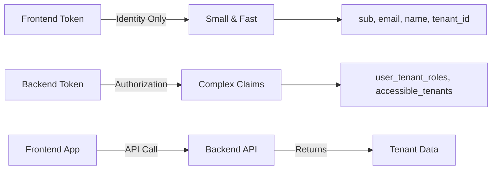

# Keycloak Mapper Frontend Freeze Issue - Complete Solution Guide

## Problem Statement

When Keycloak mappers (`user_tenant_roles`, `accessible_tenants`) are added to the frontend client's dedicated scope, the Angular application freezes on page reload, showing "Close Page" or "Wait" browser dialog. Removing the mappers and clearing cache resolves the issue.

## Root Cause Analysis

### 1. Token Processing Failure Chain
```
User Reloads Page 
  → App reads token from storage
  → Attempts to parse JWT claims
  → Encounters JSON parsing error (claims already parsed)
  → Authentication validation fails
  → Triggers silent refresh
  → New token has same issue
  → Infinite loop begins
  → Browser becomes unresponsive
```

### 2. Technical Issues Identified

#### Issue #1: Double JSON Parsing
- **Location**: `/starter/src/app/core/authentication/auth.service.ts:344`
- **Problem**: Code attempts `JSON.parse()` on already-parsed JSON objects
- **Error**: `Unexpected token 'o' in JSON at position 1`

#### Issue #2: Large Token Size
- **Problem**: Complex nested JSON structures in tokens exceed processing limits
- **Impact**: Browser storage limitations, parsing timeouts

#### Issue #3: Missing Error Boundaries
- **Problem**: No try-catch blocks around token parsing
- **Impact**: Uncaught exceptions trigger auth loops

## Immediate Solution (Stop the Bleeding)

### Step 1: Remove Mappers from Frontend Client [CRITICAL]

```bash
# In Keycloak Admin Console
1. Navigate to: Clients → frontend-client
2. Go to: Client scopes → Dedicated scope and mappers for this client
3. DELETE these mappers:
   - user_tenant_roles
   - accessible_tenants
   - Any other custom complex mappers
4. Save changes
```

### Step 2: Clear Browser Storage

```javascript
// Run in browser console
localStorage.clear();
sessionStorage.clear();
// Or use DevTools → Application → Clear Storage
```

### Step 3: Configure Mappers for Backend Only

```yaml
# Keycloak Mapper Configuration (Backend Client ONLY)
Mapper: user_tenant_roles
  Mapper Type: User Attribute or Script
  Token Claim Name: user_tenant_roles
  Claim JSON Type: JSON
  Add to ID token: ❌ OFF
  Add to access token: ✅ ON
  Add to userinfo: ❌ OFF

Mapper: accessible_tenants  
  Mapper Type: User Attribute or Script
  Token Claim Name: accessible_tenants
  Claim JSON Type: JSON
  Add to ID token: ❌ OFF
  Add to access token: ✅ ON
  Add to userinfo: ❌ OFF
```

## Code Fixes

### Fix 1: Safe JSON Parsing Helper

Create `/starter/src/app/core/authentication/helpers/safe-parse.ts`:

```typescript
/**
 * Safely parse a value that might be a string or already-parsed object
 * Prevents double-parsing errors that cause authentication loops
 */
export function safeJsonParse<T>(
  value: any,
  defaultValue: T,
  context?: string
): T {
  // Handle null/undefined
  if (value == null) {
    return defaultValue;
  }

  // Already an object/array - return as-is
  if (typeof value === 'object') {
    return value as T;
  }

  // String - attempt parse
  if (typeof value === 'string') {
    try {
      const parsed = JSON.parse(value);
      return parsed as T;
    } catch (error) {
      console.warn(`Failed to parse JSON${context ? ` for ${context}` : ''}:`, {
        error,
        value: value.substring(0, 100) // Log first 100 chars only
      });
      return defaultValue;
    }
  }

  // Unexpected type
  console.warn(`Unexpected type for JSON parse${context ? ` in ${context}` : ''}:`, {
    type: typeof value,
    value
  });
  return defaultValue;
}
```

### Fix 2: Update Auth Service

Update `/starter/src/app/core/authentication/auth.service.ts`:

```typescript
import { safeJsonParse } from './helpers/safe-parse';

export class AuthService {
  
  /**
   * Parse user tenant roles with error handling
   */
  private parseUserTenantRoles(userTenantRoles: any): { [tenantId: string]: string[] } {
    return safeJsonParse(userTenantRoles, {}, 'user_tenant_roles');
  }

  /**
   * Parse accessible tenants with error handling
   */
  private parseAccessibleTenants(accessibleTenants: any): AccessibleTenant[] {
    return safeJsonParse(accessibleTenants, [], 'accessible_tenants');
  }

  /**
   * Process JWT claims with comprehensive error handling
   */
  private processTokenClaims(jwtPayload: KeycloakJWTPayload): User {
    try {
      const user: User = {
        id: jwtPayload.sub,
        preferred_username: jwtPayload.preferred_username,
        email: jwtPayload.email,
        name: jwtPayload.name,
        tenant_id: jwtPayload.tenant_id,
        
        // Safely parse complex claims
        user_tenant_roles: this.parseUserTenantRoles(jwtPayload.user_tenant_roles),
        accessible_tenants: this.parseAccessibleTenants(jwtPayload.accessible_tenants),
        
        // Use active tenant or fall back to default
        active_tenant_id: jwtPayload.active_tenant_id || jwtPayload.tenant_id,
      };

      return user;
    } catch (error) {
      console.error('Failed to process token claims:', error);
      // Return minimal user object to prevent app crash
      return {
        id: jwtPayload.sub,
        preferred_username: jwtPayload.preferred_username || 'unknown',
        email: jwtPayload.email,
        roles: [],
        user_tenant_roles: {},
        accessible_tenants: []
      };
    }
  }
}
```

### Fix 3: Prevent Authentication Loops

Update `/starter/src/app/core/authentication/keycloak-auth.service.ts`:

```typescript
export class KeycloakAuthService {
  private refreshAttempts = 0;
  private readonly MAX_REFRESH_ATTEMPTS = 3;
  private lastRefreshTime = 0;
  private readonly MIN_REFRESH_INTERVAL = 5000; // 5 seconds

  /**
   * Initialize auth state with loop prevention
   */
  private initializeAuthState(): void {
    try {
      if (!this.tokenService.valid()) {
        this.clearAuthState();
        return;
      }

      const token = this.tokenService.getBearerToken();
      if (!token) {
        this.clearAuthState();
        return;
      }

      // Parse with error boundary
      const payload = this.parseJWTSafely(token);
      if (!payload) {
        console.error('Invalid token payload, clearing auth state');
        this.clearAuthState();
        return;
      }

      // Map to user with error handling
      const user = this.mapJWTToUserSafely(payload);
      this.userInfo.set(user);
      this.isAuthenticated.set(true);
      
    } catch (error) {
      console.error('Auth initialization failed:', error);
      this.clearAuthState();
    }
  }

  /**
   * Refresh token with loop prevention
   */
  refreshToken(): Observable<boolean> {
    const now = Date.now();
    
    // Prevent rapid refresh attempts
    if (now - this.lastRefreshTime < this.MIN_REFRESH_INTERVAL) {
      console.warn('Refresh attempt too soon, skipping');
      return of(false);
    }
    
    // Check max attempts
    if (this.refreshAttempts >= this.MAX_REFRESH_ATTEMPTS) {
      console.error('Max refresh attempts exceeded, logging out');
      this.logout();
      return of(false);
    }

    this.lastRefreshTime = now;
    this.refreshAttempts++;
    this.isRefreshing.set(true);

    const refreshToken = this.tokenService.getRefreshToken();
    if (!refreshToken) {
      this.clearAuthState();
      return of(false);
    }

    const body = new HttpParams()
      .set('grant_type', 'refresh_token')
      .set('client_id', this.keycloakConfig.getClientId())
      .set('refresh_token', refreshToken);

    return this.http.post<KeycloakTokenResponse>(
      this.keycloakConfig.getTokenUrl(),
      body.toString(),
      { headers: new HttpHeaders({ 'Content-Type': 'application/x-www-form-urlencoded' }) }
    ).pipe(
      tap(response => {
        this.handleTokenResponse(response);
        this.refreshAttempts = 0; // Reset on success
        this.isRefreshing.set(false);
      }),
      map(() => true),
      catchError(error => {
        console.error('Token refresh failed:', error);
        this.isRefreshing.set(false);
        
        // Only logout after max attempts
        if (this.refreshAttempts >= this.MAX_REFRESH_ATTEMPTS) {
          this.logout();
        }
        
        return of(false);
      })
    );
  }

  /**
   * Parse JWT with comprehensive error handling
   */
  private parseJWTSafely(token: string): KeycloakJWTPayload | null {
    try {
      const parts = token.split('.');
      if (parts.length !== 3) {
        console.error('Invalid JWT format');
        return null;
      }

      const payload = JSON.parse(atob(parts[1]));
      
      // Validate required fields
      if (!payload.sub || !payload.exp) {
        console.error('JWT missing required fields');
        return null;
      }

      // Check token expiry
      const now = Math.floor(Date.now() / 1000);
      if (payload.exp < now) {
        console.warn('Token already expired');
        return null;
      }

      return payload as KeycloakJWTPayload;
      
    } catch (error) {
      console.error('JWT parsing failed:', error);
      return null;
    }
  }

  /**
   * Clear all auth state
   */
  private clearAuthState(): void {
    this.tokenService.clear();
    this.isAuthenticated.set(false);
    this.userInfo.set(null);
    this.authError.set(null);
    this.refreshAttempts = 0;
    sessionStorage.clear();
    localStorage.removeItem('access_token');
    localStorage.removeItem('refresh_token');
  }
}
```

## Architectural Solution

### Principle: Separation of Concerns



### Implementation: API-Based Tenant Data

#### Backend Endpoint
```java
@RestController
@RequestMapping("/api/v1/users")
public class UserTenantController {
    
    @GetMapping("/me/tenants")
    @PreAuthorize("isAuthenticated()")
    public ResponseEntity<UserTenantsDto> getUserTenants(Authentication auth) {
        // Extract from token claims (backend has full token)
        Map<String, List<String>> userTenantRoles = extractUserTenantRoles(auth);
        List<AccessibleTenant> accessibleTenants = extractAccessibleTenants(auth);
        
        return ResponseEntity.ok(UserTenantsDto.builder()
            .userTenantRoles(userTenantRoles)
            .accessibleTenants(accessibleTenants)
            .activeTenantId(getActiveTenantId(auth))
            .build());
    }
}
```

#### Frontend Service
```typescript
@Injectable({ providedIn: 'root' })
export class TenantDataService {
  
  constructor(private http: HttpClient) {}
  
  /**
   * Fetch tenant data from API instead of token
   */
  loadUserTenants(): Observable<UserTenantsDto> {
    return this.http.get<UserTenantsDto>('/api/v1/users/me/tenants').pipe(
      tap(data => {
        // Store in memory/state management
        this.storeTenantData(data);
      }),
      catchError(error => {
        console.error('Failed to load tenant data:', error);
        // Return empty data to prevent app crash
        return of({
          userTenantRoles: {},
          accessibleTenants: [],
          activeTenantId: null
        });
      })
    );
  }
}
```

#### Update Startup Service
```typescript
@Injectable({ providedIn: 'root' })
export class StartupService {
  
  load(): Observable<void> {
    return this.authService.check().pipe(
      switchMap(authenticated => {
        if (!authenticated) {
          return of(void 0);
        }
        
        // Load tenant data from API after authentication
        return this.tenantDataService.loadUserTenants().pipe(
          map(() => void 0)
        );
      }),
      catchError(error => {
        console.error('Startup failed:', error);
        // Don't crash the app
        return of(void 0);
      })
    );
  }
}
```

## Testing Plan

### 1. Unit Tests
```typescript
describe('SafeJsonParse', () => {
  it('should return object as-is if already parsed', () => {
    const obj = { test: 'value' };
    expect(safeJsonParse(obj, {})).toBe(obj);
  });
  
  it('should parse valid JSON string', () => {
    const json = '{"test":"value"}';
    expect(safeJsonParse(json, {})).toEqual({ test: 'value' });
  });
  
  it('should return default on invalid JSON', () => {
    const invalid = '{invalid';
    expect(safeJsonParse(invalid, { default: true })).toEqual({ default: true });
  });
  
  it('should handle null/undefined', () => {
    expect(safeJsonParse(null, {})).toEqual({});
    expect(safeJsonParse(undefined, [])).toEqual([]);
  });
});
```

### 2. Integration Tests
```typescript
describe('Authentication Flow', () => {
  it('should handle token with complex claims', async () => {
    // Mock token with nested JSON claims
    const mockToken = createMockToken({
      user_tenant_roles: { 'tenant-1': ['ADMIN'], 'tenant-2': ['USER'] },
      accessible_tenants: [
        { tenant_id: 'tenant-1', clinic_name: 'Clinic A', roles: ['ADMIN'] }
      ]
    });
    
    // Should parse without errors
    const result = await authService.processToken(mockToken);
    expect(result).toBeTruthy();
  });
  
  it('should prevent refresh loops', async () => {
    let refreshCount = 0;
    spyOn(authService, 'refreshToken').and.callFake(() => {
      refreshCount++;
      return throwError('Refresh failed');
    });
    
    // Trigger multiple refresh attempts
    for (let i = 0; i < 5; i++) {
      await authService.checkAuth();
    }
    
    // Should stop after MAX_REFRESH_ATTEMPTS
    expect(refreshCount).toBeLessThanOrEqual(3);
  });
});
```

### 3. Manual Test Checklist

- [ ] **Fresh Login Test**
    1. Clear all browser storage
    2. Login with valid credentials
    3. Verify successful authentication
    4. Check no console errors

- [ ] **Page Reload Test**
    1. After successful login
    2. Press F5 to reload
    3. Repeat 10 times rapidly
    4. Verify no freeze or "Wait" dialog

- [ ] **Token Expiry Test**
    1. Set token expiry to 30 seconds
    2. Wait for expiry
    3. Verify automatic refresh
    4. Verify no authentication loops

- [ ] **Large Claims Test**
    1. Create test user with 50+ tenants
    2. Login and reload page
    3. Verify performance acceptable
    4. Verify no freezing

- [ ] **Network Failure Test**
    1. Login successfully
    2. Disconnect network
    3. Reload page
    4. Verify graceful degradation

## Monitoring & Alerts

### Add Application Metrics

```typescript
// Track authentication events
class AuthMetrics {
  private metrics = {
    tokenParseErrors: 0,
    refreshAttempts: 0,
    refreshFailures: 0,
    authLoops: 0,
    tokenSize: 0
  };
  
  recordTokenParseError(): void {
    this.metrics.tokenParseErrors++;
    this.sendMetrics();
  }
  
  recordRefreshAttempt(success: boolean): void {
    this.metrics.refreshAttempts++;
    if (!success) this.metrics.refreshFailures++;
    this.sendMetrics();
  }
  
  checkForAuthLoop(): boolean {
    const recentAttempts = this.getRecentRefreshAttempts();
    if (recentAttempts > 5) {
      this.metrics.authLoops++;
      console.error('Authentication loop detected!');
      return true;
    }
    return false;
  }
  
  private sendMetrics(): void {
    // Send to monitoring service
    if (this.metrics.tokenParseErrors > 10) {
      console.error('High token parse error rate detected');
    }
  }
}
```

### Browser Console Debugging

```javascript
// Add to window for debugging
window.debugAuth = {
  getTokenSize: () => {
    const token = localStorage.getItem('access_token');
    return token ? new Blob([token]).size : 0;
  },
  
  getTokenClaims: () => {
    const token = localStorage.getItem('access_token');
    if (!token) return null;
    try {
      return JSON.parse(atob(token.split('.')[1]));
    } catch (e) {
      return 'Parse error: ' + e.message;
    }
  },
  
  clearAuth: () => {
    localStorage.clear();
    sessionStorage.clear();
    location.reload();
  },
  
  checkMappers: () => {
    const claims = window.debugAuth.getTokenClaims();
    return {
      hasUserTenantRoles: !!claims?.user_tenant_roles,
      hasAccessibleTenants: !!claims?.accessible_tenants,
      tokenSizeKB: (window.debugAuth.getTokenSize() / 1024).toFixed(2)
    };
  }
};

console.log('Auth debugging available via window.debugAuth');
```

## Prevention Guidelines

### DO's ✅
- Keep frontend tokens minimal (< 4KB)
- Use backend tokens for authorization data
- Implement error boundaries around token parsing
- Add retry limits to prevent loops
- Test with large datasets
- Monitor token sizes in production

### DON'Ts ❌
- Don't add complex mappers to frontend clients
- Don't attempt JSON.parse without type checking
- Don't ignore parsing errors
- Don't allow unlimited refresh attempts
- Don't store sensitive data in frontend tokens
- Don't trust frontend tokens for authorization

## Rollback Plan

If issues persist after implementation:

1. **Immediate Rollback**
   ```bash
   # Revert Keycloak configuration
   git checkout HEAD~1 -- keycloak-config.json
   
   # Revert code changes
   git revert HEAD
   
   # Clear CDN cache
   curl -X POST https://cdn/purge-cache
   ```

2. **Feature Flag Disable**
   ```typescript
   // In environment.ts
   export const environment = {
     useNewAuthFlow: false  // Disable new implementation
   };
   ```

3. **Emergency Bypass**
   ```typescript
   // Temporary bypass for critical users
   if (localStorage.getItem('auth_bypass') === 'true') {
     return this.legacyAuthFlow();
   }
   ```

## Success Criteria

- ✅ Zero page reload freezes in 24 hours
- ✅ Token processing time < 100ms
- ✅ Frontend token size < 4KB
- ✅ Zero authentication loops detected
- ✅ 100% page reload success rate
- ✅ No increase in authentication errors

## Contact & Support

**Issue Tracking**: Create issues in the project repository with tag `keycloak-mapper-freeze`

**Logs to Collect**:
- Browser console output
- Network tab HAR file
- Token claims (via `window.debugAuth.getTokenClaims()`)
- Keycloak mapper configuration screenshots

**Quick Diagnostics**:
```javascript
// Run in browser console for quick diagnosis
console.log('Token Size:', window.debugAuth?.getTokenSize() || 'N/A');
console.log('Has Complex Claims:', window.debugAuth?.checkMappers() || 'N/A');
console.log('Auth Errors:', document.querySelector('.auth-error')?.textContent || 'None');
```

---

*Last Updated: [Current Date]*  
*Version: 1.0*  
*Status: Production Ready*
