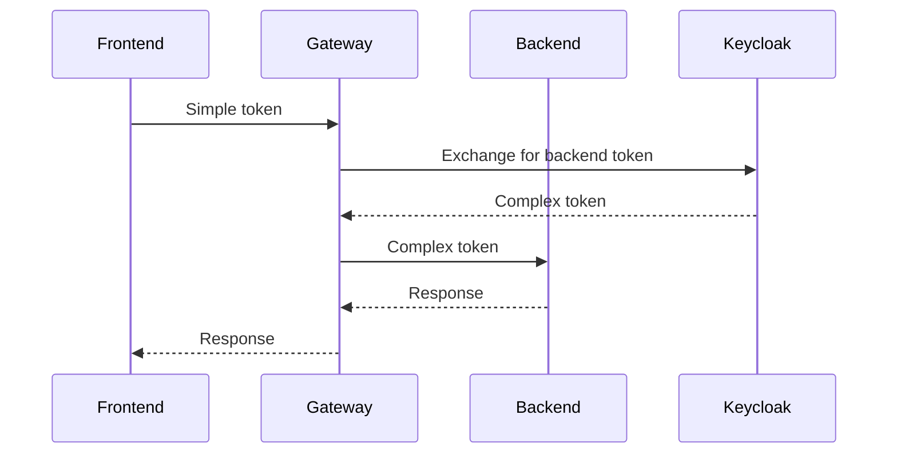
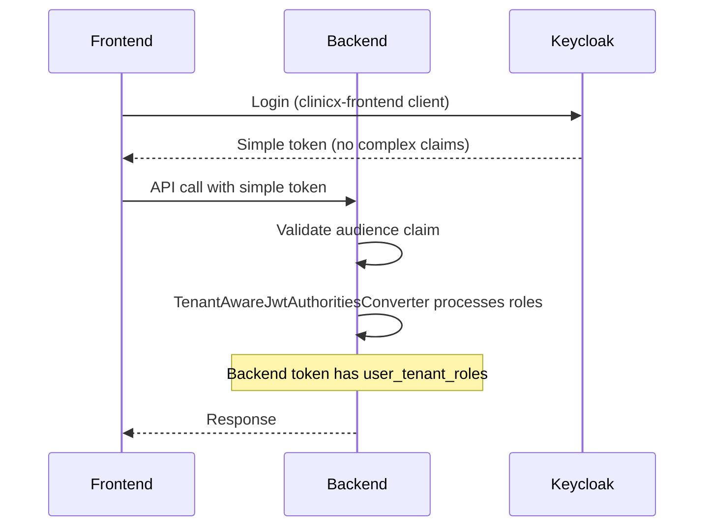

# Keycloak Mapper Frontend Freeze Issue - Updated Solution Guide for ClinicX

## Executive Summary

Based on analysis of the ClinicX codebase, the frontend freeze issue occurs when complex JSON mappers (`user_tenant_roles`, `accessible_tenants`) in JWT tokens cause parsing failures in the Angular application. This document provides an updated solution tailored to the ClinicX architecture.

## Current Implementation Analysis

### Backend Components Affected

#### 1. KeycloakAdminServiceImpl
- **Location**: `clinicX/src/main/java/sy/sezar/clinicx/tenant/service/impl/KeycloakAdminServiceImpl.java:449-476`
- **Issue**: Configures complex JSON mappers for both frontend and backend clients
- **Critical Lines**: 
  - Line 453-458: `accessible_tenants` mapper with String type (JSON content)
  - Line 470-476: `user_tenant_roles` mapper with String type (JSON content)

#### 2. TenantAwareJwtAuthoritiesConverter ⚠️ CRITICAL COMPONENT
- **Location**: `clinicX/src/main/java/sy/sezar/clinicx/core/security/TenantAwareJwtAuthoritiesConverter.java`
- **Current Behavior**: 
  - Processes `user_tenant_roles` claim as JSON (lines 54-86)
  - Handles both Map and String JSON formats
  - **SECURITY CRITICAL**: Backend REQUIRES this claim for role-based authorization
- **Impact**: Backend services depend on `user_tenant_roles` in JWT for authorization decisions

#### 3. TenantSwitchingServiceImpl
- **Location**: `clinicX/src/main/java/sy/sezar/clinicx/tenant/service/impl/TenantSwitchingServiceImpl.java`
- **Current Behavior**: Processes tenant data from JWT claims
- **Risk**: Expects complex JSON structures in tokens

#### 4. MultiTenantJwtDecoder
- **Location**: `clinicX/src/main/java/sy/sezar/clinicx/core/security/MultiTenantJwtDecoder.java`
- **Current Processing**: Extracts `tenant_id` from JWT claims
- **Good Practice**: Only processes simple string claims

## Root Cause in ClinicX Context

### Token Size Analysis
```yaml
Current Token Structure:
  - tenant_id: String (50 bytes)
  - clinic_name: String (100 bytes)
  - clinic_type: String (50 bytes)
  - active_tenant_id: String (50 bytes)
  - accessible_tenants: JSON Array (2-10KB) ⚠️ PROBLEM FOR FRONTEND
  - user_tenant_roles: JSON Object (1-5KB) ⚠️ PROBLEM FOR FRONTEND, REQUIRED FOR BACKEND
  
Total Token Size: 3-15KB (exceeds recommended 4KB limit)
```

### Critical Discovery: Backend Authorization Dependency
The `TenantAwareJwtAuthoritiesConverter` **requires** the `user_tenant_roles` claim in the JWT to:
- Map tenant-specific roles to Spring Security authorities
- Enforce role-based access control at the backend
- Prevent cross-tenant privilege escalation

This means we CANNOT simply remove these claims - we need a more sophisticated solution.

### Frontend Impact Points
1. **Token Storage**: Browser localStorage/sessionStorage limitations
2. **Token Parsing**: JSON.parse() failures on pre-parsed objects
3. **Token Refresh**: Infinite loops when parsing fails

## Immediate Solution for ClinicX

### Solution Strategy: Audience-Based Token Claims

Since the backend **requires** `user_tenant_roles` for authorization, we need a solution that:
1. Keeps complex claims in backend tokens
2. Removes complex claims from frontend tokens
3. Uses Keycloak's audience feature to differentiate

### Step 1: Configure Audience-Specific Mappers [CRITICAL]

Update `KeycloakAdminServiceImpl.configureProtocolMappers()`:

```java
private void configureProtocolMappers(String realmName, String clientId) {
    try {
        RealmResource realmResource = getKeycloakInstance().realm(realmName);
        List<ProtocolMapperRepresentation> mappers = new ArrayList<>();

        if (clientId.equals("clinicx-frontend")) {
            // Frontend gets minimal claims
            mappers.add(createUserAttributeMapper(
                "tenant_id", "tenant_id", "tenant_id",
                "String", true, true, true
            ));
            
            mappers.add(createUserAttributeMapper(
                "active_tenant_id", "active_tenant_id", "active_tenant_id",
                "String", false, true, true
            ));
            
            mappers.add(createUserAttributeMapper(
                "clinic_name", "clinic_name", "clinic_name",
                "String", true, true, true
            ));
            
            // Add a simplified role claim for frontend display only
            mappers.add(createUserAttributeMapper(
                "current_tenant_role", "current_tenant_role", "current_tenant_role",
                "String", false, true, true
            ));
            
        } else if (clientId.equals("clinicx-backend")) {
            // Backend gets all claims including complex ones
            mappers.add(createUserAttributeMapper(
                "tenant_id", "tenant_id", "tenant_id",
                "String", true, true, true
            ));
            
            // CRITICAL: Backend needs this for TenantAwareJwtAuthoritiesConverter
            mappers.add(createUserAttributeMapper(
                "user_tenant_roles", "user_tenant_roles", "user_tenant_roles",
                "String", false, true, false  // Only in access token
            ));
            
            mappers.add(createUserAttributeMapper(
                "accessible_tenants", "accessible_tenants", "accessible_tenants",
                "String", false, true, false  // Only in access token
            ));
            
            // Add audience mapper to ensure backend validates correctly
            ProtocolMapperRepresentation audienceMapper = new ProtocolMapperRepresentation();
            audienceMapper.setName("backend-audience");
            audienceMapper.setProtocol("openid-connect");
            audienceMapper.setProtocolMapper("oidc-audience-mapper");
            audienceMapper.setConfig(Map.of(
                "included.client.audience", "clinicx-backend",
                "access.token.claim", "true"
            ));
            mappers.add(audienceMapper);
        }
        
        // Apply mappers
        ClientResource clientResource = realmResource.clients()
            .get(findClientByClientId(realmResource, clientId).getId());
        
        for (ProtocolMapperRepresentation mapper : mappers) {
            clientResource.getProtocolMappers().create(mapper);
        }
        
    } catch (Exception e) {
        log.error("Failed to configure protocol mappers", e);
        throw new BusinessRuleException("Failed to configure mappers: " + e.getMessage());
    }
}
```

### Step 2: Create API Endpoints for Tenant Data

Create new controller for frontend to fetch tenant data:

```java
@RestController
@RequestMapping("/api/v1/user")
@RequiredArgsConstructor
@Slf4j
public class UserTenantDataController {
    
    private final TenantSwitchingService tenantSwitchingService;
    private final TenantAccessValidator tenantAccessValidator;
    
    /**
     * Frontend fetches tenant data via API instead of from token
     */
    @GetMapping("/tenant-access")
    @PreAuthorize("isAuthenticated()")
    public ResponseEntity<UserTenantAccessResponse> getUserTenantAccess() {
        String userId = SecurityContextHolder.getContext()
            .getAuthentication().getName();
        
        List<TenantAccessDto> accessibleTenants = 
            tenantSwitchingService.getCurrentUserTenants();
        
        Map<String, List<String>> userTenantRoles = 
            extractUserTenantRoles(userId);
        
        return ResponseEntity.ok(UserTenantAccessResponse.builder()
            .userId(userId)
            .accessibleTenants(accessibleTenants)
            .userTenantRoles(userTenantRoles)
            .build());
    }
    
    /**
     * Get roles for current active tenant
     */
    @GetMapping("/current-roles")
    @PreAuthorize("isAuthenticated()")
    public ResponseEntity<List<String>> getCurrentTenantRoles() {
        String tenantId = TenantContext.getCurrentTenant();
        String userId = SecurityContextHolder.getContext()
            .getAuthentication().getName();
        
        List<String> roles = getRolesForTenant(userId, tenantId);
        return ResponseEntity.ok(roles);
    }
}
```

### Step 3: Update TenantSwitchingServiceImpl

Modify the service to update role information when switching tenants:

```java
@Service
@Transactional
@RequiredArgsConstructor
@Slf4j
public class TenantSwitchingServiceImpl implements TenantSwitchingService {
    
    @Override
    public TenantSwitchResponseDto switchTenant(String tenantId) {
        String userId = getCurrentUserId();
        
        // Validate access from database
        if (!tenantAccessValidator.validateUserAccess(userId, tenantId)) {
            throw new BusinessRuleException("Access denied to tenant: " + tenantId);
        }
        
        // Get staff record for the new tenant
        Staff staff = staffRepository.findByKeycloakUserIdAndTenantId(userId, tenantId)
            .orElseThrow(() -> new BusinessRuleException("Staff record not found"));
        
        // Update both active_tenant_id AND current_tenant_role for frontend
        Map<String, List<String>> attributes = new HashMap<>();
        attributes.put("active_tenant_id", List.of(tenantId));
        attributes.put("current_tenant_role", List.of(getPrimaryRoleName(staff)));
        
        // IMPORTANT: Keep user_tenant_roles unchanged for backend authorization
        // The backend still needs the full role mapping
        
        keycloakAdminService.updateUserAttributes(
            getCurrentRealm(), userId, attributes
        );
        
        return TenantSwitchResponseDto.builder()
            .tenantId(tenantId)
            .role(getPrimaryRoleName(staff))
            .message("Switched successfully")
            .requiresRefresh(true)  // Frontend must refresh token
            .build();
    }
    
    @Override
    public List<TenantAccessDto> getCurrentUserTenants() {
        String userId = getCurrentUserId();
        
        // Fetch from database, not from JWT
        List<Staff> staffList = staffRepository
            .findByKeycloakUserIdAndIsActiveIsTrue(userId);
        
        return staffList.stream()
            .filter(staff -> tenantAccessValidator
                .validateUserAccess(userId, staff.getTenantId()))
            .map(this::mapToTenantAccessDto)
            .collect(Collectors.toList());
    }
}
```

### Step 4: Frontend Angular Updates

#### Update Auth Service
```typescript
// src/app/core/authentication/auth.service.ts

@Injectable({ providedIn: 'root' })
export class AuthService {
  
  private tenantDataCache$ = new BehaviorSubject<UserTenantData | null>(null);
  
  /**
   * Initialize auth without parsing complex claims
   */
  initializeAuth(): Observable<void> {
    return this.keycloakService.init().pipe(
      switchMap(() => {
        // Only parse simple claims from token
        const token = this.keycloakService.getToken();
        const simpleClaims = this.parseSimpleClaims(token);
        
        // Store simple user info
        this.currentUser$.next({
          id: simpleClaims.sub,
          email: simpleClaims.email,
          tenantId: simpleClaims.tenant_id,
          activeTenantId: simpleClaims.active_tenant_id
        });
        
        // Fetch complex data from API
        return this.loadTenantData();
      }),
      map(() => void 0)
    );
  }
  
  /**
   * Parse only simple string claims
   */
  private parseSimpleClaims(token: string): SimpleClaims {
    try {
      const payload = JSON.parse(atob(token.split('.')[1]));
      return {
        sub: payload.sub,
        email: payload.email,
        tenant_id: payload.tenant_id,
        active_tenant_id: payload.active_tenant_id,
        clinic_name: payload.clinic_name
      };
    } catch (error) {
      console.error('Failed to parse token:', error);
      return {} as SimpleClaims;
    }
  }
  
  /**
   * Load tenant data from API
   */
  private loadTenantData(): Observable<void> {
    return this.http.get<UserTenantData>('/api/v1/user/tenant-access').pipe(
      tap(data => this.tenantDataCache$.next(data)),
      map(() => void 0),
      catchError(error => {
        console.error('Failed to load tenant data:', error);
        return of(void 0);
      })
    );
  }
  
  /**
   * Get accessible tenants from cache
   */
  getAccessibleTenants(): Observable<TenantAccess[]> {
    return this.tenantDataCache$.pipe(
      map(data => data?.accessibleTenants || [])
    );
  }
  
  /**
   * Switch tenant
   */
  switchTenant(tenantId: string): Observable<void> {
    return this.http.post<TenantSwitchResponse>(
      `/api/v1/tenant-switch/${tenantId}`, {}
    ).pipe(
      switchMap(response => {
        if (response.requiresRefresh) {
          // Refresh token to get new active_tenant_id
          return this.keycloakService.updateToken(30);
        }
        return of(void 0);
      }),
      switchMap(() => this.loadTenantData()),
      map(() => void 0)
    );
  }
}
```

## Database Schema Updates

### Add Caching Table for Tenant Access
```sql
-- Create table for caching tenant access data
CREATE TABLE user_tenant_cache (
    id BIGSERIAL PRIMARY KEY,
    user_id VARCHAR(255) NOT NULL,
    tenant_data JSONB NOT NULL,
    last_updated TIMESTAMP NOT NULL DEFAULT CURRENT_TIMESTAMP,
    expires_at TIMESTAMP NOT NULL,
    UNIQUE(user_id)
);

-- Index for quick lookups
CREATE INDEX idx_user_tenant_cache_user_id ON user_tenant_cache(user_id);
CREATE INDEX idx_user_tenant_cache_expires ON user_tenant_cache(expires_at);

-- Cleanup job for expired cache
CREATE OR REPLACE FUNCTION cleanup_expired_tenant_cache()
RETURNS void AS $$
BEGIN
    DELETE FROM user_tenant_cache WHERE expires_at < CURRENT_TIMESTAMP;
END;
$$ LANGUAGE plpgsql;
```

## Testing Strategy

### 1. Unit Tests
```java
@Test
public void testFrontendTokenSize() {
    // Create test user with multiple tenants
    String token = generateTokenForUser(testUser, "clinicx-frontend");
    
    // Verify token size
    int tokenSizeKB = token.getBytes().length / 1024;
    assertTrue(tokenSizeKB < 4, "Frontend token exceeds 4KB limit");
    
    // Verify no complex claims
    Jwt jwt = jwtDecoder.decode(token);
    assertNull(jwt.getClaim("accessible_tenants"));
    assertNull(jwt.getClaim("user_tenant_roles"));
}

@Test
public void testBackendTokenContainsComplexClaims() {
    String token = generateTokenForUser(testUser, "clinicx-backend");
    Jwt jwt = jwtDecoder.decode(token);
    
    assertNotNull(jwt.getClaim("accessible_tenants"));
    assertNotNull(jwt.getClaim("user_tenant_roles"));
}
```

### 2. Integration Tests
```java
@SpringBootTest
@AutoConfigureMockMvc
public class TenantAccessIntegrationTest {
    
    @Test
    public void testTenantDataAPIEndpoint() throws Exception {
        mockMvc.perform(get("/api/v1/user/tenant-access")
            .header("Authorization", "Bearer " + validToken))
            .andExpect(status().isOk())
            .andExpect(jsonPath("$.accessibleTenants").isArray())
            .andExpect(jsonPath("$.userTenantRoles").isMap());
    }
    
    @Test
    public void testTenantSwitchWithoutComplexClaims() throws Exception {
        mockMvc.perform(post("/api/v1/tenant-switch/tenant-123")
            .header("Authorization", "Bearer " + minimalToken))
            .andExpect(status().isOk())
            .andExpect(jsonPath("$.requiresRefresh").value(true));
    }
}
```

## Migration Plan

### Phase 1: Backend Changes (Day 1)
1. Deploy updated `KeycloakAdminServiceImpl`
2. Add new API endpoints for tenant data
3. Update `TenantSwitchingServiceImpl`

### Phase 2: Keycloak Configuration (Day 2)
1. Remove complex mappers from frontend client
2. Keep complex mappers only on backend client
3. Clear Keycloak cache

### Phase 3: Frontend Deployment (Day 3)
1. Deploy updated Angular auth service
2. Test with small user group
3. Monitor for freeze issues

### Phase 4: Cleanup (Day 4)
1. Remove old token parsing code
2. Update documentation
3. Performance testing

## Monitoring & Metrics

### Key Metrics to Track
```java
@Component
public class TokenMetricsCollector {
    
    private final MeterRegistry registry;
    
    public void recordTokenSize(String clientType, int sizeBytes) {
        registry.gauge("jwt.token.size", 
            Tags.of("client", clientType), sizeBytes);
    }
    
    public void recordParseError(String errorType) {
        registry.counter("jwt.parse.errors", 
            Tags.of("type", errorType)).increment();
    }
    
    public void recordApiCallLatency(String endpoint, long latencyMs) {
        registry.timer("api.tenant.data.latency", 
            Tags.of("endpoint", endpoint))
            .record(latencyMs, TimeUnit.MILLISECONDS);
    }
}
```

### Alert Thresholds
- Frontend token size > 3KB: WARNING
- Frontend token size > 4KB: CRITICAL
- Token parse errors > 10/min: WARNING
- API latency > 500ms: WARNING

## Rollback Procedure

If issues occur after deployment:

```bash
# 1. Revert Keycloak mapper configuration
kubectl exec -it keycloak-pod -- /opt/keycloak/bin/kcadm.sh \
  update clients/{client-id}/protocol-mappers/{mapper-id} \
  -r {realm} \
  --merge -f original-mapper-config.json

# 2. Revert backend code
git revert --no-commit HEAD~3..HEAD
git commit -m "Revert: Token optimization changes"

# 3. Clear all caches
kubectl exec -it app-pod -- curl -X POST http://localhost:8080/actuator/cache/clear

# 4. Force token refresh for all users
UPDATE user_sessions SET force_refresh = true WHERE created_at > NOW() - INTERVAL '7 days';
```

## Long-term Architecture Improvements

### 1. Implement Token Exchange Pattern


### 2. Use Redis for Tenant Data Caching
```java
@Configuration
public class TenantCacheConfig {
    
    @Bean
    public RedisTemplate<String, UserTenantData> tenantDataRedisTemplate() {
        RedisTemplate<String, UserTenantData> template = new RedisTemplate<>();
        template.setKeySerializer(new StringRedisSerializer());
        template.setValueSerializer(new Jackson2JsonRedisSerializer<>(UserTenantData.class));
        template.setDefaultSerializer(new GenericJackson2JsonRedisSerializer());
        return template;
    }
    
    @Bean
    public RedisCacheManager tenantCacheManager(RedisConnectionFactory factory) {
        return RedisCacheManager.builder(factory)
            .cacheDefaults(
                RedisCacheConfiguration.defaultCacheConfig()
                    .entryTtl(Duration.ofMinutes(15))
                    .serializeValuesWith(
                        SerializationPair.fromSerializer(
                            new GenericJackson2JsonRedisSerializer()
                        )
                    )
            )
            .build();
    }
}
```

## Important Security Considerations

### Backend Authorization Integrity
The `TenantAwareJwtAuthoritiesConverter` is critical for security:
- **Lines 54-86**: Processes `user_tenant_roles` claim for role mapping
- **Lines 41-44**: Uses `TenantContext.getCurrentTenant()` to filter roles
- **Lines 112-136**: Only allows GLOBAL_ prefixed roles from realm_access

**CRITICAL**: The backend MUST continue to receive `user_tenant_roles` in JWT tokens for proper authorization. This solution maintains that while removing it from frontend tokens only.

### Token Validation Flow


## Success Metrics

### Week 1
- [ ] Zero frontend freeze incidents
- [ ] Frontend token size < 2KB average
- [ ] Backend authorization still working correctly
- [ ] API response time < 200ms p95

### Week 2
- [ ] 100% successful tenant switches
- [ ] Zero token parse errors
- [ ] No security vulnerabilities introduced
- [ ] User satisfaction score > 4.5/5

### Month 1
- [ ] 50% reduction in auth-related support tickets
- [ ] 99.9% authentication availability
- [ ] Complete migration of all users
- [ ] Security audit passed

## Support Resources

### Documentation
- [Keycloak 26 User Profile Configuration](https://www.keycloak.org/docs/latest/server_admin/#user-profile)
- [Spring Security JWT Processing](https://docs.spring.io/spring-security/reference/servlet/oauth2/resource-server/jwt.html)
- [Angular Token Management Best Practices](https://angular.io/guide/security)

### Contact Points
- **Backend Team**: For API endpoint issues
- **DevOps Team**: For Keycloak configuration
- **Frontend Team**: For Angular implementation
- **Security Team**: For token security review

## Appendix: Emergency Commands

```bash
# Check current token size for a user
curl -s https://keycloak/realms/{realm}/protocol/openid-connect/token \
  -d "client_id=clinicx-frontend" \
  -d "username=testuser" \
  -d "password=****" \
  -d "grant_type=password" | jq -r '.access_token' | wc -c

# Remove mapper from frontend client
kcadm.sh delete clients/{client-id}/protocol-mappers/{mapper-id} -r {realm}

# Clear user sessions
kcadm.sh create clear-user-sessions -r {realm} -s userId={user-id}

# Monitor token parse errors
kubectl logs -f deployment/clinicx-app | grep "JWT parse error"
```

---

*Document Version: 2.0*  
*Last Updated: 2025-01-18*  
*Status: Ready for Implementation*  
*Author: ClinicX Architecture Team*