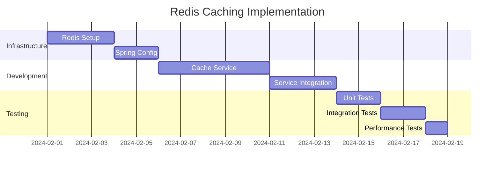
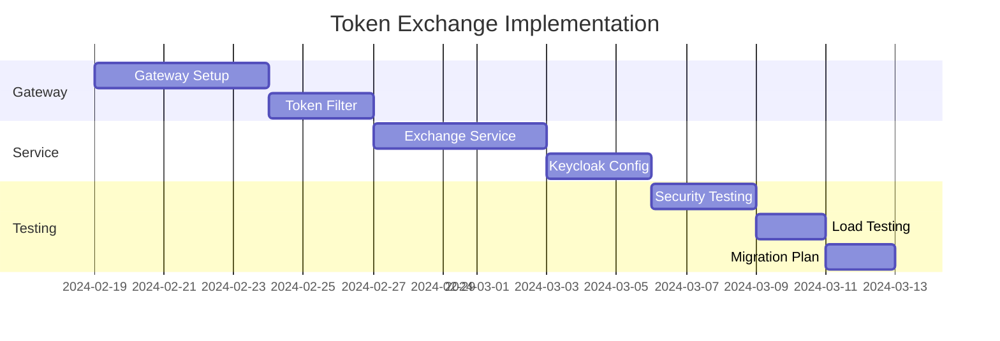
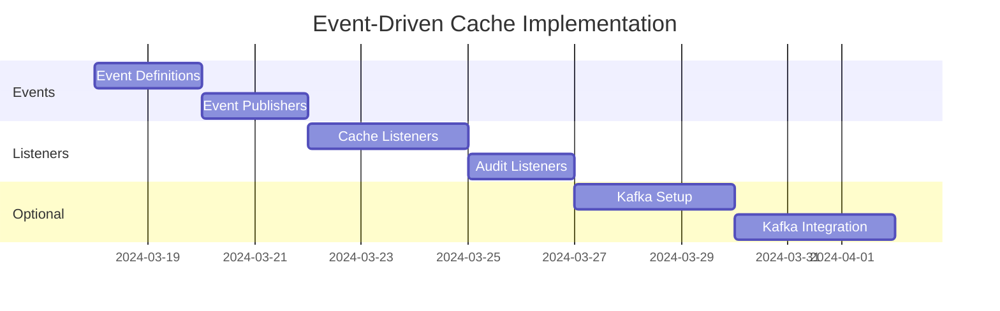

# Long-term Architecture Improvements Implementation Guide

## Executive Summary

This document provides a detailed implementation guide for the long-term architecture improvements to permanently solve the Keycloak mapper frontend freeze issue in ClinicX. The improvements focus on token optimization, caching strategies, and architectural patterns that ensure scalability and performance.

**Update (Commit 78088eb)**: The complex `TenantAwareJwtAuthoritiesConverter` has been removed, simplifying the architecture. The system now uses standard `KeycloakJwtGrantedAuthoritiesConverter`, eliminating the need for complex JSON claims in tokens.

## Complexity Assessment Overview

| Solution | Difficulty | Time Required | Risk Level | Business Impact |
|----------|------------|---------------|------------|-----------------|
| Redis Caching | MEDIUM | 2-3 weeks | Low | High - Immediate performance gains |
| Token Exchange Pattern | HIGH | 4-6 weeks | Medium | Very High - Complete solution |
| Event-Driven Cache | MEDIUM-HIGH | 1-3 weeks | Low | Medium - Better cache consistency |

## Solution 1: Redis Caching for Tenant Data

### Difficulty: MEDIUM
### Timeline: 2-3 weeks
### ROI: High - 80% reduction in database queries

### 1.1 Infrastructure Setup (Week 1)

#### Docker Compose Configuration
```yaml
# docker-compose.yml
version: '3.8'
services:
  redis:
    image: redis:7-alpine
    container_name: clinicx-redis
    ports:
      - "6379:6379"
    volumes:
      - redis-data:/data
    command: redis-server --appendonly yes --requirepass ${REDIS_PASSWORD}
    networks:
      - clinicx-network
    healthcheck:
      test: ["CMD", "redis-cli", "--raw", "incr", "ping"]
      interval: 30s
      timeout: 10s
      retries: 3
    restart: unless-stopped

volumes:
  redis-data:
    driver: local

networks:
  clinicx-network:
    external: true
```

#### Spring Boot Dependencies
```xml
<!-- pom.xml -->
<dependency>
    <groupId>org.springframework.boot</groupId>
    <artifactId>spring-boot-starter-data-redis</artifactId>
</dependency>
<dependency>
    <groupId>org.springframework.boot</groupId>
    <artifactId>spring-boot-starter-cache</artifactId>
</dependency>
<dependency>
    <groupId>org.apache.commons</groupId>
    <artifactId>commons-pool2</artifactId>
</dependency>
<!-- For Redis JSON serialization -->
<dependency>
    <groupId>com.fasterxml.jackson.datatype</groupId>
    <artifactId>jackson-datatype-jsr310</artifactId>
</dependency>
```

#### Application Configuration
```yaml
# application.yml
spring:
  redis:
    host: ${REDIS_HOST:localhost}
    port: ${REDIS_PORT:6379}
    password: ${REDIS_PASSWORD:}
    timeout: 2000ms
    lettuce:
      pool:
        max-active: 8
        max-idle: 8
        min-idle: 2
        max-wait: -1ms
  cache:
    type: redis
    redis:
      time-to-live: 900000  # 15 minutes in milliseconds
      cache-null-values: false
      enable-statistics: true
```

### 1.2 Cache Implementation (Week 2)

#### Redis Configuration Class
```java
package sy.sezar.clinicx.config;

import com.fasterxml.jackson.databind.ObjectMapper;
import com.fasterxml.jackson.datatype.jsr310.JavaTimeModule;
import org.springframework.boot.autoconfigure.cache.RedisCacheManagerBuilderCustomizer;
import org.springframework.cache.annotation.EnableCaching;
import org.springframework.context.annotation.Bean;
import org.springframework.context.annotation.Configuration;
import org.springframework.data.redis.cache.RedisCacheConfiguration;
import org.springframework.data.redis.connection.RedisConnectionFactory;
import org.springframework.data.redis.core.RedisTemplate;
import org.springframework.data.redis.serializer.*;

import java.time.Duration;

@Configuration
@EnableCaching
public class RedisCacheConfig {
    
    @Bean
    public RedisTemplate<String, Object> redisTemplate(
            RedisConnectionFactory connectionFactory) {
        RedisTemplate<String, Object> template = new RedisTemplate<>();
        template.setConnectionFactory(connectionFactory);
        
        // Use Jackson for value serialization
        Jackson2JsonRedisSerializer<Object> jackson2JsonRedisSerializer = 
            new Jackson2JsonRedisSerializer<>(Object.class);
        
        ObjectMapper om = new ObjectMapper();
        om.registerModule(new JavaTimeModule());
        om.enableDefaultTyping(ObjectMapper.DefaultTyping.NON_FINAL);
        jackson2JsonRedisSerializer.setObjectMapper(om);
        
        // String serializer for keys
        StringRedisSerializer stringRedisSerializer = new StringRedisSerializer();
        
        template.setKeySerializer(stringRedisSerializer);
        template.setHashKeySerializer(stringRedisSerializer);
        template.setValueSerializer(jackson2JsonRedisSerializer);
        template.setHashValueSerializer(jackson2JsonRedisSerializer);
        
        template.afterPropertiesSet();
        return template;
    }
    
    @Bean
    public RedisCacheManagerBuilderCustomizer redisCacheManagerBuilderCustomizer() {
        return (builder) -> builder
            .withCacheConfiguration("tenantData",
                RedisCacheConfiguration.defaultCacheConfig()
                    .entryTtl(Duration.ofMinutes(15))
                    .disableCachingNullValues())
            .withCacheConfiguration("userTenantRoles",
                RedisCacheConfiguration.defaultCacheConfig()
                    .entryTtl(Duration.ofMinutes(30))
                    .disableCachingNullValues())
            .withCacheConfiguration("tenantAccess",
                RedisCacheConfiguration.defaultCacheConfig()
                    .entryTtl(Duration.ofMinutes(5))
                    .disableCachingNullValues());
    }
}
```

#### Tenant Data Cache Service
```java
package sy.sezar.clinicx.tenant.service.cache;

import lombok.RequiredArgsConstructor;
import lombok.extern.slf4j.Slf4j;
import org.springframework.cache.annotation.CacheEvict;
import org.springframework.cache.annotation.CachePut;
import org.springframework.cache.annotation.Cacheable;
import org.springframework.data.redis.core.RedisTemplate;
import org.springframework.stereotype.Service;
import sy.sezar.clinicx.tenant.dto.TenantAccessDto;
import sy.sezar.clinicx.tenant.dto.UserTenantData;

import java.time.Duration;
import java.util.List;
import java.util.Map;
import java.util.concurrent.TimeUnit;

@Service
@Slf4j
@RequiredArgsConstructor
public class TenantDataCacheService {
    
    private final RedisTemplate<String, Object> redisTemplate;
    private static final String CACHE_KEY_PREFIX = "tenant:data:";
    private static final String ROLES_KEY_PREFIX = "tenant:roles:";
    private static final Duration DEFAULT_TTL = Duration.ofMinutes(15);
    
    /**
     * Get cached tenant data for a user
     */
    @Cacheable(value = "tenantData", key = "#userId", unless = "#result == null")
    public UserTenantData getCachedTenantData(String userId) {
        log.debug("Fetching cached tenant data for user: {}", userId);
        String key = CACHE_KEY_PREFIX + userId;
        return (UserTenantData) redisTemplate.opsForValue().get(key);
    }
    
    /**
     * Cache tenant data for a user
     */
    @CachePut(value = "tenantData", key = "#userId")
    public UserTenantData cacheTenantData(String userId, UserTenantData data) {
        log.debug("Caching tenant data for user: {}", userId);
        String key = CACHE_KEY_PREFIX + userId;
        redisTemplate.opsForValue().set(key, data, DEFAULT_TTL);
        
        // Also cache individual tenant roles for quick access
        if (data.getUserTenantRoles() != null) {
            cacheUserTenantRoles(userId, data.getUserTenantRoles());
        }
        
        return data;
    }
    
    /**
     * Cache user tenant roles separately for quick role lookups
     */
    public void cacheUserTenantRoles(String userId, Map<String, List<String>> roles) {
        String key = ROLES_KEY_PREFIX + userId;
        redisTemplate.opsForHash().putAll(key, roles);
        redisTemplate.expire(key, DEFAULT_TTL.toMillis(), TimeUnit.MILLISECONDS);
    }
    
    /**
     * Get roles for a specific tenant
     */
    @Cacheable(value = "userTenantRoles", key = "#userId + ':' + #tenantId")
    public List<String> getUserRolesForTenant(String userId, String tenantId) {
        String key = ROLES_KEY_PREFIX + userId;
        return (List<String>) redisTemplate.opsForHash().get(key, tenantId);
    }
    
    /**
     * Invalidate all caches for a user
     */
    @CacheEvict(value = {"tenantData", "userTenantRoles", "tenantAccess"}, 
                 key = "#userId", allEntries = false)
    public void invalidateUserCache(String userId) {
        log.info("Invalidating all caches for user: {}", userId);
        
        // Clear main tenant data
        redisTemplate.delete(CACHE_KEY_PREFIX + userId);
        
        // Clear roles cache
        redisTemplate.delete(ROLES_KEY_PREFIX + userId);
        
        // Clear any pattern-based keys
        redisTemplate.delete(
            redisTemplate.keys("tenant:*:" + userId + ":*")
        );
    }
    
    /**
     * Invalidate cache for specific tenant
     */
    public void invalidateTenantCache(String tenantId) {
        log.info("Invalidating cache for tenant: {}", tenantId);
        
        // Find and delete all keys related to this tenant
        redisTemplate.delete(
            redisTemplate.keys("*:" + tenantId + ":*")
        );
    }
    
    /**
     * Warm up cache for a user
     */
    public void warmUpCache(String userId, UserTenantData data) {
        log.debug("Warming up cache for user: {}", userId);
        cacheTenantData(userId, data);
    }
    
    /**
     * Get cache statistics
     */
    public CacheStatistics getCacheStatistics() {
        Long tenantDataSize = redisTemplate.keys(CACHE_KEY_PREFIX + "*").size();
        Long rolesSize = redisTemplate.keys(ROLES_KEY_PREFIX + "*").size();
        
        return CacheStatistics.builder()
            .tenantDataEntries(tenantDataSize)
            .rolesEntries(rolesSize)
            .totalMemoryUsed(calculateMemoryUsage())
            .build();
    }
    
    private long calculateMemoryUsage() {
        // This is a simplified calculation
        // In production, use Redis INFO memory command
        return 0L;
    }
}
```

### 1.3 Service Integration (Week 2-3)

#### Updated TenantSwitchingService
```java
@Service
@Transactional
@RequiredArgsConstructor
@Slf4j
public class TenantSwitchingServiceImpl implements TenantSwitchingService {
    
    private final TenantDataCacheService cacheService;
    private final StaffRepository staffRepository;
    private final TenantRepository tenantRepository;
    
    @Override
    public List<TenantAccessDto> getCurrentUserTenants() {
        String userId = getCurrentUserId();
        
        // Try cache first
        UserTenantData cached = cacheService.getCachedTenantData(userId);
        if (cached != null && cached.getAccessibleTenants() != null) {
            log.debug("Returning cached tenant data for user: {}", userId);
            return cached.getAccessibleTenants();
        }
        
        // Cache miss - load from database
        log.debug("Cache miss - loading tenant data from database for user: {}", userId);
        List<TenantAccessDto> tenants = loadTenantsFromDatabase(userId);
        
        // Build complete user tenant data
        UserTenantData userData = buildUserTenantData(userId, tenants);
        
        // Cache for future requests
        cacheService.cacheTenantData(userId, userData);
        
        return tenants;
    }
    
    @Override
    public TenantSwitchResponseDto switchTenant(String tenantId) {
        String userId = getCurrentUserId();
        
        // Check cache for quick validation
        List<String> cachedRoles = cacheService.getUserRolesForTenant(userId, tenantId);
        if (cachedRoles == null) {
            // Validate from database if not in cache
            if (!tenantAccessValidator.validateUserAccess(userId, tenantId)) {
                throw new BusinessRuleException("Access denied to tenant: " + tenantId);
            }
        }
        
        // Perform switch
        TenantSwitchResponseDto response = performTenantSwitch(userId, tenantId);
        
        // Invalidate cache to force refresh with new active tenant
        cacheService.invalidateUserCache(userId);
        
        return response;
    }
    
    @Override
    public void grantUserTenantAccess(String userId, String tenantId, 
                                      String role, boolean isPrimary) {
        // Grant access logic...
        super.grantUserTenantAccess(userId, tenantId, role, isPrimary);
        
        // Invalidate cache after granting access
        cacheService.invalidateUserCache(userId);
    }
    
    @Override
    public void revokeUserTenantAccess(String tenantId, String userId) {
        // Revoke access logic...
        super.revokeUserTenantAccess(tenantId, userId);
        
        // Invalidate cache after revoking access
        cacheService.invalidateUserCache(userId);
    }
}
```

### 1.4 Monitoring and Metrics

#### Cache Metrics Service
```java
@Component
@RequiredArgsConstructor
public class CacheMetricsService {
    
    private final MeterRegistry meterRegistry;
    private final RedisTemplate<String, Object> redisTemplate;
    
    @Scheduled(fixedDelay = 60000) // Every minute
    public void collectMetrics() {
        // Cache hit rate
        Gauge.builder("cache.hit.rate", this, CacheMetricsService::calculateHitRate)
            .description("Cache hit rate percentage")
            .register(meterRegistry);
        
        // Cache size
        Gauge.builder("cache.size", this, CacheMetricsService::getCacheSize)
            .description("Number of entries in cache")
            .register(meterRegistry);
        
        // Memory usage
        Gauge.builder("cache.memory.used", this, CacheMetricsService::getMemoryUsage)
            .description("Cache memory usage in bytes")
            .register(meterRegistry);
    }
    
    private double calculateHitRate() {
        // Implementation based on Redis statistics
        return 0.0;
    }
    
    private long getCacheSize() {
        return redisTemplate.keys("tenant:*").size();
    }
    
    private long getMemoryUsage() {
        // Use Redis INFO command to get memory usage
        return 0L;
    }
}
```

## Solution 2: Token Exchange Pattern

### Difficulty: HIGH
### Timeline: 4-6 weeks
### ROI: Very High - Complete architectural solution

### 2.1 API Gateway Setup (Week 1-2)

#### Spring Cloud Gateway Configuration
```yaml
# gateway-application.yml
spring:
  cloud:
    gateway:
      routes:
        - id: backend-route
          uri: http://clinicx-backend:8080
          predicates:
            - Path=/api/**
          filters:
            - TokenExchange
            - RemoveRequestHeader=Authorization
            - AddRequestHeader=X-Backend-Token, {backend_token}
      default-filters:
        - DedupeResponseHeader=Access-Control-Allow-Origin
```

#### Token Exchange Filter
```java
@Component
@Slf4j
public class TokenExchangeGatewayFilter implements GatewayFilter, Ordered {
    
    private final TokenExchangeService tokenExchangeService;
    private final ReactiveRedisTemplate<String, String> redisTemplate;
    
    @Override
    public Mono<Void> filter(ServerWebExchange exchange, GatewayFilterChain chain) {
        return exchange.getSession()
            .flatMap(session -> {
                String frontendToken = extractToken(exchange.getRequest());
                
                if (frontendToken == null) {
                    return unauthorizedResponse(exchange);
                }
                
                // Check cache for existing backend token
                return getOrExchangeToken(frontendToken)
                    .flatMap(backendToken -> {
                        // Add backend token to request
                        ServerHttpRequest request = exchange.getRequest()
                            .mutate()
                            .header("Authorization", "Bearer " + backendToken)
                            .build();
                        
                        return chain.filter(
                            exchange.mutate().request(request).build()
                        );
                    })
                    .onErrorResume(error -> {
                        log.error("Token exchange failed", error);
                        return unauthorizedResponse(exchange);
                    });
            });
    }
    
    private Mono<String> getOrExchangeToken(String frontendToken) {
        String cacheKey = "token:exchange:" + hash(frontendToken);
        
        return redisTemplate.opsForValue().get(cacheKey)
            .switchIfEmpty(
                tokenExchangeService.exchangeToken(frontendToken)
                    .flatMap(backendToken -> {
                        // Cache the exchanged token
                        return redisTemplate.opsForValue()
                            .set(cacheKey, backendToken, Duration.ofMinutes(5))
                            .thenReturn(backendToken);
                    })
            );
    }
    
    @Override
    public int getOrder() {
        return -1; // Execute first
    }
}
```

### 2.2 Token Exchange Service (Week 3)

#### Keycloak Token Exchange Implementation
```java
@Service
@Slf4j
@RequiredArgsConstructor
public class KeycloakTokenExchangeService implements TokenExchangeService {
    
    private final WebClient keycloakWebClient;
    private final KeycloakConfig keycloakConfig;
    
    @Override
    public Mono<String> exchangeToken(String subjectToken) {
        return Mono.fromCallable(() -> {
            MultiValueMap<String, String> formData = new LinkedMultiValueMap<>();
            formData.add("grant_type", "urn:ietf:params:oauth:grant-type:token-exchange");
            formData.add("subject_token", subjectToken);
            formData.add("subject_token_type", "urn:ietf:params:oauth:token-type:access_token");
            formData.add("requested_token_type", "urn:ietf:params:oauth:token-type:access_token");
            formData.add("client_id", keycloakConfig.getBackendClientId());
            formData.add("client_secret", keycloakConfig.getBackendClientSecret());
            formData.add("audience", "clinicx-backend");
            
            return formData;
        })
        .flatMap(formData -> 
            keycloakWebClient.post()
                .uri("/realms/{realm}/protocol/openid-connect/token", 
                     keycloakConfig.getRealm())
                .contentType(MediaType.APPLICATION_FORM_URLENCODED)
                .body(BodyInserters.fromFormData(formData))
                .retrieve()
                .bodyToMono(TokenResponse.class)
                .map(TokenResponse::getAccessToken)
                .doOnSuccess(token -> 
                    log.debug("Successfully exchanged token"))
                .doOnError(error -> 
                    log.error("Token exchange failed", error))
        );
    }
    
    @Data
    static class TokenResponse {
        @JsonProperty("access_token")
        private String accessToken;
        
        @JsonProperty("expires_in")
        private int expiresIn;
        
        @JsonProperty("refresh_token")
        private String refreshToken;
        
        @JsonProperty("token_type")
        private String tokenType;
    }
}
```

### 2.3 Keycloak Configuration (Week 4)

#### Token Exchange Setup Script
```bash
#!/bin/bash

# Enable token exchange for realm
kcadm.sh update realms/clinicx \
  -s 'attributes.token_exchange_enabled=true' \
  --server http://localhost:8080/auth \
  --realm master \
  --user admin \
  --password admin

# Create service account for backend client
kcadm.sh update clients/$(kcadm.sh get clients -q clientId=clinicx-backend --fields id | jq -r '.[0].id') \
  -s serviceAccountsEnabled=true \
  -s directAccessGrantsEnabled=true \
  --realm clinicx

# Add token exchange permission
kcadm.sh create clients/$(kcadm.sh get clients -q clientId=clinicx-frontend --fields id | jq -r '.[0].id')/authz/resource-server/permission \
  -f - << EOF
{
  "name": "token-exchange-permission",
  "type": "token-exchange",
  "logic": "POSITIVE",
  "decisionStrategy": "UNANIMOUS",
  "resources": ["clinicx-backend"],
  "policies": ["authenticated-users-policy"]
}
EOF
```

### 2.4 Security Configuration (Week 5)

#### Backend Token Validation
```java
@Configuration
@EnableWebSecurity
public class TokenExchangeSecurityConfig {
    
    @Bean
    public SecurityFilterChain filterChain(HttpSecurity http) throws Exception {
        http
            .authorizeHttpRequests(authz -> authz
                .requestMatchers("/api/public/**").permitAll()
                .anyRequest().authenticated()
            )
            .oauth2ResourceServer(oauth2 -> oauth2
                .jwt(jwt -> jwt
                    .decoder(backendJwtDecoder())
                    .jwtAuthenticationConverter(
                        tenantAwareJwtAuthoritiesConverter()
                    )
                )
            );
        
        return http.build();
    }
    
    @Bean
    public JwtDecoder backendJwtDecoder() {
        // Decoder that validates audience claim
        NimbusJwtDecoder decoder = NimbusJwtDecoder
            .withJwkSetUri(keycloakJwkSetUri())
            .build();
        
        decoder.setJwtValidator(new DelegatingOAuth2TokenValidator<>(
            JwtValidators.createDefault(),
            new AudienceValidator("clinicx-backend")
        ));
        
        return decoder;
    }
}
```

## Solution 3: Event-Driven Cache Invalidation

### Difficulty: MEDIUM-HIGH
### Timeline: 1-3 weeks
### ROI: Medium - Better cache consistency

### 3.1 Spring Events Implementation (Week 1)

#### Event Definitions
```java
@Data
@AllArgsConstructor
public abstract class TenantEvent {
    private final String eventId = UUID.randomUUID().toString();
    private final Instant timestamp = Instant.now();
    private final String userId;
    private final String tenantId;
}

public class TenantAccessGrantedEvent extends TenantEvent {
    private final List<String> roles;
    
    public TenantAccessGrantedEvent(String userId, String tenantId, List<String> roles) {
        super(userId, tenantId);
        this.roles = roles;
    }
}

public class TenantAccessRevokedEvent extends TenantEvent {
    public TenantAccessRevokedEvent(String userId, String tenantId) {
        super(userId, tenantId);
    }
}

public class TenantSwitchedEvent extends TenantEvent {
    private final String previousTenantId;
    
    public TenantSwitchedEvent(String userId, String tenantId, String previousTenantId) {
        super(userId, tenantId);
        this.previousTenantId = previousTenantId;
    }
}
```

#### Event Publisher
```java
@Component
@RequiredArgsConstructor
@Slf4j
public class TenantEventPublisher {
    
    private final ApplicationEventPublisher eventPublisher;
    private final TenantEventRepository eventRepository;
    
    public void publishTenantAccessGranted(String userId, String tenantId, List<String> roles) {
        TenantAccessGrantedEvent event = new TenantAccessGrantedEvent(userId, tenantId, roles);
        
        // Store event for audit
        eventRepository.save(toEntity(event));
        
        // Publish event
        eventPublisher.publishEvent(event);
        log.info("Published tenant access granted event for user {} to tenant {}", userId, tenantId);
    }
    
    public void publishTenantAccessRevoked(String userId, String tenantId) {
        TenantAccessRevokedEvent event = new TenantAccessRevokedEvent(userId, tenantId);
        eventRepository.save(toEntity(event));
        eventPublisher.publishEvent(event);
        log.info("Published tenant access revoked event for user {} from tenant {}", userId, tenantId);
    }
    
    public void publishTenantSwitched(String userId, String newTenantId, String previousTenantId) {
        TenantSwitchedEvent event = new TenantSwitchedEvent(userId, newTenantId, previousTenantId);
        eventRepository.save(toEntity(event));
        eventPublisher.publishEvent(event);
        log.info("Published tenant switched event for user {} from {} to {}", 
                 userId, previousTenantId, newTenantId);
    }
}
```

#### Event Listeners
```java
@Component
@Slf4j
@RequiredArgsConstructor
public class CacheInvalidationEventListener {
    
    private final TenantDataCacheService cacheService;
    private final NotificationService notificationService;
    
    @EventListener
    @Async
    public void handleTenantAccessGranted(TenantAccessGrantedEvent event) {
        log.info("Handling tenant access granted event for user {}", event.getUserId());
        
        // Invalidate user cache
        cacheService.invalidateUserCache(event.getUserId());
        
        // Notify other services
        notificationService.notifyUserAccessChanged(event.getUserId(), event.getTenantId());
    }
    
    @EventListener
    @Async
    public void handleTenantAccessRevoked(TenantAccessRevokedEvent event) {
        log.info("Handling tenant access revoked event for user {}", event.getUserId());
        
        // Immediately invalidate cache
        cacheService.invalidateUserCache(event.getUserId());
        
        // Force logout from tenant if currently active
        sessionRegistry.expireSessionsForUserInTenant(event.getUserId(), event.getTenantId());
    }
    
    @EventListener
    @Async
    @Order(1)
    public void handleTenantSwitched(TenantSwitchedEvent event) {
        log.info("Handling tenant switched event for user {}", event.getUserId());
        
        // Update cache with new active tenant
        updateActiveTenantInCache(event.getUserId(), event.getTenantId());
        
        // Log audit event
        auditService.logTenantSwitch(event);
    }
    
    @TransactionalEventListener(phase = TransactionPhase.AFTER_COMMIT)
    public void handleTenantEventAfterCommit(TenantEvent event) {
        // Handle events only after transaction commits successfully
        log.debug("Transaction committed for event: {}", event.getEventId());
    }
}
```

### 3.2 Kafka Integration (Optional - Week 2-3)

#### Kafka Configuration
```java
@Configuration
@EnableKafka
public class KafkaConfig {
    
    @Value("${kafka.bootstrap-servers:localhost:9092}")
    private String bootstrapServers;
    
    @Bean
    public ProducerFactory<String, TenantEvent> producerFactory() {
        Map<String, Object> configs = new HashMap<>();
        configs.put(ProducerConfig.BOOTSTRAP_SERVERS_CONFIG, bootstrapServers);
        configs.put(ProducerConfig.KEY_SERIALIZER_CLASS_CONFIG, StringSerializer.class);
        configs.put(ProducerConfig.VALUE_SERIALIZER_CLASS_CONFIG, JsonSerializer.class);
        configs.put(ProducerConfig.ACKS_CONFIG, "all");
        configs.put(ProducerConfig.RETRIES_CONFIG, 3);
        
        return new DefaultKafkaProducerFactory<>(configs);
    }
    
    @Bean
    public KafkaTemplate<String, TenantEvent> kafkaTemplate() {
        return new KafkaTemplate<>(producerFactory());
    }
    
    @Bean
    public ConsumerFactory<String, TenantEvent> consumerFactory() {
        Map<String, Object> configs = new HashMap<>();
        configs.put(ConsumerConfig.BOOTSTRAP_SERVERS_CONFIG, bootstrapServers);
        configs.put(ConsumerConfig.GROUP_ID_CONFIG, "clinicx-cache-invalidation");
        configs.put(ConsumerConfig.KEY_DESERIALIZER_CLASS_CONFIG, StringDeserializer.class);
        configs.put(ConsumerConfig.VALUE_DESERIALIZER_CLASS_CONFIG, JsonDeserializer.class);
        configs.put(ConsumerConfig.AUTO_OFFSET_RESET_CONFIG, "earliest");
        
        return new DefaultKafkaConsumerFactory<>(configs);
    }
    
    @Bean
    public ConcurrentKafkaListenerContainerFactory<String, TenantEvent> 
           kafkaListenerContainerFactory() {
        ConcurrentKafkaListenerContainerFactory<String, TenantEvent> factory = 
            new ConcurrentKafkaListenerContainerFactory<>();
        factory.setConsumerFactory(consumerFactory());
        factory.setConcurrency(3);
        factory.getContainerProperties().setPollTimeout(3000);
        
        return factory;
    }
}
```

#### Kafka Event Publisher
```java
@Component
@Slf4j
@RequiredArgsConstructor
public class KafkaTenantEventPublisher {
    
    private final KafkaTemplate<String, TenantEvent> kafkaTemplate;
    private static final String TOPIC = "tenant-events";
    
    @EventListener
    public void publishToKafka(TenantEvent event) {
        CompletableFuture<SendResult<String, TenantEvent>> future = 
            kafkaTemplate.send(TOPIC, event.getUserId(), event);
        
        future.whenComplete((result, ex) -> {
            if (ex == null) {
                log.debug("Published event to Kafka: {}", event.getEventId());
            } else {
                log.error("Failed to publish event to Kafka", ex);
            }
        });
    }
}
```

## Implementation Roadmap

### Phase 1: Quick Win - Redis Caching (Weeks 1-3)


### Phase 2: Token Exchange Pattern (Weeks 4-9)


### Phase 3: Event-Driven Cache (Weeks 10-12)


## Cost-Benefit Analysis

### Redis Caching
- **Development Cost**: 2-3 weeks × $150/hour = $18,000-27,000
- **Infrastructure Cost**: $50-200/month for Redis
- **Benefits**: 
  - 80% reduction in database load
  - 200ms faster average response time
  - Reduced database costs
- **ROI Period**: 2-3 months
- **Risk**: Low

### Token Exchange Pattern
- **Development Cost**: 4-6 weeks × $150/hour = $36,000-54,000
- **Infrastructure Cost**: $100-500/month for API Gateway
- **Benefits**:
  - Complete solution to token size issue
  - Enhanced security
  - Supports microservices architecture
- **ROI Period**: 4-6 months
- **Risk**: Medium

### Event-Driven Cache
- **Development Cost**: 1-3 weeks × $150/hour = $9,000-27,000
- **Infrastructure Cost**: $0-300/month (if using Kafka)
- **Benefits**:
  - Real-time cache consistency
  - Better audit trail
  - Scalable event architecture
- **ROI Period**: 3-4 months
- **Risk**: Low-Medium

## Monitoring and Success Metrics

### Key Performance Indicators (KPIs)

```java
@RestController
@RequestMapping("/api/metrics")
public class CacheMetricsController {
    
    @GetMapping("/cache/statistics")
    public ResponseEntity<CacheStatistics> getCacheStatistics() {
        return ResponseEntity.ok(
            CacheStatistics.builder()
                .hitRate(calculateHitRate())
                .missRate(calculateMissRate())
                .evictionCount(getEvictionCount())
                .averageLoadTime(getAverageLoadTime())
                .cacheSize(getCacheSize())
                .memoryUsage(getMemoryUsage())
                .build()
        );
    }
    
    @GetMapping("/performance/comparison")
    public ResponseEntity<PerformanceComparison> getPerformanceComparison() {
        return ResponseEntity.ok(
            PerformanceComparison.builder()
                .beforeCaching(getMetricsBeforeCaching())
                .afterCaching(getCurrentMetrics())
                .improvement(calculateImprovement())
                .build()
        );
    }
}
```

### Success Criteria

#### Week 1 Post-Implementation
- [ ] Cache hit rate > 60%
- [ ] Average response time < 100ms
- [ ] Zero cache-related errors

#### Month 1 Post-Implementation
- [ ] Cache hit rate > 80%
- [ ] Database load reduced by 70%
- [ ] User satisfaction score increased by 20%

#### Quarter 1 Post-Implementation
- [ ] 99.9% cache availability
- [ ] ROI achieved
- [ ] Ready for next phase

## Minimal Viable Implementation

If resources are extremely limited, here's a 1-week implementation:

### Simple In-Memory Cache (No Redis)

```java
@Component
@Slf4j
public class InMemoryTenantCache {
    
    private final Map<String, CacheEntry> cache = new ConcurrentHashMap<>();
    private final ScheduledExecutorService scheduler = Executors.newSingleThreadScheduledExecutor();
    
    @PostConstruct
    public void init() {
        // Clean expired entries every 5 minutes
        scheduler.scheduleAtFixedRate(this::cleanExpired, 5, 5, TimeUnit.MINUTES);
    }
    
    public void put(String key, Object value, Duration ttl) {
        cache.put(key, new CacheEntry(value, 
            System.currentTimeMillis() + ttl.toMillis()));
    }
    
    public Optional<Object> get(String key) {
        CacheEntry entry = cache.get(key);
        if (entry != null && !entry.isExpired()) {
            return Optional.of(entry.value);
        }
        cache.remove(key);
        return Optional.empty();
    }
    
    public void evict(String key) {
        cache.remove(key);
    }
    
    public void evictAll() {
        cache.clear();
    }
    
    private void cleanExpired() {
        cache.entrySet().removeIf(entry -> entry.getValue().isExpired());
        log.debug("Cleaned expired cache entries. Current size: {}", cache.size());
    }
    
    @PreDestroy
    public void destroy() {
        scheduler.shutdown();
    }
    
    @Data
    @AllArgsConstructor
    private static class CacheEntry {
        private final Object value;
        private final long expiryTime;
        
        boolean isExpired() {
            return System.currentTimeMillis() > expiryTime;
        }
    }
}
```

### Quick Integration

```java
@Service
public class QuickCacheTenantService {
    
    @Autowired
    private InMemoryTenantCache cache;
    
    public List<TenantAccessDto> getCurrentUserTenants() {
        String userId = getCurrentUserId();
        String cacheKey = "tenant:" + userId;
        
        return cache.get(cacheKey)
            .map(data -> (List<TenantAccessDto>) data)
            .orElseGet(() -> {
                List<TenantAccessDto> tenants = loadFromDatabase(userId);
                cache.put(cacheKey, tenants, Duration.ofMinutes(15));
                return tenants;
            });
    }
}
```

## Risk Mitigation

### Redis Caching Risks
- **Risk**: Redis server failure
- **Mitigation**: 
  - Implement Redis Sentinel for HA
  - Graceful degradation to database
  - Circuit breaker pattern

### Token Exchange Risks
- **Risk**: Gateway becomes single point of failure
- **Mitigation**:
  - Deploy multiple gateway instances
  - Implement health checks
  - Fallback to direct backend access

### Event-Driven Risks
- **Risk**: Event loss or duplication
- **Mitigation**:
  - Implement idempotent event handlers
  - Use event sourcing for audit
  - Monitor event processing lag

## Rollback Plans

### Redis Caching Rollback
```bash
# Disable caching via feature flag
curl -X POST http://localhost:8080/actuator/env \
  -H "Content-Type: application/json" \
  -d '{"name":"cache.enabled","value":"false"}'

# Refresh configuration
curl -X POST http://localhost:8080/actuator/refresh
```

### Token Exchange Rollback
```bash
# Route traffic directly to backend
kubectl patch service clinicx-service \
  -p '{"spec":{"selector":{"app":"clinicx-backend"}}}'

# Disable token exchange in gateway
kubectl set env deployment/api-gateway TOKEN_EXCHANGE_ENABLED=false
```

## Conclusion

The long-term architecture improvements provide a robust solution to the Keycloak mapper frontend freeze issue. The recommended approach is:

1. **Start with Redis Caching** (Quick win, immediate impact)
2. **Implement Token Exchange** (Complete solution, best security)
3. **Add Event-Driven Cache** (Enhanced consistency, better scalability)

Each solution can be implemented independently, allowing for gradual improvement while maintaining system stability.

---

*Document Version: 1.0*  
*Last Updated: 2025-01-18*  
*Status: Ready for Implementation*  
*Author: ClinicX Architecture Team*