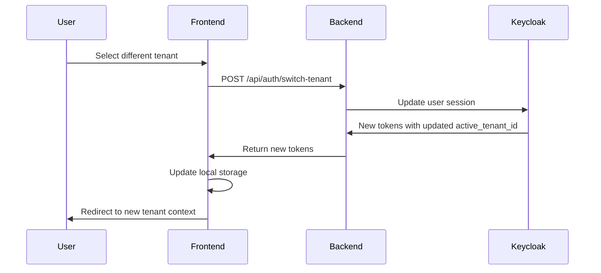

# Realm-Per-Type Multi-Tenant Architecture

## Overview

This document outlines the enhanced tenant architecture that builds upon the existing multi-tenant implementation. Currently, we have one Keycloak realm per tenant (e.g., `clinic-smile-dental`). The new approach groups tenants by specialty type, allowing multiple clinics to exist within a single realm while maintaining data isolation.

## Architecture Design

### Realm Structure

```
Keycloak
├── clinic-realm (Full access - all features) (Dynamically created)
│   ├── Tenant: Happy Clinic (tenant-id: happy-clinic-abc123)
│   ├── Tenant: Care Medical Center (tenant-id: care-center-def456)
│   └── Tenant: City Hospital (tenant-id: city-hospital-ghi789)
│
├── dental-realm (Dental + Appointments features) (Dynamically created)
│   ├── Tenant: Smile Dental (tenant-id: smile-dental-jkl012)
│   ├── Tenant: Pearl Orthodontics (tenant-id: pearl-ortho-mno345)
│   └── Tenant: Bright Teeth Clinic (tenant-id: bright-teeth-pqr678)
│
├── appointments-realm (Appointments only) (Dynamically created)
│   ├── Tenant: Quick Book Center (tenant-id: quick-book-stu901)
│   └── Tenant: Schedule Pro (tenant-id: schedule-pro-vwx234)
│
└── [future-specialty]-realm (Dynamically created)
    └── Tenants for new specialty
```

### Dynamic Realm Creation

The system maintains the existing logic for realm creation but adapts it for specialty-based realms:

1. **First tenant of a new specialty**: Creates the specialty realm
2. **Subsequent tenants**: Added to existing specialty realm
3. **Realm naming convention**: `{specialty}-realm` (e.g., `dental-realm`, `cardiology-realm`)

### User-Tenant Relationship

Users can belong to multiple tenants within the same realm. This is managed through:

1. **Primary Tenant**: The default tenant for the user
2. **Accessible Tenants**: List of all tenants the user can access
3. **Active Tenant**: The currently selected tenant in the session

## Implementation Approach

### 1. User Attributes Structure

Building on the existing implementation where users have attributes configured via Keycloak User Profile:

```json
{
  "username": "john.doe@example.com",
  "attributes": {
    "tenant_id": ["smile-dental-jkl012", "pearl-ortho-mno345"],
    "primary_tenant_id": ["smile-dental-jkl012"],
    "clinic_name": ["Smile Dental"],
    "clinic_type": ["DENTAL"],
    "accessible_tenants": [
      "smile-dental-jkl012|Smile Dental|ADMIN",
      "pearl-ortho-mno345|Pearl Orthodontics|DENTIST"
    ]
  }
}
```

Note: Protocol mappers must be configured for these attributes to appear in JWT tokens.

### 2. JWT Token Structure

Enhanced JWT token structure building on the existing `tenant_id` claim:

```json
{
  "sub": "user-uuid",
  "preferred_username": "john.doe@example.com",
  "email": "john.doe@example.com",
  "iss": "http://localhost:18081/realms/dental-realm",
  "tenant_id": "smile-dental-jkl012",  // Current active tenant
  "clinic_name": "Smile Dental",
  "clinic_type": "DENTAL",
  "primary_tenant_id": "smile-dental-jkl012",
  "accessible_tenants": ["smile-dental-jkl012", "pearl-ortho-mno345"],
  "realm_access": {
    "roles": ["ADMIN", "DENTIST"]
  },
  "resource_access": {
    "clinicx-backend": {
      "roles": ["manage-patients", "view-appointments"]
    }
  }
}
```

### 3. Tenant Switching Flow



## Benefits

1. **Reduced Realm Management**: Fewer realms to maintain
2. **Feature-Based Access Control**: Realms define available features
3. **Cross-Tenant Collaboration**: Users can work across multiple clinics
4. **Simplified User Management**: One user account for multiple clinics

## Challenges & Solutions

### Challenge 1: Data Isolation
**Solution**: Every API request must validate that the user has access to the active_tenant_id

### Challenge 2: Role Management
**Solution**: Roles are tenant-specific - user can be ADMIN in one tenant and RECEPTIONIST in another

### Challenge 3: Tenant Switching
**Solution**: Implement tenant switcher UI component and update tokens without full re-authentication

## TODO List

### Phase 1: Foundation (Week 1)
- [ ] Extend existing Keycloak user attributes to support multiple tenant IDs
- [ ] Create protocol mappers for new attributes (primary_tenant_id, accessible_tenants)
- [ ] Create database schema for user-tenant relationships
- [ ] Design API for tenant switching
- [ ] Maintain backward compatibility with existing single-tenant users

### Phase 2: Backend Implementation (Week 2)
- [ ] Update `KeycloakAdminService` to handle realm-per-type creation
- [ ] Implement `DynamicRealmService` for automatic realm creation
- [ ] Create `SpecialtyRegistry` to manage available specialties
- [ ] Modify `TenantService` to support multiple tenants per user
- [ ] Implement `TenantSwitchingService` for changing active tenant
- [ ] Update `TenantResolver` to use active_tenant_id from JWT
- [ ] Create `TenantAccessValidator` to verify user-tenant permissions
- [ ] Modify `TenantInterceptor` to validate tenant access on each request
- [ ] Update existing realm creation logic to check specialty type first

### Phase 3: Security & Authorization (Week 3)
- [ ] Implement tenant-specific role checking
- [ ] Add audit logging for tenant switches
- [ ] Create tenant access middleware
- [ ] Implement rate limiting for tenant switching
- [ ] Add security headers for tenant context

### Phase 4: Frontend Updates (Week 4)
- [ ] Create tenant switcher component
- [ ] Update authentication service to handle multiple tenants
- [ ] Modify routing to include tenant context
- [ ] Update API interceptors to include active tenant
- [ ] Implement tenant-aware navigation guards

### Phase 5: Migration & Testing (Week 5)
- [ ] Create migration script for existing tenants
- [ ] Write integration tests for multi-tenant scenarios
- [ ] Test tenant isolation thoroughly
- [ ] Performance testing with multiple tenants
- [ ] Create rollback plan

### Phase 6: Documentation & Deployment (Week 6)
- [ ] Update API documentation
- [ ] Create user guides for tenant switching
- [ ] Document troubleshooting procedures
- [ ] Plan phased deployment strategy
- [ ] Monitor and optimize

## API Changes

### New Endpoints

```
GET  /api/auth/my-tenants          - Get list of accessible tenants
POST /api/auth/switch-tenant       - Switch active tenant
GET  /api/auth/current-tenant      - Get current active tenant
```

### Modified Headers

```
X-Tenant-ID: {active_tenant_id}    - Current active tenant
X-Primary-Tenant: {primary_tenant_id} - User's primary tenant
```

## Database Schema Changes

```sql
-- User-Tenant relationship table
CREATE TABLE user_tenant_access (
    id UUID PRIMARY KEY,
    user_id VARCHAR(255) NOT NULL,
    tenant_id VARCHAR(255) NOT NULL,
    role VARCHAR(50) NOT NULL,
    is_primary BOOLEAN DEFAULT FALSE,
    created_at TIMESTAMP DEFAULT CURRENT_TIMESTAMP,
    UNIQUE(user_id, tenant_id)
);

-- Add specialty columns to tenants table
ALTER TABLE tenants ADD COLUMN specialty VARCHAR(50) NOT NULL DEFAULT 'CLINIC';
ALTER TABLE tenants ADD COLUMN realm_type VARCHAR(50) NOT NULL DEFAULT 'CLINIC';

-- Specialty registry table
CREATE TABLE specialty_types (
    id UUID PRIMARY KEY,
    code VARCHAR(50) UNIQUE NOT NULL,
    name VARCHAR(100) NOT NULL,
    features TEXT[], -- Array of feature codes
    realm_name VARCHAR(100),
    is_active BOOLEAN DEFAULT TRUE,
    created_at TIMESTAMP DEFAULT CURRENT_TIMESTAMP
);

-- Insert default specialties
INSERT INTO specialty_types (id, code, name, features, realm_name) VALUES
(gen_random_uuid(), 'CLINIC', 'General Clinic', ARRAY['ALL'], 'clinic-realm'),
(gen_random_uuid(), 'DENTAL', 'Dental Clinic', ARRAY['DENTAL', 'APPOINTMENTS'], 'dental-realm'),
(gen_random_uuid(), 'APPOINTMENTS', 'Appointments Only', ARRAY['APPOINTMENTS'], 'appointments-realm');
```

## Configuration Changes

```yaml
app:
  tenant:
    mode: multi
    realm-per-tenant: false
    realm-per-type: true
    realm-types:
      - CLINIC
      - DENTAL
      - APPOINTMENTS
      # New specialties can be added here dynamically
    features:
      CLINIC: [ALL]
      DENTAL: [DENTAL, APPOINTMENTS]
      APPOINTMENTS: [APPOINTMENTS]
      # Feature mappings for new specialties
    specialty-realm-mapping:
      enabled: true
      auto-create-realm: true
      default-features:
        - APPOINTMENTS  # All specialties get appointments by default
```

## Specialty Management

The system supports dynamic specialty types (CLINIC, DENTAL, APPOINTMENTS) with the ability to add new specialties without code changes. Each specialty defines:
- Available features
- Associated realm name
- Default roles and permissions

Implementation details for Keycloak configuration, user attributes, and protocol mappers are documented in [KEYCLOAK-SETUP.md](./KEYCLOAK-SETUP.md).

## Risk Mitigation

1. **Data Leak Risk**: Implement strict tenant validation on every request
2. **Performance Risk**: Cache user-tenant relationships
3. **Complexity Risk**: Provide clear documentation and training
4. **Migration Risk**: Test thoroughly with production data copies

## Implementation Examples

### Creating a New Tenant with Specialty

When creating a new tenant, specify the specialty type in the request:

```json
POST /api/v1/tenants
{
    "subdomain": "heart-care",
    "name": "Heart Care Center",
    "specialty": "CARDIOLOGY",
    "adminUsername": "admin@heartcare.com",
    "adminEmail": "admin@heartcare.com",
    "adminFirstName": "Admin",
    "adminLastName": "User",
    "adminPassword": "secure-password",
    "contactEmail": "info@heartcare.com",
    "contactPhone": "+1234567890"
}
```

The system will:
1. Check if cardiology-realm exists (create if needed)
2. Generate unique tenant ID
3. Create admin user with appropriate attributes
4. Configure protocol mappers
5. Return tenant configuration details

### Adding New Specialty

To add a new specialty type:

```json
POST /api/admin/specialties
{
    "code": "CARDIOLOGY",
    "name": "Cardiology Clinic",
    "features": ["CARDIOLOGY", "APPOINTMENTS", "IMAGING"],
    "realmName": "cardiology-realm"
}
```

### Multi-Tenant User Access

Users can be granted access to multiple tenants:

```json
PUT /api/admin/users/{userId}/tenant-access
{
    "tenantId": "pearl-ortho-mno345",
    "role": "CONSULTANT"
}
```

## Migration Path from Current Implementation

### Current State
- One realm per tenant (e.g., `clinic-smile-dental`)
- Users have `tenant_id`, `clinic_name`, `clinic_type` attributes
- Protocol mappers configured in each realm
- `KeycloakTenantResolver` extracts tenant from JWT or realm name

### Migration Steps

1. **Phase 1 - Prepare Infrastructure**
   - Add `specialty` column to tenants table
   - Create `specialty_types` registry table
   - Deploy enhanced `TenantService` with backward compatibility

2. **Phase 2 - Gradual Migration**
   - New tenants use specialty-based realms
   - Existing tenants remain in their current realms
   - Add migration endpoint for voluntary migration

3. **Phase 3 - User Migration**
   - Users in specialty realms can access multiple tenants
   - Maintain existing single-tenant users as-is
   - Add tenant switching UI for multi-tenant users

## Success Criteria

- Users can seamlessly switch between tenants
- No data leakage between tenants
- Performance remains optimal
- Existing functionality is preserved
- Audit trail captures all tenant switches
- New specialties can be added without code changes
- Existing realm creation logic continues to work
- Zero downtime migration from current architecture
