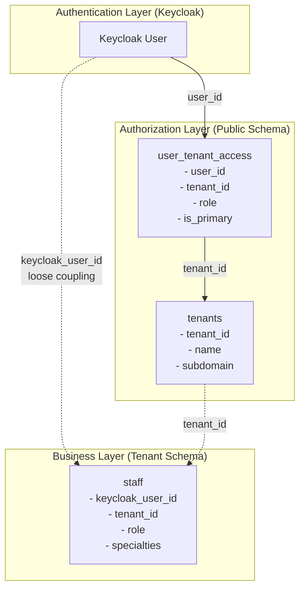

# Tenant and User Management Flow

## Architecture Overview

The system implements a **loose coupling architecture** between authentication/authorization (`user_tenant_access` table) and business data (`staff` table). This design prepares the system for future schema-per-tenant migration.



## 1. Tenant Creation with Admin User

### Step-by-Step Process

#### 1.1 Create Tenant via API
```bash
POST /api/tenants
Content-Type: application/json

{
  "name": "Sample Clinic",
  "subdomain": "sample-clinic",
  "adminEmail": "admin@sampleclinic.com",
  "adminFirstName": "John",
  "adminLastName": "Doe",
  "adminPassword": "SecurePassword123!"
}
```

#### 1.2 What Happens Behind the Scenes

1. **Tenant Creation**
   - New record created in `tenants` table
   - Unique `tenant_id` generated (UUID)
   - Subdomain validated for uniqueness

2. **Keycloak Realm Setup** (if multi-realm mode)
   - New realm created with tenant subdomain
   - Admin user created in Keycloak
   - User assigned admin role in Keycloak

3. **Admin User Access Setup**
   ```sql
   -- Automatic creation in user_tenant_access table
   INSERT INTO user_tenant_access (
       user_id,        -- Keycloak user ID
       tenant_id,      -- New tenant ID
       role,           -- 'ADMIN'
       is_primary,     -- true (first tenant)
       is_active       -- true
   )
   ```

4. **Admin Staff Record Creation**
   ```sql
   -- Automatic creation in staff table
   INSERT INTO staff (
       keycloak_user_id,  -- Links to Keycloak
       tenant_id,         -- New tenant ID
       full_name,         -- 'John Doe'
       email,            -- 'admin@sampleclinic.com'
       role,             -- 'ADMIN'
       is_active         -- true
   )
   ```

### Code Flow for Tenant Creation

```java
// TenantServiceImpl.java
@Transactional
public TenantDto createTenant(CreateTenantRequest request) {
    // 1. Create tenant
    Tenant tenant = new Tenant();
    tenant.setTenantId(UUID.randomUUID().toString());
    tenant.setName(request.getName());
    tenant.setSubdomain(request.getSubdomain());
    tenant = tenantRepository.save(tenant);
    
    // 2. Create admin user in Keycloak
    String keycloakUserId = keycloakAdminService.createUser(
        request.getAdminEmail(),
        request.getAdminFirstName(),
        request.getAdminLastName(),
        request.getAdminPassword()
    );
    
    // 3. Grant admin access
    userTenantAccessService.createAdminAccess(
        keycloakUserId, 
        tenant.getTenantId()
    );
    
    // 4. Create staff record for admin
    TenantContext.setCurrentTenant(tenant.getTenantId());
    Staff adminStaff = new Staff();
    adminStaff.setKeycloakUserId(keycloakUserId);
    adminStaff.setTenantId(tenant.getTenantId());
    adminStaff.setFullName(request.getAdminFirstName() + " " + request.getAdminLastName());
    adminStaff.setEmail(request.getAdminEmail());
    adminStaff.setRole(StaffRole.ADMIN);
    staffRepository.save(adminStaff);
    
    return tenantMapper.toDto(tenant);
}
```

## 2. Adding New Users to Tenant

### Step-by-Step Process

#### 2.1 Create New User via API
```bash
POST /api/staff
Content-Type: application/json
X-Tenant-ID: {tenant_id}

{
  "fullName": "Dr. Jane Smith",
  "email": "jane.smith@sampleclinic.com",
  "phoneNumber": "+1234567890",
  "role": "DOCTOR",
  "specialtyIds": ["specialty-uuid-1", "specialty-uuid-2"],
  "createKeycloakUser": true,
  "password": "TempPassword123!"
}
```

#### 2.2 What Happens Behind the Scenes

1. **Keycloak User Creation** (if requested)
   ```java
   // Create user in Keycloak
   String keycloakUserId = keycloakAdminService.createUser(
       email, firstName, lastName, password
   );
   ```

2. **User-Tenant Access Grant**
   ```sql
   -- Create access record
   INSERT INTO user_tenant_access (
       user_id,        -- Keycloak user ID
       tenant_id,      -- Current tenant ID
       role,           -- 'DOCTOR'
       is_primary,     -- false (unless first tenant)
       is_active       -- true
   )
   ```

3. **Staff Record Creation**
   ```sql
   -- Create staff business data
   INSERT INTO staff (
       keycloak_user_id,  -- Links to Keycloak
       tenant_id,         -- Current tenant ID
       full_name,         -- 'Dr. Jane Smith'
       email,            -- 'jane.smith@sampleclinic.com'
       phone_number,      -- '+1234567890'
       role,             -- 'DOCTOR'
       is_active         -- true
   )
   ```

4. **Specialty Association** (if applicable)
   ```sql
   -- Link staff to specialties
   INSERT INTO staff_specialties (staff_id, specialty_id)
   VALUES (new_staff_id, specialty_id);
   ```

### Code Flow for Adding Users

```java
// StaffServiceImpl.java
@Transactional
public StaffDto createStaff(StaffCreateRequest request) {
    String currentTenantId = TenantContext.getCurrentTenant();
    
    // 1. Create Keycloak user if requested
    String keycloakUserId = null;
    if (request.isCreateKeycloakUser()) {
        keycloakUserId = keycloakAdminService.createUser(
            request.getEmail(),
            request.getFullName().split(" ")[0],
            request.getFullName().split(" ")[1],
            request.getPassword()
        );
    }
    
    // 2. Create staff record
    Staff staff = staffMapper.toEntity(request);
    staff.setKeycloakUserId(keycloakUserId);
    staff.setTenantId(currentTenantId);
    staff = staffRepository.save(staff);
    
    // 3. Grant tenant access if Keycloak user exists
    if (keycloakUserId != null) {
        CreateUserTenantAccessRequest accessRequest = CreateUserTenantAccessRequest.builder()
            .userId(keycloakUserId)
            .tenantId(currentTenantId)
            .role(request.getRole().name())
            .isPrimary(false)
            .isActive(true)
            .build();
        userTenantAccessService.grantAccess(accessRequest);
    }
    
    return staffMapper.toDto(staff);
}
```

## 3. Linking Existing Keycloak Users to Staff

### Scenario: User Already Exists in Keycloak

```bash
POST /api/staff/link-existing
Content-Type: application/json
X-Tenant-ID: {tenant_id}

{
  "keycloakUserId": "existing-keycloak-user-id",
  "fullName": "Dr. John Existing",
  "email": "john.existing@email.com",
  "role": "DOCTOR"
}
```

### Process Flow

1. **Verify User Exists in Keycloak**
2. **Grant Tenant Access**
3. **Create Staff Record with Link**

```java
@Transactional
public StaffDto linkExistingUser(LinkExistingUserRequest request) {
    String currentTenantId = TenantContext.getCurrentTenant();
    
    // 1. Verify user exists in Keycloak
    if (!keycloakAdminService.userExists(request.getKeycloakUserId())) {
        throw new ResourceNotFoundException("User not found in Keycloak");
    }
    
    // 2. Grant tenant access
    CreateUserTenantAccessRequest accessRequest = CreateUserTenantAccessRequest.builder()
        .userId(request.getKeycloakUserId())
        .tenantId(currentTenantId)
        .role(request.getRole().name())
        .build();
    userTenantAccessService.grantAccess(accessRequest);
    
    // 3. Create staff record
    Staff staff = new Staff();
    staff.setKeycloakUserId(request.getKeycloakUserId());
    staff.setTenantId(currentTenantId);
    staff.setFullName(request.getFullName());
    staff.setEmail(request.getEmail());
    staff.setRole(request.getRole());
    staff = staffRepository.save(staff);
    
    return staffMapper.toDto(staff);
}
```

## 4. Multi-Tenant User Access

### User Accessing Multiple Tenants

A single Keycloak user can have access to multiple tenants with different roles:

```sql
-- User has different roles in different tenants
user_tenant_access:
| user_id | tenant_id | role    | is_primary |
|---------|-----------|---------|------------|
| user-1  | tenant-A  | ADMIN   | true       |
| user-1  | tenant-B  | DOCTOR  | false      |
| user-1  | tenant-C  | VIEWER  | false      |

-- Each tenant has separate staff record
staff:
| keycloak_user_id | tenant_id | role    | full_name    |
|------------------|-----------|---------|--------------|
| user-1           | tenant-A  | ADMIN   | John Doe     |
| user-1           | tenant-B  | DOCTOR  | Dr. John Doe |
| user-1           | tenant-C  | VIEWER  | John Doe     |
```

### Switching Between Tenants

```java
// Get user's accessible tenants
List<UserTenantAccessDto> accesses = userTenantAccessService.getActiveUserAccesses(userId);

// Switch to a different tenant
TenantContext.setCurrentTenant(selectedTenantId);

// Load staff data for that tenant
Staff staffInTenant = staffRepository.findByKeycloakUserIdAndTenantId(
    userId, selectedTenantId
).orElseThrow();
```

## 5. Database Triggers and Consistency

The system includes a database trigger to maintain consistency:

```sql
-- Trigger: ensure_staff_has_access()
-- Automatically creates user_tenant_access when staff is created
CREATE TRIGGER trg_ensure_staff_access
    AFTER INSERT OR UPDATE OF keycloak_user_id, tenant_id ON staff
    FOR EACH ROW 
    EXECUTE FUNCTION ensure_staff_has_access();
```

This ensures:
- Every staff member with a Keycloak ID has corresponding access rights
- No orphaned staff records without access control
- Automatic synchronization between tables

## 6. API Endpoints Summary

### Tenant Management
- `POST /api/tenants` - Create new tenant with admin
- `GET /api/tenants/{id}` - Get tenant details
- `PUT /api/tenants/{id}` - Update tenant
- `DELETE /api/tenants/{id}` - Delete tenant

### User Access Management
- `POST /api/user-access/grant` - Grant user access to tenant
- `PUT /api/user-access/{id}` - Update access (role, primary, active)
- `DELETE /api/user-access/{id}` - Revoke access
- `GET /api/user-access/user/{userId}` - Get user's tenant accesses
- `GET /api/user-access/tenant/{tenantId}` - Get tenant's users

### Staff Management
- `POST /api/staff` - Create new staff (with optional Keycloak user)
- `POST /api/staff/link-existing` - Link existing Keycloak user
- `GET /api/staff` - List staff in current tenant
- `PUT /api/staff/{id}` - Update staff details
- `DELETE /api/staff/{id}` - Delete staff

## 7. Security Considerations

1. **Tenant Isolation**
   - All queries filtered by `tenant_id`
   - TenantContext ensures correct tenant scope
   - Row-level security in database

2. **Access Control**
   - JWT tokens contain user ID and tenant claims
   - Each request validated against `user_tenant_access`
   - Role-based permissions per tenant

3. **Data Integrity**
   - Foreign key constraints where appropriate
   - Loose coupling via IDs for cross-schema preparation
   - Audit trails in base entities

## 8. Migration Path

The current architecture prepares for future schema-per-tenant:

### Current State (Shared Schema)
- All tenants in same schema
- Filtered by `tenant_id` column
- `user_tenant_access` in public schema

### Future State (Schema-per-Tenant)
- Each tenant gets dedicated schema
- `user_tenant_access` remains in public schema
- Staff table moves to tenant schema
- No foreign keys between schemas (already using loose coupling)

This design allows gradual migration without breaking changes to the application logic.