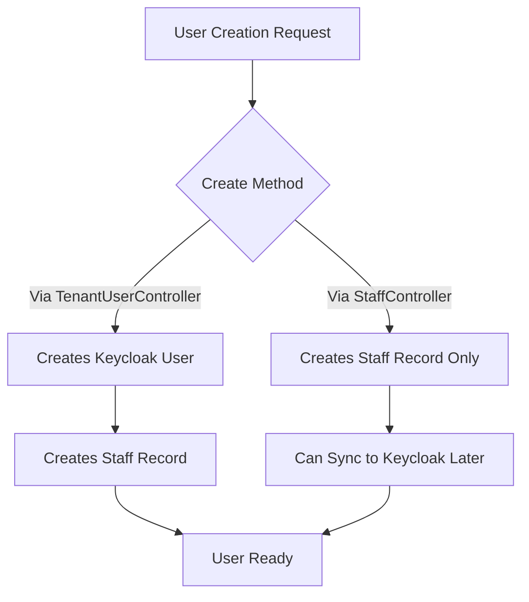

# Tenant User Management Guide

This guide explains how to manage users within tenants in the ClinicX system, including the relationship between Keycloak users and Staff records.

## Overview

The ClinicX system maintains user information in two places:
1. **Keycloak**: Handles authentication, authorization, and user attributes
2. **Staff Table**: Stores staff-specific information and tenant associations

## Architecture



## User Creation Flow

### 1. When Creating a New Tenant

When a new tenant is created, an admin user is automatically created:

```java
// In TenantCreateRequest
{
    "name": "Smile Dental Clinic",
    "subdomain": "smile-dental",
    "adminUsername": "admin",
    "adminEmail": "admin@smiledental.com",
    "adminFirstName": "John",
    "adminLastName": "Smith",
    "adminPassword": "SecurePass123!",
    // ... other fields
}
```

This automatically:
- Creates a Keycloak realm for the tenant
- Creates an admin user in that realm
- Sets up tenant attributes for the admin

### 2. Creating Users via TenantUserController

**Endpoint**: `POST /api/v1/tenant/users`

```bash
# Get admin token
TOKEN=$(curl -s -X POST "http://localhost:18081/realms/tenant-001-realm/protocol/openid-connect/token" \
  -H "Content-Type: application/x-www-form-urlencoded" \
  -d "client_id=clinicx-backend" \
  -d "client_secret=<your-secret>" \
  -d "username=admin" \
  -d "password=admin" \
  -d "grant_type=password" | jq -r '.access_token')

# Create a new user
curl -X POST "http://localhost:8080/api/v1/tenant/users" \
  -H "Authorization: Bearer $TOKEN" \
  -H "Content-Type: application/json" \
  -d '{
    "username": "doctor.jane",
    "email": "jane.doe@clinic.com",
    "firstName": "Jane",
    "lastName": "Doe",
    "password": "SecurePass123!",
    "roles": ["DOCTOR"],
    "phoneNumber": "+1234567890",
    "temporaryPassword": false
  }'
```

This creates:
1. A Keycloak user with proper tenant attributes
2. A Staff record linked to the Keycloak user

### 3. Creating Staff via StaffController

**Endpoint**: `POST /api/v1/staff`

```bash
# Create staff without Keycloak user
curl -X POST "http://localhost:8080/api/v1/staff" \
  -H "Authorization: Bearer $TOKEN" \
  -H "Content-Type: application/json" \
  -d '{
    "fullName": "Dr. Jane Doe",
    "role": "DOCTOR",
    "email": "jane.doe@clinic.com",
    "phoneNumber": "+1234567890",
    "specialtyIds": ["specialty-uuid-here"]
  }'
```

This creates only a Staff record without a Keycloak user.

### 4. Creating Staff with Keycloak User

Using the enhanced StaffKeycloakSyncService:

```java
@RestController
@RequestMapping("/api/v1/staff-enhanced")
public class EnhancedStaffController {
    
    @Autowired
    private StaffKeycloakSyncService syncService;
    
    @PostMapping
    public ResponseEntity<StaffDto> createStaffWithUser(
            @RequestBody StaffCreateRequestWithCredentials request) {
        
        StaffDto staff = syncService.createStaffWithKeycloakUser(
            request, 
            request.getPassword(), 
            request.isCreateKeycloakUser()
        );
        
        return ResponseEntity.ok(staff);
    }
}
```

## User Management Operations

### List Users in Tenant

```bash
# Get all users (including external users)
curl -X GET "http://localhost:8080/api/v1/tenant/users?includeExternal=true" \
  -H "Authorization: Bearer $TOKEN"

# Get only internal users
curl -X GET "http://localhost:8080/api/v1/tenant/users?includeExternal=false" \
  -H "Authorization: Bearer $TOKEN"
```

### Update User

```bash
curl -X PUT "http://localhost:8080/api/v1/tenant/users/{userId}" \
  -H "Authorization: Bearer $TOKEN" \
  -H "Content-Type: application/json" \
  -d '{
    "email": "new.email@clinic.com",
    "firstName": "Jane",
    "lastName": "Smith",
    "phoneNumber": "+9876543210"
  }'
```

### Deactivate/Activate User

```bash
# Deactivate
curl -X POST "http://localhost:8080/api/v1/tenant/users/{userId}/deactivate" \
  -H "Authorization: Bearer $TOKEN"

# Activate
curl -X POST "http://localhost:8080/api/v1/tenant/users/{userId}/activate" \
  -H "Authorization: Bearer $TOKEN"
```

### Update User Roles

```bash
curl -X PUT "http://localhost:8080/api/v1/tenant/users/{userId}/roles" \
  -H "Authorization: Bearer $TOKEN" \
  -H "Content-Type: application/json" \
  -d '{
    "roles": ["DOCTOR", "ADMIN"]
  }'
```

## External User Access

### Grant External User Access

Allow a user from another tenant to access your tenant:

```bash
curl -X POST "http://localhost:8080/api/v1/tenant/users/grant-access" \
  -H "Authorization: Bearer $TOKEN" \
  -H "Content-Type: application/json" \
  -d '{
    "username": "external.doctor",
    "roles": ["DOCTOR"],
    "accessNote": "Visiting specialist from partner clinic"
  }'
```

### Revoke External User Access

```bash
curl -X DELETE "http://localhost:8080/api/v1/tenant/users/revoke-access/{userId}" \
  -H "Authorization: Bearer $TOKEN"
```

## Data Synchronization

### Staff to Keycloak Sync

The system maintains synchronization between Staff records and Keycloak users:

1. **Creating a user via TenantUserController**:
   - Creates Keycloak user first
   - Then creates Staff record with `userId` reference

2. **Creating staff via StaffController**:
   - Creates Staff record only
   - Can later sync to Keycloak using `StaffKeycloakSyncService`

3. **Updates are synchronized**:
   - Deactivating a user updates both Keycloak and Staff
   - Role changes update both systems
   - Deletion removes from both systems

### Database Schema

```sql
-- Staff table includes Keycloak references
CREATE TABLE staff (
    id UUID PRIMARY KEY,
    full_name VARCHAR(100) NOT NULL,
    role VARCHAR(50) NOT NULL,
    email VARCHAR(100) NOT NULL UNIQUE,
    phone_number VARCHAR(30),
    is_active BOOLEAN DEFAULT true,
    user_id VARCHAR(255),        -- Keycloak user ID
    tenant_id VARCHAR(255),      -- Tenant ID
    is_primary BOOLEAN DEFAULT false,
    created_at TIMESTAMP,
    updated_at TIMESTAMP
);
```

## Best Practices

1. **Always use TenantUserController for new users** that need login access
2. **Use StaffController for staff records** that don't need immediate login access
3. **External users** should be granted access using the grant-access endpoint
4. **Role updates** should be done through the user management endpoints to ensure Keycloak sync
5. **Deletion** should consider whether to delete completely or just revoke access

## Error Handling

Common errors and solutions:

1. **"User with email already exists"**
   - Email must be unique across the system
   - Check if user already exists in another tenant

2. **"User not found in this tenant"**
   - User doesn't have access to the current tenant
   - May need to grant external access

3. **"Cannot revoke access to primary tenant"**
   - Users cannot be removed from their primary tenant
   - Must delete the user entirely instead

## Security Considerations

1. **Password Requirements**:
   - Minimum 8 characters
   - At least one uppercase, one lowercase, and one number

2. **Role Hierarchy**:
   - SUPER_ADMIN > ADMIN > DOCTOR > NURSE > RECEPTIONIST > ACCOUNTANT > ASSISTANT

3. **Tenant Isolation**:
   - Users can only see/manage users within their tenant
   - External users have limited access based on granted roles

4. **Audit Trail**:
   - All user operations are logged
   - Activity logs available via `/api/v1/tenant/users/{userId}/activity`