# ClinicX Patient Module - Database & Entity Analysis

## Executive Summary
This document provides a comprehensive analysis of the ClinicX patient module's database schema and Java entity mappings. The system implements a sophisticated multi-tenant clinic management platform with particular emphasis on dental clinic operations.

## Database Schema Analysis

### Core Tables Structure

#### 1. **patients** (Central Entity)
- **Primary Key**: `id` (UUID)
- **Unique Identifier**: `public_facing_id` (patient-friendly ID)
- **Key Attributes**:
  - Personal: full_name, date_of_birth, gender, phone_number, email, address
  - Insurance: insurance_provider, insurance_number
  - Medical: important_medical_notes
  - Financial: balance (calculated via triggers)
  - Status: is_active
  - Audit: created_at, updated_at, created_by (FK to staff)

#### 2. **appointments**
- **Primary Key**: `id` (UUID)
- **Foreign Keys**: 
  - patient_id → patients
  - doctor_id → staff
  - specialty_id → specialties
- **Key Attributes**: appointment_datetime, duration_minutes, status, notes
- **Statuses**: SCHEDULED, CONFIRMED, CANCELLED, NO_SHOW, COMPLETED

#### 3. **treatments**
- **Primary Key**: `id` (UUID)
- **Foreign Keys**:
  - appointment_id → appointments
  - patient_id → patients
  - procedure_id → procedures
  - doctor_id → staff
- **Key Attributes**: tooth_number, status, cost, treatment_notes, treatment_date
- **Tooth Numbering**: International FDI notation (11-48)

#### 4. **invoices & invoice_items**
- **Invoice**: invoice_number (unique), issue_date, due_date, total_amount, status
- **Invoice Items**: Links to treatments, description, amount
- **Statuses**: UNPAID, PAID, CANCELLED, PARTIALLY_PAID

#### 5. **payments**
- **Links**: invoice_id (optional), patient_id (required)
- **Key Attributes**: payment_date, amount, payment_method, type, reference_number
- **Types**: PAYMENT, CREDIT, REFUND

#### 6. **dental_charts**
- **One-to-One with Patient**
- **JSONB Storage**: chart_data column for flexible tooth condition tracking
- **Structure**: 
  ```json
  {
    "meta": {"version": "1.0", "lastUpdated": null, "updatedBy": null},
    "teeth": {}
  }
  ```

#### 7. **treatment_materials**
- **Tracks materials used in treatments**
- **Key Attributes**: material_name, quantity, unit, cost_per_unit, total_cost
- **Automatic Calculation**: total_cost = quantity × cost_per_unit (via trigger)

### Supporting Tables

#### 8. **procedures**
- Defines available medical/dental procedures
- Links to specialties
- Default cost and duration settings

#### 9. **tooth_conditions**
- Defines conditions for dental chart visualization
- Includes color coding (color_hex) for UI representation

#### 10. **lab_requests**
- External lab work tracking
- Order management with status tracking

#### 11. **documents**
- Patient document management
- File metadata storage (actual files stored externally)

#### 12. **notes**
- Clinical notes for patients
- Timestamped with author tracking

### Multi-Tenant Architecture Tables

#### 13. **tenants**
- Tenant configuration and metadata
- Subscription management
- Keycloak realm mapping

#### 14. **user_tenant_access**
- Maps users to tenants
- Primary tenant designation
- Access control

#### 15. **staff**
- Employee records
- Keycloak user ID mapping
- Role assignments via staff_roles

#### 16. **specialties**
- Medical specialties catalog
- Links to procedures and appointments

## Entity Relationship Diagram

```mermaid
erDiagram
    clinic_info {
        boolean id PK
        varchar name
        text address
        varchar phone_number
        varchar email
        varchar timezone
        timestamp created_at
        timestamp updated_at
    }

    tenants {
        uuid id PK
        varchar tenant_id UK
        varchar name
        varchar subdomain UK
        varchar realm_name
        boolean is_active
        varchar contact_email
        varchar contact_phone
        text address
        timestamp subscription_start_date
        timestamp subscription_end_date
        varchar subscription_plan
        integer max_users
        integer max_patients
        varchar specialty
        timestamp created_at
        timestamp updated_at
        varchar created_by
        varchar updated_by
    }

    specialty_types {
        uuid id PK
        varchar code UK
        varchar name
        varchar features
        varchar realm_name
        boolean is_active
        timestamp created_at
        timestamp updated_at
        varchar created_by
        varchar updated_by
    }

    staff {
        uuid id PK
        varchar full_name
        varchar email
        varchar phone_number
        boolean is_active
        varchar tenant_id
        varchar keycloak_user_id
        varchar source_realm
        timestamp created_at
        timestamp updated_at
    }

    staff_roles {
        uuid staff_id PK,FK
        varchar role PK
    }

    user_tenant_access {
        uuid id PK
        varchar user_id
        varchar tenant_id FK
        boolean is_primary
        boolean is_active
        timestamp created_at
        timestamp updated_at
        varchar created_by
        varchar updated_by
    }

    user_tenant_access_roles {
        uuid user_tenant_access_id PK,FK
        varchar role PK
    }

    specialties {
        uuid id PK
        varchar name UK
        text description
        boolean is_active
        timestamp created_at
        timestamp updated_at
    }

    staff_specialties {
        uuid staff_id PK,FK
        uuid specialty_id PK,FK
    }

    patients {
        uuid id PK
        varchar public_facing_id UK
        varchar full_name
        date date_of_birth
        varchar gender
        varchar phone_number
        varchar email
        text address
        varchar insurance_provider
        varchar insurance_number
        text important_medical_notes
        numeric balance
        boolean is_active
        uuid created_by FK
        timestamp created_at
        timestamp updated_at
    }

    dental_charts {
        uuid id PK
        uuid patient_id UK,FK
        json chart_data
        timestamp created_at
        timestamp updated_at
    }

    appointments {
        uuid id PK
        uuid specialty_id FK
        uuid patient_id FK
        uuid doctor_id FK
        timestamp appointment_datetime
        integer duration_minutes
        varchar status
        text notes
        uuid created_by FK
        timestamp created_at
        timestamp updated_at
    }

    procedures {
        uuid id PK
        uuid specialty_id FK
        varchar procedure_code UK
        varchar name
        text description
        numeric default_cost
        integer default_duration_minutes
        boolean is_active
        timestamp created_at
        timestamp updated_at
    }

    treatments {
        uuid id PK
        uuid appointment_id FK
        uuid patient_id FK
        uuid procedure_id FK
        uuid doctor_id FK
        integer tooth_number
        varchar status
        numeric cost
        text treatment_notes
        date treatment_date
        uuid created_by FK
        timestamp created_at
        timestamp updated_at
    }

    treatment_materials {
        uuid id PK
        uuid treatment_id FK
        varchar material_name
        numeric quantity
        varchar unit
        numeric cost_per_unit
        numeric total_cost
        varchar supplier
        varchar batch_number
        text notes
        timestamp created_at
        timestamp updated_at
    }

    tooth_conditions {
        uuid id PK
        varchar code UK
        varchar name
        text description
        varchar color_hex
        boolean is_active
        timestamp created_at
    }

    invoices {
        uuid id PK
        uuid patient_id FK
        varchar invoice_number UK
        date issue_date
        date due_date
        numeric total_amount
        varchar status
        uuid created_by FK
        timestamp created_at
        timestamp updated_at
    }

    invoice_items {
        uuid id PK
        uuid invoice_id FK
        uuid treatment_id UK,FK
        varchar description
        numeric amount
        timestamp created_at
    }

    payments {
        uuid id PK
        uuid invoice_id FK
        uuid patient_id FK
        date payment_date
        numeric amount
        varchar payment_method
        varchar type
        varchar description
        varchar reference_number
        uuid created_by FK
        timestamp created_at
    }

    lab_requests {
        uuid id PK
        uuid patient_id FK
        varchar order_number UK
        text item_description
        integer tooth_number
        date date_sent
        date date_due
        varchar status
        varchar lab_name
        timestamp created_at
        timestamp updated_at
    }

    documents {
        uuid id PK
        uuid patient_id FK
        uuid uploaded_by_staff_id FK
        varchar file_name
        text file_path
        bigint file_size_bytes
        varchar mime_type
        varchar type
        timestamp created_at
    }

    notes {
        uuid id PK
        uuid patient_id FK
        text content
        uuid created_by FK
        timestamp note_date
        timestamp created_at
        timestamp updated_at
    }

    flyway_schema_history {
        integer installed_rank PK
        varchar version
        varchar description
        varchar type
        varchar script
        integer checksum
        varchar installed_by
        timestamp installed_on
        integer execution_time
        boolean success
    }

%% Relationships
    staff ||--o{ staff_roles : has
    staff ||--o{ staff_specialties : has
    specialties ||--o{ staff_specialties : has
    specialties ||--o{ appointments : for
    specialties ||--o{ procedures : contains

    patients ||--o{ appointments : has
    patients ||--o{ treatments : receives
    patients ||--o{ invoices : has
    patients ||--o{ payments : makes
    patients ||--o{ lab_requests : has
    patients ||--o{ documents : has
    patients ||--o{ notes : has
    patients ||--|| dental_charts : has

    staff ||--o{ appointments : conducts
    staff ||--o{ treatments : performs
    staff ||--o{ patients : creates
    staff ||--o{ invoices : creates
    staff ||--o{ payments : records
    staff ||--o{ documents : uploads
    staff ||--o{ notes : creates
    staff ||--o{ appointments : creates
    staff ||--o{ treatments : creates

    appointments ||--o{ treatments : generates
    procedures ||--o{ treatments : used-in
    treatments ||--o{ treatment_materials : uses
    treatments ||--o| invoice_items : billed-in

    invoices ||--o{ invoice_items : contains
    invoices ||--o{ payments : receives

    tenants ||--o{ user_tenant_access : has
    user_tenant_access ||--o{ user_tenant_access_roles : has
```



## Java Entity Analysis

### Entity Mapping Strategy

#### 1. **Base Entity Pattern**
All entities extend `BaseEntity` which provides:
- `id` (UUID) - Primary key
- `createdAt` (Instant) - Creation timestamp
- `updatedAt` (Instant) - Last modification timestamp

#### 2. **Patient Entity** (Core Aggregate Root)
```java
@Entity
@Table(name = "patients")
public class Patient extends BaseEntity {
    // Bidirectional relationships
    @OneToMany(mappedBy = "patient", cascade = CascadeType.ALL, orphanRemoval = true)
    private Set<Appointment> appointments;
    
    @OneToMany(mappedBy = "patient", cascade = CascadeType.ALL, orphanRemoval = true)
    private Set<Treatment> treatments;
    
    @OneToOne(mappedBy = "patient", cascade = CascadeType.ALL, orphanRemoval = true)
    private DentalChart dentalChart;
    
    // ... other relationships
}
```

#### 3. **Relationship Patterns**
- **Cascade Operations**: ALL with orphanRemoval for child entities
- **Fetch Strategy**: LAZY for all associations (performance optimization)
- **Bidirectional**: Patient ↔ Child entities
- **Unidirectional**: Most other relationships

### Key Design Patterns Observed

#### 1. **Aggregate Root Pattern**
- Patient serves as the main aggregate root
- Child entities (appointments, treatments, etc.) managed through patient

#### 2. **Value Objects**
- Enums for status fields (AppointmentStatus, InvoiceStatus, etc.)
- Embedded types for complex attributes

#### 3. **Domain Events** (via Triggers)
- Automatic balance calculation on invoice/payment changes
- Material cost calculation on quantity/price changes

#### 4. **Multi-Tenancy**
- Tenant context not directly in entities (handled at service layer)
- Staff entity includes tenant_id for access control

## Data Integrity & Business Rules

### Database Constraints

1. **Check Constraints**:
   - Email format validation
   - Positive amounts for costs and payments
   - Tooth number range (11-48)
   - Date validations (due_date >= issue_date)

2. **Unique Constraints**:
   - Patient public_facing_id
   - Invoice number
   - Staff email per tenant
   - One dental chart per patient

3. **Referential Integrity**:
   - CASCADE DELETE for patient-owned data
   - SET NULL for optional relationships (e.g., doctor assignments)
   - RESTRICT for critical references (e.g., specialties, procedures)

### Business Logic Implementation

1. **Triggers**:
   - `update_patient_balance()` - Maintains patient balance
   - `calculate_material_total_cost()` - Auto-calculates material costs
   - `update_updated_at_column()` - Timestamp management

2. **Functions**:
   - `get_treatment_material_cost(UUID)` - Aggregates material costs
   - `get_patient_material_cost(UUID)` - Total material costs per patient

## Performance Considerations

### Indexes

1. **Primary Indexes**: All UUID primary keys
2. **Unique Indexes**: public_facing_id, invoice_number, email
3. **Foreign Key Indexes**: All relationship columns
4. **Search Indexes**:
   - `idx_patients_full_name_lower` - Case-insensitive name search
   - `idx_patients_email_lower` - Case-insensitive email search
   - `idx_appointments_datetime` - Date range queries
   - `idx_treatments_date` - Treatment history queries

### Query Optimization Views

1. **v_upcoming_appointments** - Pre-joined appointment data
2. **v_patient_financial_summary** - Aggregated financial metrics
3. **v_treatment_material_summary** - Material usage per treatment
4. **v_material_usage_stats** - Material inventory analytics

## Security Considerations

### Data Protection

1. **Sensitive Data**:
   - Medical notes (encrypted at rest recommended)
   - Insurance information
   - Personal identifiers

2. **Audit Trail**:
   - created_by tracking on all major entities
   - updated_at timestamps
   - Staff action logging

3. **Multi-Tenant Isolation**:
   - Tenant context validation at application layer
   - Staff-tenant access mapping
   - Keycloak realm separation

## Recommendations & Observations

### Strengths
1. **Well-Structured Schema**: Clear separation of concerns
2. **Comprehensive Auditing**: Timestamps and user tracking
3. **Financial Integrity**: Automated balance calculations
4. **Flexible Dental Charting**: JSONB for extensibility

### Areas for Enhancement

1. **Soft Deletes**: Consider adding deleted_at for audit trail
2. **Versioning**: Add version columns for optimistic locking
3. **Partitioning**: Consider partitioning large tables (appointments, treatments) by date
4. **Archival Strategy**: Old data management strategy needed
5. **Encryption**: Implement column-level encryption for PII
6. **Event Sourcing**: Consider for financial transactions

### Missing Entities/Features

1. **Waiting List Management**
2. **Prescription Tracking**
3. **Insurance Claim Processing**
4. **Appointment Reminders/Notifications**
5. **Treatment Plans** (multi-visit treatment tracking)
6. **Inventory Management** (beyond materials)

## Migration Considerations

### From Database to JPA
1. **JSONB Handling**: Custom Hibernate types for dental_charts
2. **Trigger Logic**: May need application-level implementation
3. **View Mapping**: Consider @Immutable entities for views
4. **Enum Mapping**: Ensure consistent string values

### Data Migration Strategy
1. **Flyway Migrations**: Already in place
2. **Test Data**: Comprehensive test fixtures needed
3. **Validation**: Data integrity checks post-migration

## Conclusion

The ClinicX patient module demonstrates a mature, well-architected database design with corresponding JPA entities. The system effectively balances normalization with performance considerations and provides robust support for multi-tenant clinic operations. The architecture is particularly well-suited for dental clinics but flexible enough for general medical practices.

Key strengths include comprehensive audit trails, automated financial calculations, and flexible dental charting capabilities. Future enhancements should focus on advanced features like treatment planning, insurance integration, and enhanced security measures for sensitive medical data.

---
*Document Generated: 2025-01-21*
*Analysis Version: 1.0*
*Analyzed by: Claude Code Assistant*
